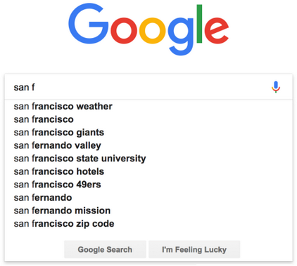
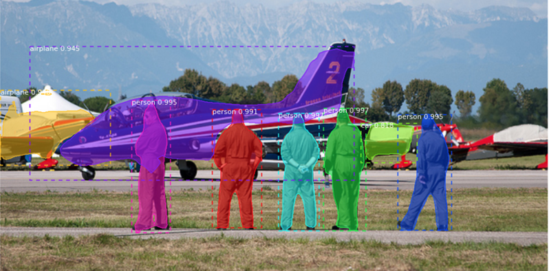

.. qnum::
   :prefix: Q
   :start: 1

.. raw:: html

   

.. include:: ../common/include_lobster_exercises.in.rst

.. raw:: html

   

=================================================
Applying Computing to Engineering Problems
=================================================

Congratulations, you've made it to the last Runestone chapter! We have covered a lot of different elements of computing - variables, loops, branching, functions, structs, and many more... In this chapter, we want to take a step back and look at how we can use what we've learned to solve engineering problems.

^^^^^^^^^^^^^^^^^^^^^^^^^^^^^^^^^^^^^^^
Warm-up: Binary Search
^^^^^^^^^^^^^^^^^^^^^^^^^^^^^^^^^^^^^^^

.. mchoice:: ch21_00_ex_binary_search_01

  In Project 4, you used binary search to find the optimal braking coefficient for a shuttle. To refresh your memory, check all of the statements that are true about binary search:

  - Binary search looks through every possible braking coefficient in order to find the optimal one.

    - Oops! Think about how many braking coefficients you looked at in Project 4 before finding the optimal one.

  - Binary search repeatedly divides the search space (the values you are searching through) in half.

    + Correct! Each time through the loop, binary search divides the search space in half and only considers either the upper half or the lower half.

  - Binary search repeatedly divides the search space into three pieces.

    - Oops! Think about how many pieces the search space is divided into each time through the loop.

  - In the worst case scenario, you would need to look at every possible braking coefficient before finding the optimal one.

    - Oops! Even in the worst case scenario, binary search stills divides the search space in half each time through the loop.

  - Binary search can only be used to look for numbers (not another data type, like strings).

    - Oops! Binary search can be used on any data type that can be put in order (e.g., strings can be put in alphabetical order).

  - In the best case scenario, the first value that you look at is the optimal braking coefficient.

    + Correct! In the best case scenario, you find the optimal value after only looking at one potential value.

Binary search is a particular kind of **searching algorithm**. In this chapter, we'll consider other algorithms and data structures.

^^^^^^^^^^^^^^^^^^^^^^^^^^^^^^^^^^^^^^^^^^^^
Introduction: Algorithms and Data Structures
^^^^^^^^^^^^^^^^^^^^^^^^^^^^^^^^^^^^^^^^^^^^

.. youtube:: 107ZN7siEI0
  :divid: ch21_00_algorithms_dataStructures
  :height: 315
  :width: 560
  :align: center

|

There are many common **algorithms** written for common computational problems - when we encounter one of those common problems, we don't need to re-invent the wheel! We can use an existing algorithm. Because the problems that we will face in many engineering problems involve big datasets and complex calculations, we care about how **efficient** our program is (how long it takes to run). Choosing an appropriate algorithm can make a program more efficient, as can choosing the appropriate **data structure** (a way to organize and store data).

Learning the basics of algorithms and data structures will be useful to you as you write your own computer programs as an engineer! This chapter will also give you a sneak peek of the material covered by more advanced computer science classes (like EECS 280 and EECS 281).

^^^^^^^^^^^^^^^^
Time Complexity
^^^^^^^^^^^^^^^^

In the previous video, we wrote this code for :code:`chargeRover`:

.. code :: cpp

  // Find a particular rover (using the id of the rover)
  // Set charge = 1 for that rover
  // return true if we find the rover, false otherwise
  bool chargeRover(vector<Rover> &fleet,
                  string roverId) {

    for(int i = 0; i < fleet.size(); ++i) {
      if (fleet[i].id  == roverId) {
        fleet[i].charge = 1;
        return true;
      }  
    }

    return false;

  }

In a real-world context, we often need to run our functions on huge datasets, or run them many times. For example, what if we had 1,000 rovers in our fleet, and we needed to run :code:`chargeRover` hundreds of times? If we are only running :code:`chargeRover` a few times, it doesn't really matter how fast it takes to run. But, if we are running it hundreds of times, it matters a lot! Even making :code:`chargeRover` a little bit more efficient would save us a lot of time!

When we are thinking about a function or an algorithm, we want to be able to quantify how efficient it is. This allows us to compare it to other algorithms, to see which one is most efficient. To start thinking about how to quantify efficiency, consider the following scenarios.

Let’s suppose we have 20 rovers in our fleet, and our vector of rovers is in a random order (e.g., the rovers aren’t sorted in any way). We are looking for a particular rover to charge.

.. mchoice:: ch21_01_ex_time_complexity_01

   In the **best case scenario**, how many rovers will we have to look at before we find the rover we are looking for?

   - 1 rover

     + Correct! In the best case scenario, the first rover that we look at it is the rover that we’re looking for.

   - 5 rovers

     - Oops! The best case scenario is the scenario where we need to look at as few rovers as possible to find the one we’re looking for.

   - 10 rovers

     - Oops! The best case scenario is the scenario where we need to look at as few rovers as possible to find the one we’re looking for.

   - 20 rovers

     - Oops! The best case scenario is the scenario where we need to look at as few rovers as possible to find the one we’re looking for.

.. mchoice:: ch21_01_ex_time_complexity_02

   In the **worst case scenario**, how many rovers will we have to look at before we find the rover we are looking for?

   - 1 rover

     - Oops! The worst case scenario is the scenario where we need to look at the maximum number of rovers before we find the one we’re looking for.

   - 5 rovers

     - Oops! The worst case scenario is the scenario where we need to look at the maximum number of rovers before we find the one we’re looking for.

   - 10 rovers

     - Oops! The worst case scenario is the scenario where we need to look at the maximum number of rovers before we find the one we’re looking for.

   - 20 rovers

     + Correct! In the worst case scenario, we’ll have to look at every single rover before we find the rover that we’re looking for.

.. mchoice:: ch21_01_ex_time_complexity_03

   **On average**, how many rovers will we have to look at before we find the rover we are looking for? (If you're not sure, take your best guess, and revise your guess until you figure it out!)

   - 1 rover

     - Oops! This is the best case scenario, but we’re not always going to have the best case scenario.

   - 5 rovers

     - Oops! This guess is lower than what the average will be.

   - 10 rovers

     + Correct! On average, we will need to look at half of the rovers.

   - 20 rovers

     - Oops! This is the worst case scenario, but we’re not always going to have the worst case scenario.

.. youtube:: W_GwYj2bZnk
  :divid: ch21_00_time_complexity
  :height: 315
  :width: 560
  :align: center

|

This video introduces some terms to more formally talk about the efficiency of algorithms. **Time complexity** refers to the how long an algorithm takes to run. We care about **best-case** time complexity, **worst-case** time complexity, and **average-case** time complexity. Sometimes, time complexity is written using **big-oh notation**.

.. dragndrop:: ch21_01_ex_time_complexity_004
   :match_1: When n grows to be three times as big as it originally was, the algorithm takes nine times as long to run.|||polynomial time
   :match_2: The algorithm always takes the same amount of time to run.|||constant time
   :match_3: When n grows to be three times as big as it originally was, the algorithm takes three times as long to run.|||linear time

   Match the description of an algorithm with its correct time complexity.

.. dragndrop:: ch21_01_ex_time_complexity_005
   :match_1: O(1)|||constant time
   :match_2: O(n)|||linear time
   :match_3: O(log(n))|||logarithmic time
   :match_4: O(n^3)|||polynomial time

   Match the big-oh notation to the correct time complexity.

Assume :code:`fleet` is a vector of Rovers. What is the worst-case time complexity of the following snippets of code? (Here, **n** = size of :code:`fleet`.)

.. mchoice:: ch21_01_ex_time_complexity_05

   .. code :: cpp

      // finds the largest amount that TWO rovers can carry together
      double biggestTwoRoverCapacity = -1;
      for (int i = 0; i < fleet.size(); ++i) {

         for(int j = 0; j < fleet.size(); ++j) {

            double twoRoverCapacity = fleet[i].capacity + fleet[j].capacity;
            if (biggestTwoRoverCapacity == -1 ||
                twoRoverCapacity > biggestTwoRoverCapacity) {
               biggestTwoRoverCapacity = twoRoverCapacity;
            }

         }

      }

   - Constant time

     - Oops! If the size of the fleet is five, the outer loop will run five times, and the inner loop will run five times *for each rover* - this means that the code in the middle of the nested loops will run twenty-five times total. If the size of the fleet is ten, then the code in the middle of the nested loops will run one hundred times total. The time the loop takes to run is changing based on the size of the fleet, so this can’t be constant time.

   - Logarithmic time

     - Oops! If the size of the fleet is five, the outer loop will run five times, and the inner loop will run five times *for each rover* - this means that the code in the middle of the nested loops will run twenty-five times total. If the size of the fleet is ten, then the code in the middle of the nested loops will run one hundred times total. The time the algorithm takes to run is growing faster than logarithmic time.

   - Linear time

     - Oops! If the size of the fleet is five, the outer loop will run five times, and the inner loop will run five times *for each rover* - this means that the code in the middle of the nested loops will run twenty-five times total. If the size of the fleet is ten, then the code in the middle of the nested loops will run one hundred times total. The time the algorithm takes to run is growing faster than linear time.

   - Polynomial time

     + Correct! Anytime we see nested loops iterating through vectors, it’s pretty likely that the algorithm will be at least polynomial time. In this case, if the size of the fleet is five, the outer loop will run five times, and the inner loop will run five times *for each rover* - this means that the code in the middle of the nested loops will run twenty-five times total. If the size of the fleet is ten, then the code in the middle of the nested loops will run one hundred times total. This is growing polynomially.

.. mchoice:: ch21_01_ex_time_complexity_06

   .. code :: cpp

      // Print out the id the first five rovers (if they exist)
      for(int i = 0; i < 5; ++i) {

         if (i < fleet.size()) {
            cout << fleet[i].id << endl;
         }

      }

   - Constant time

     + Correct! No matter how big our fleet is, the loop will only run five times.

   - Logarithmic time

     - Oops! Think about how long this code would take to run if the fleet had five rovers vs. if the fleet had ten rovers.

   - Linear time

     - Oops! Think about how long this code would take to run if the fleet had five rovers vs. if the fleet had ten rovers. Even though there's a loop here, the loop isn't going through the entire vector.

   - Polynomial time

     - Oops! Think about how long this code would take to run if the fleet had five rovers vs. if the fleet had ten rovers.

.. mchoice:: ch21_01_ex_time_complexity_07

   .. code :: cpp

      // How many rovers are selected for the mission?
      int numSelected = 0;
      for(int i = 0; i < fleet.size(); ++i) {

         if (fleet[i].isSelected) {
            numSelected += 1;
         }

      }

   - Constant time

     - Oops! If the size of the fleet is five, the loop will run five times. If the size of the fleet is ten, the loop will run ten times. The time the loop takes to run is changing based on the size of the fleet, so this can’t be constant time.

   - Logarithmic time

     - Oops! If the size of the fleet is five, the loop will run five times. If the size of the fleet is ten, the loop will run ten times. This is growing too fast to be logarithmic time.

   - Linear time

     + Correct! Anytime we see a single loop going through an entire vector, it’s pretty likely that the algorithm will be at least linear time. In this case, if the size of the fleet is five, the loop will run five times. If the size of the fleet is ten, the loop will run ten times. This is growing linearly.

   - Polynomial time

     - Oops! If the size of the fleet is five, the loop will run five times. If the size of the fleet is ten, the loop will run ten times. This is growing too slow to be polynomial time.

^^^^^^^^^^^^^^^^^^^^^
Searching Algorithms
^^^^^^^^^^^^^^^^^^^^^

.. youtube:: wVc-U3XvW84
  :divid: ch21_00_binary_search_video
  :height: 315
  :width: 560
  :align: center

|

We've now looked at one particular type of algorithm - **searching algorithms**. These are algorithms that look for a particular element in a collection of elements. We've seen two searching algorithms in this chapter - **linear search** and **binary search**. Both of these algorithms have strengths and weaknesses. Binary search is more efficient than linear search, but binary search requires that the items are already sorted. Linear search works on any vector of items, regardless of if the items are sorted.

As you solve engineering problems using computing, you may encounter a scenario where you need a searching algorithm! You've already seen one example of binary search in Project 4, searching for the optimal braking coefficient. Here are a few more examples of real-life problems that use searching algorithms:

- **Autocomplete**. As you are typing out a word on your phone, your phone is searching through all possible words and trying to guess which word you meant to type. There are thousands of possible words that you could be trying to type - this has to be a very efficient search!

- **Keyword search**. Suppose that you want to write a program to help doctors access relevant medical information. One part of this program could be searching for particular keywords in medical literature, and identifying which articles have these keywords.
- **Searching through simulation results**. It's common to run complicated simulations of fluid dynamics, in order to understand how air or water interacts with certain physical objects. Suppose that you ran hundreds of these simulations with different parameters. You would need to search through the simulation results in order to identify which parameters are optimal for this particular set-up.

^^^^^^^^^^^^^^^^^^^^^^^^^^^^^^^^^^^^
A Sorting Algorithm: Selection Sort
^^^^^^^^^^^^^^^^^^^^^^^^^^^^^^^^^^^^

Another common type of algorithm is sorting algorithms.

.. youtube:: kdsd-yzc94c
  :divid: ch21_00_selection_sort
  :height: 315
  :width: 560
  :align: center

|

.. mchoice:: ch21_02_ex_selection_sort_01

   Suppose we are sorting a vector of size **n**. What is the maximum number of swaps that selection sort will take?

   - 1

     - Oops! Revisit the animation in the previous video and count how many swaps are needed.

   - n/2

     - Oops! Revisit the animation in the previous video and count how many swaps are needed.

   - n-1

     + Correct! In the worst case, you will have to do a swap for every single element in the list, except for the last element. Once you've sorted n-1 elements, the last element will necessarily be the largest element and won't need to be swapped.

   - n

     - Oops! Think about what happens when you get to the end of the vector - will you need to swap the last element?

.. mchoice:: ch21_02_ex_selection_sort_02

   Suppose that we have a vector of size **n**, and all of the elements are already sorted. If we run selection sort on this vector, how many swaps will selection sort do?

   - 0

     + Correct! In selection sort, swaps only happen if there is an element in the rest of the vector smaller than the element at the current position. Because the elements of the vector are already sorted, this will never happen. The element at the current position will be smaller than all of the elements in the rest of the vector.

   - 1

     - Oops! Think about what condition needs to be true for a swap to happen.

   - n/2

     - Oops! Think about what condition needs to be true for a swap to happen.

   - n-1

     - Oops! Think about what condition needs to be true for a swap to happen.

--------------------------------------
Exercise: Implementing Selection Sort
--------------------------------------

Arrange the lines of code below to write a program that implements selection sort on a vector of Rovers. Assume that :code:`fleet` is a vector of Rovers, and that we have access to a helper function :code:`swap` that swaps two Rovers.

Some lines contain **mistakes** or are **unnecessary** for the function - these lines should not be selected. Make sure to place the blocks at the right indentation levels!

.. parsonsprob:: ch21_03_ex_selectionSort
    :language: cpp

    -----
    for(int currentPosition = 0; currentPosition < fleet.size(); ++currentPosition) {
    =====
      int minRover = currentPosition;
    =====
      for(int j = currentPosition + 1; j < fleet.size(); ++j) {
    =====
        if(fleet[j].id < fleet[minRover].id) {
          minRover = j;
        }
    =====
      }
    =====
      swap(fleet[currentPosition], fleet[minRover]);
    =====
    }
    =====
        if(fleet[j].id > fleet[minRover].id) { #distractor
          minRover = j;
        }
    =====
      swap(fleet[0], fleet[minRover]); #distractor
    =====
      for(int j = 0; j < fleet.size(); ++j) { #distractor
    =====

.. admonition:: Walkthrough

  .. reveal:: ch21_04_revealwt_implementing_selectionSort
  
    .. youtube:: XBhdJmLgUmw
      :divid: ch21_04_wt_implementing_selectionSort
      :height: 315
      :width: 560
      :align: center

|

.. mchoice:: ch21_04_ex_selection_sort_01

   What is the worst-case time complexity of selection sort? (Here, **n** = size of :code:`fleet`.) *Hint: Look back at the code you just put in order.*

   - Constant time

     - Oops! If the size of the fleet is five, the outer loop will run five times. If the size of the fleet is ten, then the outer loop will run ten times. The time the outer loop takes to run is changing based on the size of the fleet, so this can’t be constant time.

   - Logarithmic time

     - Oops! Think about how long this code would take to run if the fleet had five rovers vs. if the fleet had ten rovers.

   - Linear time

     - Oops! Think about how long this code would take to run if the fleet had five rovers vs. if the fleet had ten rovers.

   - Polynomial time

     + Correct! If the size of the fleet is five, the outer loop will run five times, and the inner loop will run between one and four times for each rover. If the size of the fleet is ten, the outer loop will run ten times, and the inner loop will run between one and nine times for each rover. Because of the inner loop, we know that this runs slower than linear time (if there were no inner loop, this would be a linear time algorithm). Even though the number of iterations that the inner loop goes through changes, this is still polynomial time.

^^^^^^^^^^^^^^^^^^^^^^^^^
Other Sorting Algorithms
^^^^^^^^^^^^^^^^^^^^^^^^^

There are lots of sorting algorithms! Depending on what data you are trying to sort, different algorithms are more or less efficient in different contexts. Take a look at this neat visualization of many different sorting algorithms (the first one is selection sort, which we've talked about above!).

.. youtube:: kPRA0W1kECg
   :divid: ch21_04_selection_sort
   :height: 315
   :width: 560
   :align: center

|

.. shortanswer:: ch21_05_ex_otherSortingAlgorithms

  List three sorting algorithms (other than selection sort) covered in the previous video.

Just like for searching algorithms, you may encounter a computational problem where you could use a sorting algorithm. Here are a few real-world examples:

- **Showing product results**. When you search for a product on an online store (like Amazon), the store *sorts* the results in order of relevance, putting the products that they think will be most helpful at the top of the list.
- **Object detection**. A self-driving car has cameras that take images of the scenes around it. After getting these images, an algorithm parses the images to identify possible objects (e.g,. other cars, pedestrians, trees). For a single object, the algorithm generates several possibilities for what that object could be, and then it sorts them in order of which label is most likely. In the example below, the algorithm identifies people and airplanes with high probability.

Searching and sorting algorithms are two categories of algorithms that are already developed. So, if you find yourself writing a computer program where you need to search for a particular item or sort a collection of items, you don't need to re-invent the wheel! You can use an algorithm that someone else has already written. There are many other algorithms out there that solve common computational problems.

^^^^^^^^^^^^^^^^^
Data Structures
^^^^^^^^^^^^^^^^^

We've seen how using a good algorithm can make your program run faster. Using the appropriate data structure can also make your program more efficient!

.. youtube:: z0eaEq4rfMU
  :divid: ch21_00_data_structures
  :height: 315
  :width: 560
  :align: center

|

.. dragndrop:: ch21_06_ex_data_structures_01
   :match_1: Reversing a word. We want to insert all of the characters of a word into a data structure, and remove them in reverse order.|||stack
   :match_2: Retrieving information. We have student information for every student in our class, and we want to be able to give our data structure a student ID, and access all of the information about that student ID.|||dictionary
   :match_3: Scheduling programs on your computer. Suppose that you have multiple programs that you want your computer to run. As soon as a program is ready to run, it is inserted into the data structure. When the computer is ready to run a program, it removes that program from the data structure and runs it. The first program that is ready to run should be the first program that is actually run.|||queue
   :match_4: File organization. The files on your computer are organized hierarchically (e.g., a folder might have additional folders inside of it). We want to store the file structure of your computer, and be able to access different folders in that structure.|||tree

   Match the program examples on the left with the appropriate data structure.

.. admonition:: Walkthrough

  .. reveal:: ch21_06_revealwt_dataStructures_matching
  
    .. youtube:: b5ZJdy19aGo
      :divid: ch21_06_wt_dataStructures_matching
      :height: 315
      :width: 560
      :align: center

^^^^^^^^^^^^^^^^^^^^^^^^^^^^^^^^^^^^^^^^^^^^^^^^^^^^^^^
Summary
^^^^^^^^^^^^^^^^^^^^^^^^^^^^^^^^^^^^^^^^^^^^^^^^^^^^^^^

This is the end of the chapter! Here is a summary of what we covered in this chapter: 

* There are many algorithms written for common computational problems. Two categories of algorithms are **searching algorithms** and **sorting algorithms**.
* **Time complexity** refers to how long an algorithm takes to run. Specifically, we looked at **constant time**, **logarithmic time**, **linear time**, and **polynomial time**. Sometimes, time complexity is written using **big-oh notation**.
* **Linear search** and **binary search** are two searching algorithms. Binary search is more efficient, but requires the items to be sorted first.
* There are many different sorting algorithms. We looked closely at **selection sort**.
* **Data structures** are ways to organize and store data. A **dictionary** maps keys to values. A **tree** is a collection of nodes often used for hierarchical or sorted data. A **stack** is similar to a vector, but requires elements to be inserted and removed from only end. A **queue** is similar to a vector, but requires elements to be inserted on one end and removed on the other end. Different data structures are more efficient for different contexts.

You can double check that you have completed everything on the "Assignments" page. Click the icon that looks like a person, go to "Assignments", select the chapter, and make sure to scroll all the way to the bottom and click the "Score Me" button.