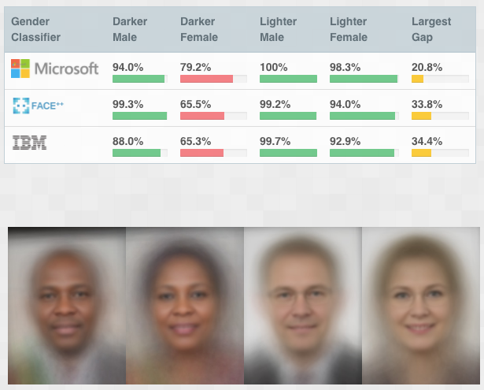
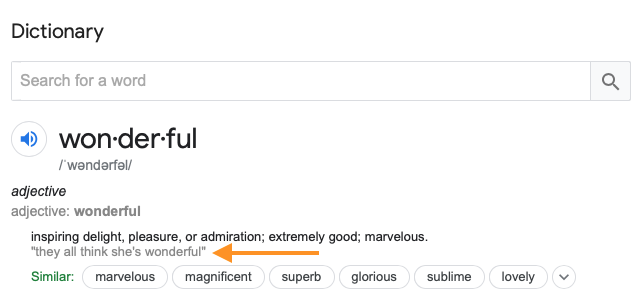
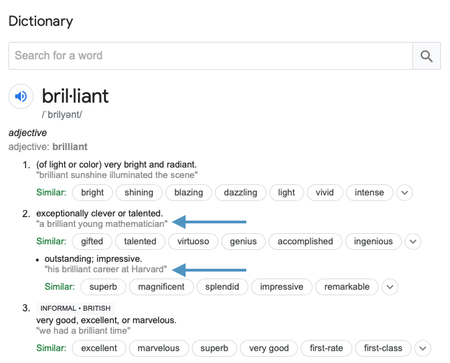

.. qnum::
   :prefix: Q
   :start: 1

.. raw:: html

   <link rel="stylesheet" href="../_static/common/css/theme-overrides.css">

.. raw:: html

   

.. include:: ../common/include_lobster_exercises.in.rst

.. raw:: html

   

=============================
Applying Computing to Society
=============================

^^^^^^^^^^^^^^^^
Introduction
^^^^^^^^^^^^^^^^
.. section 2

As we've seen in this class, technology is a powerful tool that can be used to make positive contributions in many areas of society (and many areas of engineering!). Sometimes, however, the use of technology can have negative effects on society, and deepen existing inequities. For example, consider the technology of facial recognition. This technology has been used for many purposes - to unlock phones, to help the blind recognize people, to find missing children and victims of human trafficking.

It has also been used by `police departments to identify criminal suspects <https://www.nytimes.com/2020/01/12/technology/facial-recognition-police.html>`__. Using facial recognition in criminal justice settings raises some serious concerns, and researchers have studied if this technology is able to recognize faces equally across races and genders. `One study <http://gendershades.org/overview.html>`__ compared three facial recognition systems (Microsoft, Face++, and IBM) across darker males, darker females, lighter males, and lighter females. Here are the results:

   ..

In all three systems, there is at least a 20% gap in accuracy between recognizing lighter males and darker females!

.. shortanswer:: ch20_01_ex_facialRecognition

   Reflection: Consider the implications of this accuracy gap in uses of facial recognition technology. Which people are most impacted by the poor performance of facial recognition systems? What are some specific ways that this might negatively impact these people?

Whenever we use technology to solve a problem, we have a responsibility to think through the impacts of our technology use. What are the potential negative implications of a certain use of technology? Will people be affected unequally by this technology? Will this have an overall positive or negative impact? In this chapter, we will consider ways that technology affects society, and ways that technology can be used to study society.

^^^^^^^^^^^^^
Implicit Bias
^^^^^^^^^^^^^
.. section 3

An **implicit bias** is a bias towards or against something, of which we are not consciously aware but that affects our thoughts and actions anyway.

.. youtube:: UZETCosXncU
   :divid: ch20_03_implicit_bias
   :height: 315
   :width: 560
   :align: center

.. admonition:: Video Recap

   We all have implicit biases because we get them from the societies we live in. We have a responsibility to not let those implicit biases negatively affect the people around us. You can change your implicit biases!

Knowledge is your best tool for helping to change implicit bias. We have more information about our societies than ever before, so let's use computing and data analysis to try to learn a little more about how implicit bias shows up in our societies. 

^^^^^^^^^^^^^^^^^^^^^^^^^^^^^^^^^^^^^^^^^^^^^^^^^^
Application: Bias in Ratings - RateMyProfessor.com
^^^^^^^^^^^^^^^^^^^^^^^^^^^^^^^^^^^^^^^^^^^^^^^^^^
.. section 4

For this investigation, we're going to look at some data we're guessing you're somewhat familiar with: instructor ratings on `RateMyProfessors.com <https://www.ratemyprofessors.com/>`__. In rating instructors, students give a rating (out of 5 stars) and give a short description of the instructor. We want to investigate whether there are any differences in how female instructors are described vs. how male instructors are described.

.. admonition:: Important note before we get started!

   Online reviews of anything are notoriously unreliable (as you'll see with Project 5!). Yet we still rely on online reviews to inform our decision making.

   In this investigation of Rate My Professor ratings, **we are not trying to validate any of the ratings** nor can we say that these are "truthful" ratings. Instead, we are investigating how implicit bias might be present in those ratings and how those biases could affect our perceptions of the things that are being rated - in this case, actual human beings.

Dr. Ben Schmidt at New York University has created a website that visualizes the words used by students to describe their instructors on RateMyProfessor.com:
`http://benschmidt.org/profGender/ <http://benschmidt.org/profGender/>`__

On this website, you can enter a keyword (or two word phrase), and the visualizer will show how many times that word is used in the ratings for professors. The visualizer breaks down the uses per million words of text into two categories: the gender of the professor and their discipline.

For this activity, we want you to go to Dr. Schmidt's website and actively try out some different keywords.

.. admonition :: Website down?

   Due to the pandemic, Dr. Schmidt has been working from home some (professors -- they're just like you!) and according to his twitter postings, his home internet is not terribly reliable and the visualizer keeps going down. Throughout this activity, we'll post some screenshots of the website, in case you are't able to access the visualizer. But, if you do have access, you should try it out for yourself!

-----------------------------
Who is Considered a "Genius"?
-----------------------------

Go to the profGender visualizer, and put in the keyword "genius".

.. admonition:: Walkthrough

  .. reveal:: ch20_01_revealwt_genius
  
    .. figure:: img/genius.png
      :width: 400
      :align: center

|

In the "genius" plot, we notice a few things: 

- This keyword is "gendered" -- each discipline shown has a difference between the number of times a female professor was described as a genius and the number of times a male professor was described as a genius.
- Some disciplines are more "gendered" than others for the "genius" keyword. For example, the distance between the blue and orange dots is greater for Chemistry than Economics.
- Some disciplines have more ratings that use the word "genius" than others. For example, Physics has overall more uses of the word "genius" than Languages, regardless of gender.

Let's look a little more closely at the "genius" plot and answer a few questions.

.. fillintheblank:: ch20_04_ex_genius_01
   :casei:

   Which discipline is most "gendered" for the word "genius"? (This is the discipline that has the biggest gap between the orange and blue dots?
   
   |blank|
  
   - :music: Correct! Wow, that's a pretty big difference. Do you know anyone that is taking classes in the School of Music, Theater, and Dance? If so, ask them what they think of this result!
     :x: Incorrect. Look again at the distance between the orange and blue dots (hint: it's also the discipline listed at the top of the chart)

.. mchoice:: ch20_04_ex_genius_02

   Find "Engineering" on this chart. Who has more uses of the word "genius" in their ratings, women or men?
   
   - Women
   
     - Incorrect. Remember that women are the orange dots and men are the blue dots

   - Men
   
     + Correct, and this is a pretty big gender gap. Again, we're not saying that anyone should use RateMyProfessor ratings to do anything "real", but it makes us wonder what might be going through students' heads when they use the word "genius" in a rating. Are women held to a higher standing than men, and so therefore it's harder to rate as "genius"? Are men held to a lower standing than women, and so therefore it's easier to rate as "genius"? Neither of these assumptions seem especially helpful to our society! Think about some other reasons that might result in this gender gap.

.. shortanswer:: ch20_04_ex_genius_03

   Reflection: Do you think this graph accurately captures students' perceptions and/or assumptions about engineering professors? What about Michigan Engineering professors, specifically? Write down your thoughts here.

------------------------------------------
Not So Gendered: Perceptions of Difficulty
------------------------------------------

Go to the profGender visualizer and put in the keyword "hard" and then the keyword "easy".

.. admonition:: Walkthrough

  .. reveal:: ch20_02_revealwt_easy_hard

      Open the image in a new tab to see a larger version.

      .. figure:: img/easy_hard.png
         :width: 600
         :align: center

|

In the "hard" and "easy" plots, we notice a few things:

- These keywords are not very "gendered" - each discipline shows a similar number of times a female professor was described as easy/hard and the number of times a male professor was described as easy/hard.
- Some disciplines have more ratings that use the word "hard" than others. For example, History has overall more uses of the word "hard" than Computer Science.
- Some disciplines have more ratings that use the word "easy" than others. For example, Criminal Justice has overall more uses of the word "easy" than English.

Let's look a little more closely at the "hard" and "easy" plots and answer a few questions.

.. fillintheblank:: ch20_04_ex_hard_easy_01
   :casei:

   Which discipline has the **most** uses of the keyword "hard"? 
   
   |blank|
  
   - :biology: Correct! Although all of the physical sciences have higher numbers of the uses of "hard" for their professors.
     :x: Incorrect. Look again at the chart for the keyword "hard" (hint: it's also the discipline listed at the top of the chart)

.. fillintheblank:: ch20_04_ex_hard_easy_02
   :casei:

   Which discipline has the **most** uses of the keyword easy? 
   
   |blank|
  
   - :health science: Correct! Health science is the application of science to health including the study of medicine, nutrition, and other health-related topics. 
     :x: Incorrect. Look again at the chart for the keyword "easy" (hint: it's also the discipline listed at the top of the chart)

.. shortanswer:: ch20_04_ex_hard_easy_03

   Reflection: Engineering and Health Sciences are both fields that apply science to solve problems that benefit humanity. Compare the uses of "hard" and "easy" for Engineering professors and Health Science professors, and write down 2-3 conclusions or interpretations that you think might explain the difference between these ratings. Remember that these ratings are for the **people** that teach courses in these disciplines.

---------------------------------------------------------------------------
Very Gendered: Who is Considered Wonderful and Who is Considered Brilliant?
---------------------------------------------------------------------------

Go to the profGender visualizer and put in the keyword "wonderful" and then the keyword "brilliant".

.. admonition:: Walkthrough

  .. reveal:: ch20_03_revealwt_wonderful_brilliant

      Open the image in a new tab to see a larger version.

      .. figure:: img/wonderful_brilliant.png
         :width: 600
         :align: center

|

In the "wonderful" and "brilliant" plots, we notice a few things: 

- These are "gendered" -- each discipline shown has a difference between the number of times a female professor was described as wonderful/brilliant and the number of times a male professor was described as wonderful/brilliant.
- As before, some disciplines have more ratings that use the word "wonderful" than others. For example, Fine Arts has overall more uses of the word "wonderful" than Political Science.
- Some disciplines have more ratings that use the word "brilliant" than others. For example, Anthropology has overall more uses of the word "brilliant" than Mathematics.

Let's look a little more closely at the "wonderful" and "brilliant" plots and answer a few questions.

.. mchoice:: ch20_04_ex_wonderful_brilliant_01

   Who has more uses of the word "wonderful" in their ratings, women or men?
   
   - Women
   
     + Correct. Make sure to check out where Engineering is on the "wonderful" chart. 

   - Men
   
     - Incorrect. Remember that women are the orange dots and men are the blue dots.

.. mchoice:: ch20_04_ex_wonderful_brilliant_02

   Who has more uses of the word brilliant in their ratings, women or men?
   
   - Women
   
     - Incorrect. Remember that women are the orange dots and men are the blue dots

   - Men
   
     + Correct. Make sure to check out where Engineering is on the "brilliant" chart. 

Consider these definitions for the words "wonderful" and "brilliant" that are presented by Google if you search for these terms; the definitions are from Oxford Languages. We have highlighted the examples that the Google + Oxford Languages algorithm provides for each of these words. 

   ..

   ..

.. mchoice:: ch20_04_ex_wonderful_brilliant_03

   Which word has a definition that hints at technical expertise, like you might wish for your engineering professor?
   
   - wonderful
   
     - Incorrect. While no one is likely to be upset about being called "wonderful", there isn't anything in this definition that speaks to technical expertise. 

   - brilliant
   
     + Correct. This definition includes terms like "exceptionally clever or talented" and the examples include references to mathematics (a technical field if ever there was one) and Harvard (a college renowned for their technical expertise in many fields). So what does that say about our society that we rank more women as "wonderful" and more men as "brilliant"?

.. shortanswer:: ch20_04_ex_wonderful_brilliant_04

   Reflection: Think about the "example uses" of these two words. Remember that these are the recommended examples that are being provided to anyone who searches these terms in English. How might other people feel about these examples? Specifically, put yourselves in the shoes of someone who is a different gender than you, and consider how that person may feel about these examples. For instance, perhaps some people might feel nervous about being called "wonderful" rather than "brilliant" if it might play into a stereotype that they're just a "nice" person, but not necessarily technically or professionally competent.

   Think about your own gender and how it is or is not being used in these examples, and then think about how you might view other people's successes in terms of these kinds of descriptions.

   This is a very personal reflection, so after you have thought about these things for a few minutes, just enter "I have reflected on these examples" in the text box below to receive your credit for this question. 

-------------------------------------------------
Thinking About Your Future Engineering Professors
-------------------------------------------------

Let's do one more keyword search -- this one usually gets some very strong reactions. Look up the word "hot" in RateMyProfessor ratings.

.. admonition:: Walkthrough

  .. reveal:: ch20_04_revealwt_hot

      .. figure:: img/hot.png
         :width: 400
         :align: center

|

.. shortanswer:: ch20_04_ex_hot_01

   The amount and direction in which the word "hot" is gendered varies widely between disciplines. Why do you think this is?

.. mchoice:: ch20_04_ex_hot_02

   For Engineering, who has more uses of the word "hot" in their ratings, women or men?
   
   - Women
   
     + Correct. And WOW is that a big difference...

   - Men
   
     - Incorrect. Remember that women are the orange dots and men are the blue dots

.. shortanswer:: ch20_04_ex_hot_03

   Reflection: If you feel comfortable sharing, how does this difference in the use of the word "hot" in reviews of Engineering professors make you feel? (If you prefer not to share your feelings, please enter "I have thought about this difference in ratings" in the box below).

--------------------
Ratings: Wrapping Up
--------------------

So, now we've seen visualizations for the following keywords:

- genius
- hard
- easy
- wonderful
- brilliant
- hot

.. shortanswer:: ch20_04_ex_wrapping_up

   How do you think your future engineering instructors feel about these descriptions of themselves, knowing that students come into a new semester thinking of their instructors in this way? (Note: Instructors certainly do not stay up at night fretting about reviews on RateMyProfessor.com. Most instructors do care about their students, though, and want to teach good, interesting classes.)

^^^^^^^^^^^^^^^^^^^^^^^^^^^^^^^^^^^^^^^^^^^^^^^^^^^^^^^^^^^
Bias in Choosing Where To Live: The Parable of the Polygons
^^^^^^^^^^^^^^^^^^^^^^^^^^^^^^^^^^^^^^^^^^^^^^^^^^^^^^^^^^^
.. section 5

Implicit biases often manifest in subtle ways, but they can have real and significant effects and even small biases can have a big impact on society. Let's use simulation to look at how bias towards or against diversity impacts what our neighborhoods look like. 

The Parable of the Polygons is a "a playable post on the shape of society" by Vi Hart and Nicky Case. Hart and Case have made this interactive blog post public domain, you can access it here: `http://ncase.me/polygons/ <http://ncase.me/polygons/>`__

Open the Parable of the Polygons blog post in a separate window or tab and answer the questions below as you go through the simulations.

.. mchoice:: ch20_05_ex_polygons_01

   Small individual bias can lead to large collective bias.
   
   - True
   
     + Correct. The first simulation shows how even though the shapes are just a little bit biased towards their own shape, the whole neighborhood ends up more segregated when the shapes start moving. 

   - False
   
     - Incorrect. Run the first simulation again (click "new board' first) and compare how much the neighborhood is segregated in the beginning to how much it is segregated at the end of the simulation.

.. mchoice:: ch20_05_ex_polygons_02

   The post asks, "What if the threshold was at 50%? Seems reasonable for a shape to prefer not being in the minority…" Set the slider to be 50% bias, like this:

   
   .. figure:: img/polygons.png
      :width: 500
      :align: center

      ..

   and run the simulation a few times (make sure to click "new board" for each simulation). What results do you see?

   - The neighborhood is < 25% segregated
   
     - Incorrect. Check to make sure you're on the correct simulation (see image above).
   
   - The neighborhood is ~50% segregated
   
     - Incorrect. Check to make sure you're on the correct simulation (see image above).

   - The neighborhood is > 75% segregated
   
     + Correct. Something as seemingly-harmless as "I just don't want to be a minority" causes strong segregation in the neighborhood.

.. mchoice:: ch20_05_ex_polygons_03

   The post also asks about the case where, "world starts segregated. what happens when you lower the bias?" What happens when you lower the bias to 0% before starting the simulation?

   - The neighborhood didn't start "unshuffled", it started segregated -- so the shapes were happy to leave it as it was and the neighborhood stays segregated.  
   
     + Correct! We don't shuffle ourselves up every single day. We inherit bias from the previous days. So having zero bias is not enough to change the neighborhood. 
   
   - The shapes move around and the neighborhood becomes more "shuffled". 
   
     - Incorrect. Remember, the shapes with "zero bias" are happy to live next to any kind of shape, so they're not going to be unhappy enough to move.

   - The shapes constantly move around, trying to find where they would be happy -- the simulation never ends.
   
     - Incorrect. Remember, the shapes with "zero bias" are happy to live next to any kind of shape, so they're not going to be unhappy enough to move.

.. mchoice:: ch20_05_ex_polygons_04

   What happens when the neighborhood starts segregated but the shapes demand just a little bit of diversity?

   - The neighborhood didn't start "unshuffled", it started segregated -- so the shapes were happy to leave it as it was and the neighborhood stays segregated.  
   
     - Incorrect. These shapes are unhappy if too many of their own shapes live next to them, so they will move to a new spot. 
   
   - The shapes move around and the neighborhood becomes more "shuffled". 
   
     + Correct! These shapes are unhappy if too many of their own shapes live next to them, so they will move to a new spot, thus they create a more integrated neighborhood.

   - The shapes constantly move around, trying to find where they would be happy -- the simulation never ends.
   
     - Incorrect. These shapes do want a little bit of diversity, so they will move around to get it. (Of course, this IS a simulation, so if you think it's taking too long for the shapes to find a new home, then restart the simulation with a new board.)

.. mchoice:: ch20_05_ex_polygons_05

   Unless you explicitly try to live in a diverse neighborhood, your choices may cause or reinforce segregation?

   - True
   
     + Correct. From the blog post: "If small biases created the mess we're in, small anti-biases might fix it. Look around you. Your friends, your colleagues, that conference you're attending. If you're all triangles, you're missing out on some amazing squares in your life - that's unfair to everyone. Reach out, beyond your immediate neighbors."
   
   - False
   
     - Incorrect.

^^^^^^^^^^^^^^^^^^^^^^^^^^^^^^^^^^^^^
Further Reading about Bias in Society
^^^^^^^^^^^^^^^^^^^^^^^^^^^^^^^^^^^^^
.. section 6

There are many, many ways to learn about bias in society. Here are a few places to get started that are related to the things we talk about in this chapter.

Bias in ratings, whether of people or things, is a known issue. The challenge is how to mitigate the bias. The Project 5 specs have some resources linked about bias in online reviews and in natural language processing. Here's another example: A famous study of orchestra auditions found that placing candidates behind a screen increased the likelihood of women being hired. This is a simple solution that is easily implemented - not everything has to be hard to do!

**Journal Article:** Goldin, Claudia, and Cecilia Rouse. 2000. "Orchestrating Impartiality: The Impact of "Blind" Auditions on Female Musicians." American Economic Review, 90 (4): 715-741. `Access article here. <https://www.aeaweb.org/articles?id=10.1257%2Faer.90.4.715&source=post_page-----deda93da109b---------------------->`__

**Online Training (Google):** Google, one of the most pervasive computing organizations ever, has a program called *re:Work* through which employees can learn about things like implicit (or "unconscious") bias. It's worth looking through their re:Work material -- do you think that it's helping them to "put people first"?

*re:Work* is a collection of practices, research, and ideas from Google and others to help you put people first. `https://rework.withgoogle.com <https://rework.withgoogle.com>`__

**UM Training:** U-M offers an "Unconscious Bias in Recruiting and Hiring" training module that you can take to learn more about how your perceptions of people can inaccurately affect your assessment of their performance. You can apply this knowledge to help you have a less frustrating project team experience in future classes.
`https://hr.umich.edu/working-u-m/professional-development/courses/unconscious-bias-recruiting-hiring <https://hr.umich.edu/working-u-m/professional-development/courses/unconscious-bias-recruiting-hiring>`__

The Parable of the Polygons has a real-life analogy: in the 1930s, the Federal Housing Administration instituted a policy of "redlining" neighborhoods. Neighborhoods outlined in red (hence the name "redlining") were deemed "hazardous" and thus were considered unsafe to approve mortgages in. The history of the policy is fascinating and frustrating, and we encourage you to learn some more about the impact of this policy. Here are several resources you can use to get started:

**Book:** Rothstein, R. (2017). The Color of Law: A forgotten history of how our government segregated America. Liveright Publishing.

**Article Summary:** A 'Forgotten History' Of How The U.S. Government Segregated America. NPR's Fresh Air, May 3, 2017. `https://www.npr.org/2017/05/03/526655831/a-forgotten-history-of-how-the-u-s-government-segregated-america <https://www.npr.org/2017/05/03/526655831/a-forgotten-history-of-how-the-u-s-government-segregated-america>`__

**Interactive Website:** Mapping Inequality: Redlining in New Deal America
`https://dsl.richmond.edu/panorama/redlining/#loc=5/39.1/-94.58 <https://dsl.richmond.edu/panorama/redlining/#loc=5/39.1/-94.58>`__ An interactive map showing "redlined" neighborhoods and why they were deemed "hazardous" (spoiler: because non-whites lived there)

And in case you are wondering, Why did they use shapes to illustrate segregation? Well, sometimes it's easier to talk about hard topics when we make them a little less personal. The animated short Balablok also uses shapes to illustrate human behavior. 

**Animated Short** Balablock. Dir. Bretislav Pojar. National Film Board of Canada, 1972. Animated Short. 
`https://www.youtube.com/watch?v=6fzWJcgVgYY <https://www.youtube.com/watch?v=6fzWJcgVgYY>`__

^^^^^^^^^^^^^^^^^^^^^^^^^^^^^^^^^^^^^^^^^^^^^^^^^^^^^^^
Summary
^^^^^^^^^^^^^^^^^^^^^^^^^^^^^^^^^^^^^^^^^^^^^^^^^^^^^^^

This is the end of the chapter! Here is a summary of what we covered in this chapter: 

* Whenever we use technology to solve a problem, we have a responsibility to think through the impacts of our technology use.
* An **implicit bias** is a bias, towards or against something, of which we are not consciously aware but that affects our thoughts and actions anyway. We all have implicit biases, and we have a responsibility to not let our implicit biases negatively affect those around us. Implicit biases can be changed!
* RateMyProfessor reviews can be used to look at students' perceptions of male and female professors in different disciplines.
* The Parable of the Polygons shows how individual decisions results in either segregated or diverse neighborhoods.

You can double check that you have completed everything on the "Assignments" page. Click the icon that looks like a person, go to "Assignments", select the chapter, and make sure to scroll all the way to the bottom and click the "Score Me" button.