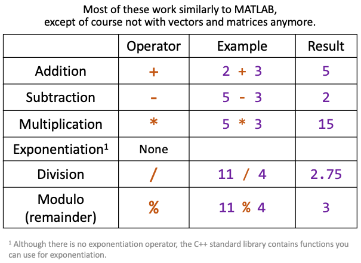
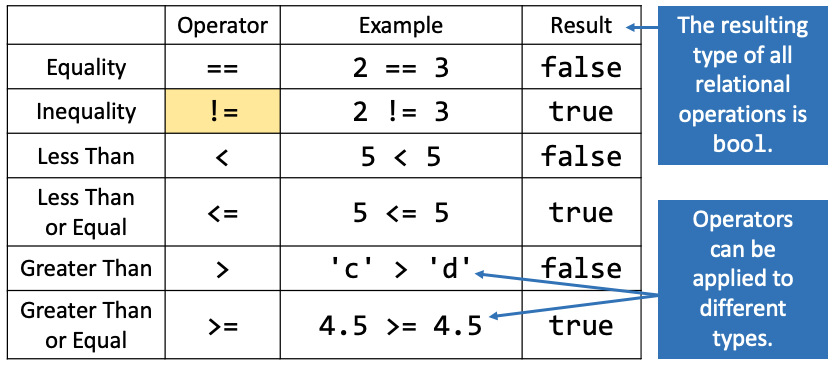
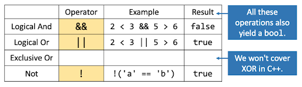
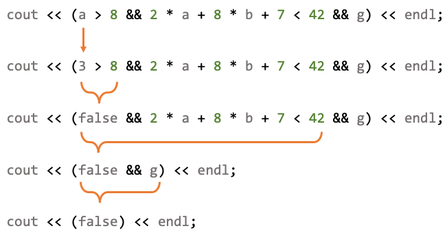
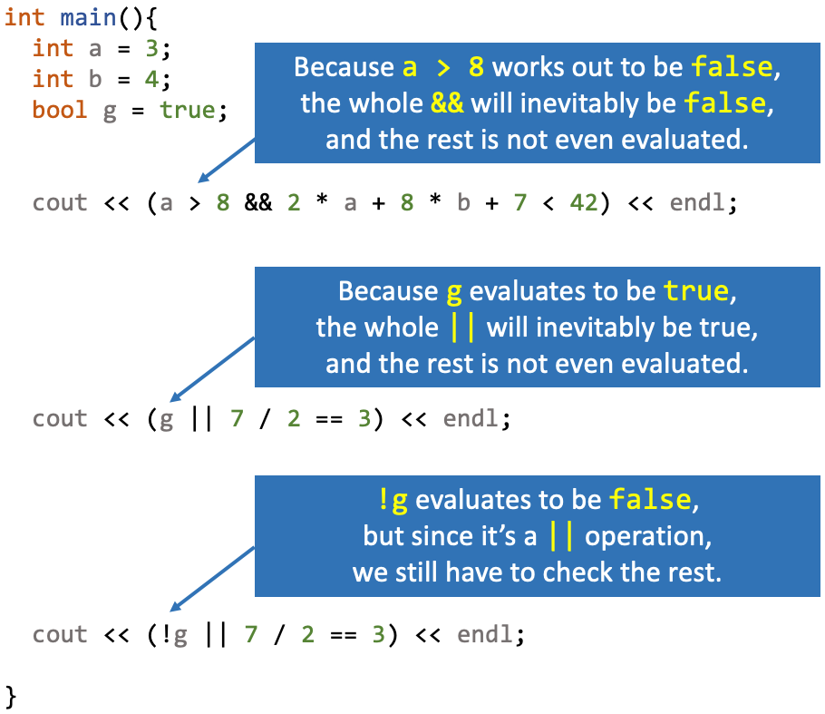

.. qnum::
   :prefix: Q
   :start: 1

.. include:: ../include/common.in.rst
.. include:: ../include/lobster.in.rst

.. raw:: html

   

=============================
More C++ Basics and Branching
=============================

^^^^^^^^^^^^
Introduction
^^^^^^^^^^^^
.. section 1

In this chapter, we'll take a look at a few more fundamental details of C++, including types and type conversions, integer vs. floating point division, and boolean operations. Finally, we'll begin to dive into control flow in C++ with branching, followed up by iteration next chapter.

-------
Lobster
-------

.. raw:: html

  

   <table><tbody>
      <tr>
         <td style="width:175px; text-align: center">
            
         </td>
         <td>
            For C++, we'll use a web-based program visualization tool called "Lobster". Lobster allows you to write and run C++ code in your web browser, including for your Runestone exercises in this and future chapters. Once you've written the code, you can click the "Simulate" button, and Lobster will show you line-by-line what is going on so that you can get a better feel for what your code actually does. Lobster can also track checkpoints as you work through exercsies and analyze your code to help you spot common bugs.
         </td>
      </tr>
   </tbody></table>
  

|

Let's take a closer look at the interface for Lobster and how you can use it to step through your code line-by-line.

.. youtube:: bvKhl8iPc7I
   :divid: ch12_01_vid_lobster
   :height: 315
   :width: 560
   :align: center

|

Here's the Lobster example we just went through in the video. You don't have to do anything with it, but you're welcome to play around with it if you like.

.. raw:: html

   

      
ch12_01_ex

   

^^^^^^^^^^^^
Introduction
^^^^^^^^^^^^
.. section 2

In the last chapter, we talked about how different variables can have different types. Sometimes you can "mix types" and one type will be converted into the other type. But what are the rules for this conversion? Let's do a short *inductive learning* experiment; inductive learning is when you run an experiment, observe what happens, and determine the patterns or rules based on your observations.

Use the Lobster simulation to step through the following code, which contains several **implicit conversions** between variable types allowed by C++. An implicit conversion occurs when a value of one type is converted by the compiler into a different type. (An explicit type conversion occurs when you, the programmer, write an expression to convert data from one type to another type.) When an implicit conversion is about to occur, Lobster will show a pink box around the value being converted. Take note of how the conversions might affect the data itself as it is copied from one variable to another.

.. raw:: html

   

      
ch12_02_ex

   

Based on the simulation and your observations, answer these questions.

.. shortanswer:: ch12_02_ex_implicit_conversions_01

  Describe some of the conversions that you saw.

.. shortanswer:: ch12_02_ex_implicit_conversions_02

  Based on your observations, what do you think are the rules C++ follows at runtime to convert one type to another? 

.. admonition:: Walkthrough

  .. reveal:: ch12_02_revealwt_implicit_conversions
  
    .. youtube:: 16emLHkdSV8
      :divid: ch12_02_wt_implicit_conversions
      :height: 315
      :width: 560
      :align: center

|

^^^^^^^^^^^^^^^^^^^^^^^^^
Implicit Type Conversions
^^^^^^^^^^^^^^^^^^^^^^^^^
.. section 3

Here's a few more details about the conversions we saw earlier:

:code:`int` to :code:`double`

Because a :code:`double` can always hold any integer value, we call this a **widening conversion** - that is, a :code:`double` is a "wider" data type than an :code:`int`, because there is a possible :code:`double` representation for every :code:`int`, plus more. Since there's no information loss (think of it as just adding a :code:`.0`), this conversion and other widening conversions are generally considered safe.

|

:code:`double` to :code:`int`

In this direction, the value is **truncated** and only the integer part of the number is retained (the fractional part can't possibly fit in an :code:`int` variable!). For similar reasons to above, this is called a **narrowing conversion**. Because the truncation involves a loss of information, these conversions can lead to bugs! (Think back to the temperature converter program from the previous chapter, where the input temperature would randomly lose its fractional part if stored in an :code:`int` variable.)

|

:code:`bool` to :code:`int`/:code:`double`

Basically, :code:`false` turns into :code:`0` and :code:`true` turns into :code:`1`.

|

:code:`int`/:code:`double` to :code:`bool`

This direction is a little more subtle. The easiest way to remember is that *only* a zero value will convert to :code:`false`. Everything else, even negative numbers, turns into :code:`true`.

|

^^^^^^^^^^^^^^^^^^^^
Arithmetic Operators
^^^^^^^^^^^^^^^^^^^^
.. section 4

Here's the basic math operators available in C++:

   ..

.. note::

   Since C++ doesn't have built-in vectors or matrices like MATLAB, there's no more "dot operators" to do element-by-element operations. Make sure you use just :code:`*` or :code:`/`. But don't worry, if you accidentally type :code:`.*` out of MATLAB-habit, the compiler will give you an error, and you'll know where to go to fix your error!

|

--------------------------------------------
Floating Point Division vs. Integer Division
--------------------------------------------

We often see two kinds of division in programming:

1. floating point division
2. integer division

**Floating point division** is what we typically think of when we think about division. For example, if we say, "*11 divided by 4 equals 2.75*" then we're talking about floating point division. We might expect to simply use the :code:`/` operator to get the exact quotient (and there is no remainder left over).

**Integer division** is what you may have done when you were younger, before you learned about fractions and decimal numbers. For example, if we say, "*11 divided by 4 yields a quotient of 2, with remainder 3*" then we're talking about integer division. In this case, we might like the :code:`/` operator to get the whole number quotient, and then use the :code:`%` operator if we need to get the remainder.

That's sort of how it works, but in C++, the kind of division depends on the *type of the operands* you give to the :code:`/` operator. Simulate this code and watch to see where you get floating point division and where you get integer division, then answer the questions below.

.. raw:: html

   

      
ch12_04_ex

   

.. shortanswer:: ch12_04_ex_division_01

   Where, and why, do you get floating point division?

.. shortanswer:: ch12_04_ex_division_02

  Where, and why, do you get integer division?

.. admonition:: Walkthrough

  .. reveal:: ch12_04_revealwt_division
  
    .. youtube:: ruDKJrC8_tQ
      :divid: ch12_04_wt_division
      :height: 315
      :width: 560
      :align: center

|

.. admonition:: Common Pattern

   Remember the problem we had with integer division in the temperature converter problem?

   .. code-block:: cpp
   
      // this expression has integer division :( 
      double f = 9 / 5 * c + 32; 

   To avoid this hard-to-find bug, add :code:`.0` or even just :code:`.` to the numeric literals to ensure we get floating point division instead of integer division:

   .. code-block:: cpp

      // this expression has floating point division -- yay!
      double f = 9.0 / 5. * c + 32; 

.. shortanswer:: ch12_04_ex_division_03

   What is the result of the C++ expression :code:`50 / 6`?

.. shortanswer:: ch12_04_ex_division_04

   What is the result of the C++ expression :code:`50 % 6`?
  
.. shortanswer:: ch12_04_ex_division_05

   What is the result of the C++ expression :code:`1 / 2`?

.. shortanswer:: ch12_04_ex_division_06

   What is the result of the C++ expression :code:`1 % 2`?

-------------------
Exercise: Stopwatch
-------------------

So, if integer division can cause us so much trouble, why would we ever want to do it? Why would we work with the quotient and remainder separately?

Well, here's an example: you're writing code for a stopwatch app, but the hardware only reports time in seconds. You want to display this in minutes/seconds instead. Therefore, you need to write a program that converts :code:`x` total seconds to :code:`m` minutes and :code:`s` seconds. Let's use this algorithm:

1. Store the total number of seconds in the variable :code:`x`.
2. Use integer division to divide :code:`x` by :code:`60` (60 seconds in a minute) to get the number of whole minutes elapsed; store the number of whole minutes in the variable :code:`m`.
3. Use the modulo operator :code:`%` to get the remainder when :code:`x` is divided by :code:`60`. These are the seconds leftover and not accounted for in the number of minutes :code:`m`. Store the remaining seconds in the variable :code:`s`.

Here is the implementation of this algorithm in C++:

.. code-block:: cpp

   int main() {
      int x = 153; // total seconds
      int m = x / 60; // minutes
      int s = x % 60; // leftover seconds
   }

Now, it's your turn! Continue the stopwatch example, but extend it to hours, minutes, and seconds. For example, if the hardware reported :code:`3753` seconds, your program should convert this to :code:`1` hour, :code:`2` minutes, and :code:`33` seconds.

This is a little tricky, be creative!

.. raw:: html

   

      
ch12_04_ex_stopwatch

      

         Well done! The secret word is "waffle".
      

   

.. fillintheblank:: ch12_04_ex_stopwatch
  :casei:

  Complete the Lobster exercise to reveal the *secret word*. Enter it here.
  
  |blank|

  - :waffle: Correct.
    :x: Incorrect. If you finished the exercise, please double check your spelling.

.. admonition:: Walkthrough

  .. reveal:: ch12_04_revealwt_stopwatch
  
    .. youtube:: IKVUdrAGZr4
      :divid: ch12_04_wt_stopwatch
      :height: 315
      :width: 560
      :align: center

|

^^^^^^^^^^^^^^^^^^^^^^^^^^^^^^^^^
Relational and Logical Operations
^^^^^^^^^^^^^^^^^^^^^^^^^^^^^^^^^
.. section 5

Just like in MATLAB, relational operations check for equality or perform comparisons. One big difference is that the true/false data type in C++ is called "boolean" (a term named after logician George Boole) rather than "logical". 

Below is a table of relational operators in C++; those operators with different symbols than in MATLAB are highlighted.

   ..

Also just like in MATLAB, logical operators combine two truth values in a particular way. Below is a table of logical operators in C++; those operators with different symbols than in MATLAB are highlighted.

   ..

.. note::

   C++ also includes "bitwise operators", which are :code:`&`, :code:`|`, :code:`~`, and :code:`^`. These manipulate the binary representation of data, and we won't use them for 101, but be careful not to get the bitwise :code:`&` and :code:`|` mixed up with the regular logical :code:`&&` and :code:`||`.

Below are some examples of using relational and logical operators in C++. First, work through each :code:`cout` statement by hand and try to predict the output, recording your answer in the box below. (Note that by default a boolean will print to :code:`cout` as :code:`1` or :code:`0` rather than true/false.) Then, simulate the code to check your answers against the Lobster visualization.

.. raw:: html

   

      
ch12_05_ex

   

.. shortanswer:: ch12_05_ex_logical

   Predict the output of each of the statements in the code above.

.. admonition:: Heads Up!

   In most cases, you should not use the :code:`==` or :code:`!=` operators to compare floating point numbers (the :code:`double` type). The basic reason is that computations with these numbers have a limited amount of precision, such that two :code:`double` values might not be exactly equal anymore after accumulating a bit of roundoff error. A better technique is to check whether two numbers are sufficiently close to each other, and we'll come back to this in a future chapter to write a function that compares doubles in this way.

|

------------------------
Short-Circuit Evaluation
------------------------

Did you notice anything peculiar about the way some :code:`&&` and :code:`||` expressions are visualized in Lobster in the previous question? Some of the expressions were "short-circuited" and not fully evaluated if their result could be determined early on. How is this possible? Consider the very complicated expression below. Once we find an early :code:`false` value, the right-hand side of the :code:`&&` operation doesn't really matter anymore - the whole thing is going to be :code:`false` now no matter what else happens.

   ..

|

This is an example of short circuit behavior. The :code:`&&` and :code:`||` operators both have short-circuit behavior. If the result of the expression can be determined just from the left side of the operator, the right side is not evaluated at all. Here are a few more examples:

   ..

^^^^^^^^^^^^^^^^^^^^^^^^^^^^^^^^^^^^
Branching with :code:`if` Statements
^^^^^^^^^^^^^^^^^^^^^^^^^^^^^^^^^^^^
.. section 6

We can use the :code:`if` control flow structure to specify parts of our code that we want to run only *if* some condition is true. Let's take a look...

.. youtube:: yqlgptx8Le8
  :divid: ch12_06_vid_if_statements
  :height: 315
  :width: 560
  :align: center

|

To recap, here's the general syntax for an :code:`if` statement:

.. code-block:: cpp

   if ( condition ) {
     statement1;
     statement2;
     statement3;
     ...
   }

The condition may be any expression that can be interpreted as a boolean. The "body" of the :code:`if` may contain any number of statements, surrounded by curly braces, and these statements will only run if the given condition turns out to be true.

-----
Scope
-----

Before we get carried away with more complex programs, we need to start thinking about the relationship between variables and *scopes* in our programs. Essentially, we are only allowed to use a variable inside of the scope in which it is declared, and this gets a bit more complicated once we start using control flow structures.

.. youtube:: NE6H6OZKkCo
  :divid: ch12_06_vid_scope
  :height: 315
  :width: 560
  :align: center

|

To recap, a variable can only be used after it's been declared, and while it's in scope. Many variables have **local scope** (or **block scope**, where a **block** is a chunk of code enclosed by curly braces :code:`{}`).

-----------------------------------
Two-way Branching With :code:`else` 
-----------------------------------

The natural counterpart to :code:`if` is :code:`else`:

.. youtube:: TqF9xgcjoQ0
  :divid: ch12_06_vid_else
  :height: 315
  :width: 560
  :align: center

|

-----------------------------------------------
Nested :code:`if` Statements and Decision Trees
-----------------------------------------------

Finally, we can make some pretty complex structures by combining multiple :code:`if`/:code:`else` statements together.

.. youtube:: 7buBYvX9wMM
  :divid: ch12_06_vid_decision_trees
  :height: 315
  :width: 560
  :align: center

|

If we want to split into multiple branches, we can use the :code:`else if` pattern. The structure of an :code:`if/else` statement can be modeled using a **decision tree**.

^^^^^^^^^^^^^^^^^^^^^^^^^^^^^^^^^^^^^^^^^^^^^^^^^^^^^^^
Summary
^^^^^^^^^^^^^^^^^^^^^^^^^^^^^^^^^^^^^^^^^^^^^^^^^^^^^^^

This is the end of the chapter! Here is a summary of what we covered in this chapter: 

* An **implicit conversion** happens when a value of one data type is converted by the compiler into a different type. (By contrast, an **explicit conversion** is a type conversion written by the programmer.)
* Converting :code:`int` to :code:`double` is a **widening conversion** with no information loss. Converting :code:`double` to :code:`int` is a **narrowing conversion** where the value is **truncated**.
* When converting from :code:`bool` to :code:`int` or :code:`double`, :code:`false` turns into :code:`0` and :code:`true` turns into :code:`1`. When converting the other direction, only :code:`0` converts to :code:`false`; everything else converts to :code:`true`.
* Basic arithmetic operators in C++ are addition, subtraction, multiplication, division, and modulo.
* **Floating point division** gives us the exact quotient. **Integer division** gives us the whole number quotient (we can use :code:`%` to get the remainder). Which kind of division is used depends on the data types of the operands.
* Basic relational operators include equality, inequality, less than, less than or equal, greater than, and greater than or equal. Logical operators include logical and, logical or, and not.
* :code:`&&` and :code:`||` are evaluated with **short-circuit evaluation**. This means that their result is not fully evaluated if the result can be determined early on.
* :code:`if`, :code:`else`, and :code:`else if` statements can be used for branching. These statements can be modeled using a **decision tree**.
* Variables can only be used in the **scope** in which they are declared. Many variables have **local scope** (or **block scope**).

You can double check that you have completed everything on the "Assignments" page. Click the icon that looks like a person, go to "Assignments", select the chapter, and make sure to scroll all the way to the bottom and click the "Score Me" button.
