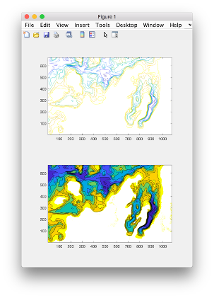
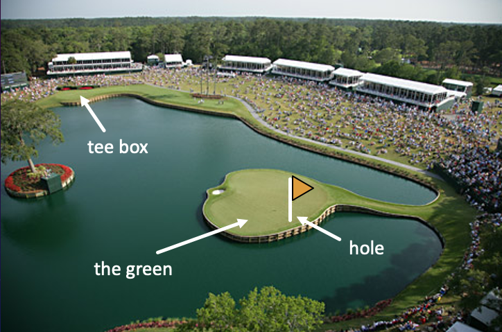
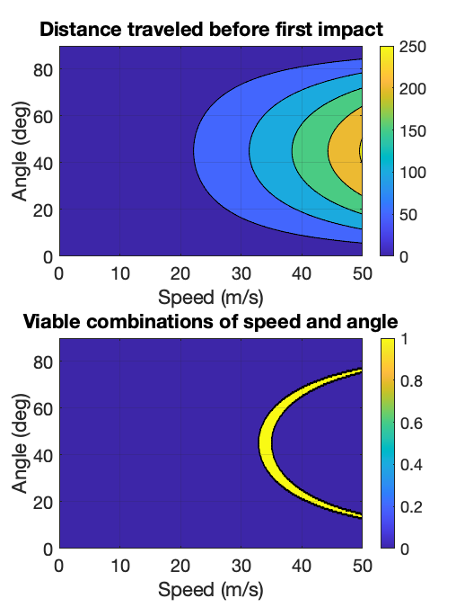

.. qnum::
   :prefix: Q
   :start: 1

.. raw:: html

<<<<<<< HEAD
   <link rel="stylesheet" href="../_static/common/css/matlab.css">
   
   
=======
   
>>>>>>> master

========================================
Advanced Plotting and Data Visualization
========================================

.. admonition:: Chapter Files

  We'll be using several files throughout this chapter's exercises. It might be helpful to go ahead and download each of them now and move them to your current folder in MATLAB. (It's also a good idea to go ahead and create a new folder for this chapter and use that as your current folder, so that you don't clutter up whatever else you were working on.)

  .. list-table:: 
    :align: left
    :widths: auto
    
    * - :download:`Demo.m <../_static/data_visualization/Demo.m>`

      - .. reveal:: Demo_m_preview
          :showtitle: Preview
          :modal:
          :modaltitle: <code>Demo.m</code>

          .. literalinclude:: ../_static/data_visualization/Demo.m
            :language: matlab

      - Demo script walking through some example 3D plots

    * - :download:`bathymetryData.mat <../_static/data_visualization/bathymetryData.mat>`

      - .. reveal:: bathymetryData_mat_preview
          :showtitle: Preview
          :modal:
          :modaltitle: <code>bathymetryData.mat</code>

          No preview available

      - MATLAB saved workspace containing variables with bathymetry data (bathymetry is the depth of water in rivers, lakes, oceans)

    * - :download:`UpNorth.m <../_static/data_visualization/UpNorth.m>`

      - .. reveal:: UpNorth_m_preview
          :showtitle: Preview
          :modal:
          :modaltitle: <code>UpNorth.m</code>

          .. literalinclude:: ../_static/data_visualization/UpNorth.m
            :language: matlab

      - Starter file for comparing contour plots of bathymetry data

    * - :download:`LandOnGreen.m <../_static/data_visualization/LandOnGreen.m>`

      - .. reveal:: LandOnGreen_m_preview
          :showtitle: Preview
          :modal:
          :modaltitle: <code>LandOnGreen.m</code>

          .. literalinclude:: ../_static/data_visualization/LandOnGreen.m
            :language: matlab

      - Starter file for determining how best to hit a golf ball so that it lands on the green

    * - :download:`dist2green.m <../_static/data_visualization/dist2green.m>`

      - .. reveal:: dist2green_m_preview
          :showtitle: Preview
          :modal:
          :modaltitle: <code>dist2green.m</code>

          .. literalinclude:: ../_static/data_visualization/dist2green.m
            :language: matlab

      - Starter file for calculating distance from a tee box to the green; helper function for the :code:`LandOnGreen.m` script
    
  .. reveal:: data_visualization_download_instructions
    :showtitle: Download Instructions
    :modal:
    :modaltitle: File Download Instructions for MATLAB
    
    .. include:: ../common/matlab_download_instructions.in.rst
      

^^^^^^^^^^^^
Introduction
^^^^^^^^^^^^
.. section 1

In this chapter, we will dive deeper into data visualization and learn how to use MATLAB to plot in a three-dimensional space.

In Lab 3, we used three dimensional arrays to represent images with rows, columns, and layers. We can represent all sorts of datasets in 3D space as a set of (x,y,z) values. When we use 3D arrays to hold data for spatial coordinates, trends, or maps, it is useful to visualize the data we are using in order to understand and communicate what we're working with.

^^^^^^^^^^^^^^^^^^^^^^^^^^^^^^^^^
3D Plotting Using Vectors of Data
^^^^^^^^^^^^^^^^^^^^^^^^^^^^^^^^^
.. section 2

Let's look at two useful MATLAB functions for simple plots of 3D data. This video goes through :code:`Demo.m`, which you can download from the Chapter Files at the top, in order to follow along and reference.

.. youtube:: YjeF1h6Ravs
  :divid: ch09_02_vid_plotting_3d_vectors
  :height: 315
  :width: 560
  :align: center

|

To recap, :code:`plot3` and :code:`scatter3` can be used to make 3D plots.

- :code:`plot3` - works analogously to its regular 2D counterpart :code:`plot`; :code:`plot3` uses three vectors for x, y, and z data
- :code:`scatter3` -- works analogously to its regular 2D counterpart :code:`scatter`; :code:`scatter3` uses three vectors for x, y, and z data

-----------------------------
Exercise: Plotting 3D Vectors
-----------------------------

.. shortanswer:: ch09_02_ex_plotting_3d_vectors

  Consider the equation:

  .. math::

    z = x + x * sin(\frac{y}{50})

  How could we plot this in MATLAB? We know that MATLAB does't plot math functions, only data points. Open MATLAB and create the variables :code:`x` and :code:`y` where:

  - :code:`x` is a vector containing the values from :code:`0.5` to :code:`200` in steps of :code:`0.5`
  - :code:`y` is a vector containing the values from :code:`1` to :code:`800` in steps of :code:`2`

  Create the vectors described and then calculate the vector of values :code:`z` using the equation above. Plot :code:`x`, :code:`y`, and :code:`z` using :code:`scatter3` and :code:`plot3`. Which of the two functions do you think is  most appropriate for use with this data? Why?

.. mchoice:: ch09_02_ex_plot_choice_01
  :answer_a: scatter3
  :answer_b: plot3
  :correct: a
  :feedback_a: Correct! A scatter plot is more appropriate here because the data contains individual discrete measurements.
  :feedback_b: Incorrect. A scatter plot is more appropriate here because the data contains individual discrete measurements.

  Which 3D plotting function would be the most appropriate to display this data:

    *Reaction times, age, and height of a population*
    
.. mchoice:: ch09_02_ex_plot_choice_02
  :answer_a: scatter3
  :answer_b: plot3
  :correct: b
  :feedback_a: Incorrect. A line plot is more appropriate because there are one or more variables dependent on a continuously changing variable.
  :feedback_b: Correct! A line plot is more appropriate because there are one or more variables dependent on a continuously changing variable.

  Which 3D plotting function would be the most appropriate to display this data:

    *Driver tiredness and distance from base as time progresses during a delivery truck's route*
    
.. mchoice:: ch09_02_ex_plot_choice_03
  :answer_a: scatter3
  :answer_b: plot3
  :correct: b
  :feedback_a: Incorrect. A line plot is more appropriate because there are one or more variables dependent on a continuously changing variable.
  :feedback_b: Correct! A line plot is more appropriate because there are one or more variables dependent on a continuously changing variable.

  Which 3D plotting function would be the most appropriate to display this data:

    *A butterfly's flight pattern over a minute*
    
.. mchoice:: ch09_02_ex_plot_choice_04
  :answer_a: scatter3
  :answer_b: plot3
  :correct: a
  :feedback_a: Correct! A scatterplot is more appropriate here because the data contains individual discrete measurements.
  :feedback_b: Incorrect. A scatterplot is more appropriate here because the data contains individual discrete measurements.

  Which 3D plotting function would be the most appropriate to display this data:

    *The heights and weights and birth months of 300 ducks less than 1 year old.*

.. admonition:: Walkthrough

  .. reveal:: ch09_02_revealwt_plot_choice
  
    .. youtube:: MSGAU-5sPq8
      :divid: ch07_02_wt_plot_choice
      :height: 315
      :width: 560
      :align: center

^^^^^^^^^^^^^^^^^^^^^^^^^^^^^
The :code:`meshgrid` Function
^^^^^^^^^^^^^^^^^^^^^^^^^^^^^
.. section 3

The previous exercise used vectors to plot a solution to the equation: 

.. math::

  z = x + x * sin(\frac{y}{50})

But these vectors gave us only one line (or set of markers if you used :code:`scatter3`). This math equation actually states that :code:`z` is a function of :code:`x` and :code:`y` for all possible combinations of the values for :code:`x` and :code:`y`. This means that :code:`z` is a surface that is defined by this equation… and right now all we have is one "slice" of that surface: the particular combination of :code:`x` and :code:`y` coordinates in our vectors. To fully represent the surface defined by the equation,

.. math::

  Z = X + X * sin(\frac{Y}{50})

we will need to calculate an array for :code:`Z` that contains all the possible combinations of :code:`X` and :code:`Y` coordinates. In other words, we need matrices not vectors. 

MATLAB has a built-in function called :code:`meshgrid()` that will convert our vectors :code:`x` and :code:`y` into their corresponding matrices :code:`X` and :code:`Y` so that we can properly visualize our math equation. Watch the video below to see how :code:`meshgrid()` works. 

.. youtube:: L3ydtLFKiwE
  :divid: ch09_03_vid_meshgrid
  :height: 315
  :width: 560
  :align: center

|

As shown in the video, the :code:`meshgrid` function takes two vectors as inputs and returns two matrices, one where each row is a copy of the first input, and another where each column is a copy of the second input. For example:

.. code-block:: matlab

  x = -2:1:2;
  y = -2:1:2;
  [X, Y] = meshgrid(x,y);

-------------------------------------
Exercise: :code:`meshgrid()` Practice
-------------------------------------

.. mchoice:: ch09_03_ex_meshgrid_01
  :answer_a: Z = A + B
  :answer_b: Z = 3 .* A
  :answer_c: Z = A .* B
  :answer_d: Z = b .* a
  :correct: c
  :feedback_a: Oops! Try out this code in MATLAB, or sketch out the matrices on a piece of paper.
  :feedback_b: Oops! Try out this code in MATLAB, or sketch out the matrices on a piece of paper.
  :feedback_c: Correct!
  :feedback_d: Oops! Try out this code in MATLAB, or sketch out the matrices on a piece of paper.

  Assume the following code has been run:

  .. code-block:: matlab

    a = [1 2 3 4];
    b = [4 3 2 1];
    [A, B] = meshgrid(a, b);

  Which of the following computes the value of Z to be:
  
  .. raw:: html

      

        

        <table><tbody>
          <tr>
            <td>
              

                Z = [4 8 12 16; 3 6 9 12; 2 4 6 8; 1 2 3 4];
                Z;
              

            </td>
          </tr>
        </tbody></table>
        

         
      

.. mchoice:: ch09_03_ex_meshgrid_02
  :answer_a: Z = 2 + D .* F
  :answer_b: Z = F ./ D
  :answer_c: Z = f .* d
  :answer_d: Z = D .* F
  :correct: b
  :feedback_a: Oops! Try out this code in MATLAB, or sketch out the matrices on a piece of paper.
  :feedback_b: Correct!
  :feedback_c: Oops! Try out this code in MATLAB, or sketch out the matrices on a piece of paper.
  :feedback_d: Oops! Try out this code in MATLAB, or sketch out the matrices on a piece of paper.

  Assume the following code has been run:

  .. code-block:: matlab

    f = [9 9 9];
    d = [1 3 6];
    [F, D] = meshgrid(f, d);

  Which of the following computes the value of Z to be:
  
  .. raw:: html

      

        

        <table><tbody>
          <tr>
            <td>
              

                Z = [9 9 9; 3 3 3; 1.5 1.5 1.5];
                Z;
              

            </td>
          </tr>
        </tbody></table>
        

         
      

.. mchoice:: ch09_03_ex_meshgrid_03
  :answer_a: Z = X - 2 .* Y
  :answer_b: Z = X - Y
  :answer_c: Z = x .* y
  :answer_d: Z = x ./ y
  :correct: a
  :feedback_a: Correct!
  :feedback_b: Oops! Try out this code in MATLAB, or sketch out the matrices on a piece of paper.
  :feedback_c: Oops! Try out this code in MATLAB, or sketch out the matrices on a piece of paper.
  :feedback_d: Oops! Try out this code in MATLAB, or sketch out the matrices on a piece of paper.

  Assume the following code has been run:

  .. code-block:: matlab

    x = [1 2];
    y = [0 1];
    [X,Y] = meshgrid(x,y);

  Which of the following computes the value of Z to be:
  
  .. raw:: html

      

        

        <table><tbody>
          <tr>
            <td>
              

                Z = [1 2; -1 0];
                Z;
              

            </td>
          </tr>
        </tbody></table>
        

         
      

.. admonition:: Walkthrough

  .. reveal:: ch09_03_revealwt_meshgrid
  
    .. youtube:: vjqqTu_4GXE
      :divid: ch07_03_wt_meshgrid
      :height: 315
      :width: 560
      :align: center

^^^^^^^^^^^^^^^^^^^^^^^^^
3D Surface and Mesh Plots
^^^^^^^^^^^^^^^^^^^^^^^^^
.. section 4

Once you have data in matrix form, you can create 3D surface and mesh plots in MATLAB. Watch the video below to see how to do this.

.. youtube:: wZFqJ5bJoZY
  :divid: ch09_04_vid_surface_and_mesh_plots
  :height: 315
  :width: 560
  :align: center

|

As we've seen, we can use the :code:`surf` function with three matrices to create a surface plot. We can use the :code:`mesh` function with three matrices to create a mesh plot.

--------------------------------
Exercise: Surface and Mesh Plots
--------------------------------

.. shortanswer:: ch09_04_ex_surface_and_mesh_plots_01

  Copy the starter code below into MATLAB and complete the missing portions (indicated by the :code:`% TODO` comments) so that the code produces the graph shown below. (Please note that you do not need to figure out the math "equation" that produces the 3D graph - this is already given in the starter code. You just need to do the meshgrid and plotting portions.)

  .. code-block:: matlab

    a = [1:10];
    b = [1:50];

    % TODO use meshgrid to create the matrices A and B

    Z = cos(B ./ 2) + 2 .* sin(A);

    % TODO plot the surface Z as a function of A and B

  .. figure:: img/SurfFig.png
    :width: 300
    :align: center

    ..

  Paste your finished code into the box.

.. shortanswer:: ch09_04_ex_surface_and_mesh_plots_02

  Copy the starter code below into MATLAB and complete the missing portions (indicated by the :code:`% TODO` comments) so that the code produces the graph shown below. (Please note that you do not need to figure out the math "equation" that produces the 3D graph - this is already given in the starter code. You just need to do the meshgrid and plotting portions.)

  .. code-block:: matlab

    q = [0:12];
    w = [1:15];

    % TODO use meshgrid to create the matrices Q and W

    F = Q .^ 2 + W .^ 0.2 + 5;

    % TODO plot the surface F as a function of Q and W

  .. figure:: img/MeshFig.png
    :width: 300
    :align: center

    ..

  Paste your finished code into the box. 

^^^^^^^^^^^^^
Contour Plots
^^^^^^^^^^^^^
.. section 5

MATLAB also has two helpful plotting functions to create contour maps. Watch the video below to learn about these functions.

.. youtube:: dPSrG2lhsa8
  :divid: ch09_05_vid_contour_maps
  :height: 315
  :width: 560
  :align: center

|

As we saw, :code:`contour` is used to create contour plots, and :code:`contourf` is used to create *filled* contour plots.

-----------------------
Exercise: Contour Plots
-----------------------

.. mchoice:: ch09_05_ex_contour_plots_01
  :answer_a:
  :answer_b:
  :answer_c:
  :correct: b
  :feedback_a: Try again.
  :feedback_b: Correct! This plot contains contour lines, but they are not filled (i.e. the "f" in "contourf").
  :feedback_c: Try again.

  Which of the following plots would NOT have been made with the :code:`contourf` function?

  .. list-table:: 
    :align: left
    :widths: 10 90

    * - A

      - .. figure:: img/contour1.jpg
          :width: 250
          :align: center

          ..

    * - B

      - .. figure:: img/contour2.jpg
          :width: 250
          :align: center

          ..

    * - C

      - .. figure:: img/contour3.jpg
          :width: 250
          :align: center

          ..

.. mchoice:: ch09_05_ex_contour_plots_02
  :answer_a: A 3D curve of the function Z = sin(X) + cos(Y);
  :answer_b: Population density of neighborhoods in the Detroit metro area
  :answer_c: The elevations of an area of hiking trails in the Rocky Mountains
  :answer_d: The temperatures across the United States
  :correct: b,c,d
  :feedback_a: Not this one. A countour plot can't show a curve in 3D.
  :feedback_b: Correct!
  :feedback_c: Correct!
  :feedback_d: Correct!

  Select all of the datasets that would be displayed well in a contour plot.

^^^^^^^^^^^^^^^^^^^^^^^^^^^^^^^^^^^^^^^
Application: Comparing Bathymetry Plots
^^^^^^^^^^^^^^^^^^^^^^^^^^^^^^^^^^^^^^^
.. section 7

This exercise uses the following files.

- :file:`bathymetryData.mat`
- :file:`UpNorth.m`

Please ensure you have downloaded these exercise files (see the chapter files box at the beginning of this chapter) and placed them in your current MATLAB folder.

.. tip::
    The following exercise uses the :code:`subplot` function. If you need a review on how subplots work, please refer back to Chapter 6.

Let's practice creating contour plots and using the subplot function. We will generate a figure that compares the two contour plots of the bathymetry data we used earlier. Open :file:`UpNorth.m` in MATLAB. We've provided an outline for your code, as well as initial code to read data from the :file:`bathymetryData.mat` file. Complete the :file:`UpNorth.m` script to plot both contour plots in the same figure, like this:

    ..

.. shortanswer:: ch09_07_ex_comparing_bathymetry_plots

  Copy and paste your finished :file:`UpNorth.m` script here.

.. admonition:: Walkthrough

  .. reveal:: ch09_07_revealwt_comparing_bathymetry_plots
  
    .. youtube:: JEzq5AsWDH8
      :divid: ch09_07_wt_comparing_bathymetry_plots
      :height: 315
      :width: 560
      :align: center

^^^^^^^^^^^^^^^^^^^^^^^^^^^^^^^^^^^^
Application: Optimizing a Golf Swing
^^^^^^^^^^^^^^^^^^^^^^^^^^^^^^^^^^^^
.. section 8

This exercise uses the following files.

- :file:`dist2green.m`
- :file:`LandOnGreen.m`

Please ensure you have downloaded these exercise files (see the chapter files box at the beginning of this chapter) and placed them in your current MATLAB folder.

Let's practice some more with creating contour plots and using the subplot function. This is the 17th hole at the TPC Sawgrass golf course.

    ..

It is 120 meters from the tee box to the hole on the island green.  But if you hit the ball in the water, you lose a stroke and have to hit again, so that's bad. We want to answer the question: **How fast** and at **what angle** should you hit the ball so it lands on the green instead of in the water?

This is an optimization problem. We want to check all possible combinations of "how fast" and "what angle" and find out which combinations put the ball on the green instead of in the water. Here is our algorithm for solving this optimization problem using computing: 

1. Write a function :code:`dist2green` that calculates the distance a golf ball will travel before it hits the ground. Use these two MATLAB versions of the projectile motion equations:

.. code-block:: matlab

  t = 2 .* speed .* sin(angle) ./ 9.8  % g = 9.8 m/s^2
  distance = speed .* cos(angle) .* t

2. Use :code:`meshgrid` to create matrices that correspond to the different speed and angle combinations. These should be saved in variables named :code:`V` and :code:`T`, respectively.
3. Calculate the distance traveled for each speed/angle combination by calling :code:`dist2green` and passing the matrices created by :code:`meshgrid`. This should be saved in a variable named :code:`distance`.
4. Make two plots to interpret your simulation:

   a. A contourf plot of speed, angle, and distance
   b. A contourf plot of the viable combinations of speed and angle 

Open :file:`LandOnGreen.m` in MATLAB. We've provided an outline for your code, as well as some initial code. Complete the :file:`LandOnGreen.m`  script to plot both contour plots in the same figure, like this:

    ..

.. admonition:: Pro Tip

  If the figure looks a bit distorted, you can resize it by grabbing a corner of the figure window and dragging it to resize the figure.

.. shortanswer:: ch09_08_ex_optimizing_a_golf_swing

  Copy and paste your finished :file:`LandOnGreen.m` script here.

.. admonition:: Walkthrough

  .. reveal:: ch09_08_revealwt_optimizing_a_golf_swing_01
  
    .. youtube:: RG_1DvV-Mjo
      :divid: ch09_08_wt_optimizing_a_golf_swing_01
      :height: 315
      :width: 560
      :align: center

|

Solving an optimization problem often gives you a range of "best" answers, not a single "best" answer. Sometimes, you need to apply your engineering expertise, or even just your good common sense, to select which "best answers" you should use. Watch the video below to see how to interpret the output of our "optimizing a golf swing" program. (Note: Walkthrough: Optimizing a Golf Swing (Part 1) is in the orange walkthrough box above this paragraph.)

.. youtube:: iNIE7gmetBs
  :divid: ch09_08_vid_optimizing_a_golf_swing_02
  :height: 315
  :width: 560
  :align: center

|

^^^^^^^^^^^^^^^^^^^^^^^^^^^^^^^^^^^^^^^^^^^^^^^^^^^^^^^
Summary
^^^^^^^^^^^^^^^^^^^^^^^^^^^^^^^^^^^^^^^^^^^^^^^^^^^^^^^

This is the end of the chapter! Here is a summary of what we covered in this chapter: 

* Use :code:`plot3` and :code:`scatter3` to make 3D line plots and scatter plots.
* The :code:`meshgrid` function takes two vectors as inputs and returns two matrices, one where each row is a copy of the first input, and another where each column is a copy of the second input.
* You can use the :code:`meshgrid` function to create a set of (x,y) coordinates that can be used as starter data for problems that have a range of possible values for two different variables. 
* Use :code:`surf` to create surface plots, and :code:`mesh` to create mesh plots.
* Use :code:`contour` to create contour plots, and :code:`contourf` to create filled contour plots.
* You can create visuals that compare different datasets using :code:`subplot`. 
* You can solve optimization problems by using MATLAB's ability to quickly simulate starter data and generate a range of solutions. You can investigate the range of solutions and pick the one that is the best (or most realistic) solution for your problem.

You can double check that you have completed everything on the "Assignments" page. Click the icon that looks like a person, go to "Assignments", select the chapter, and make sure to scroll all the way to the bottom and click the "Score Me" button.
