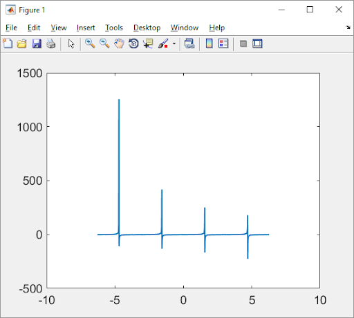
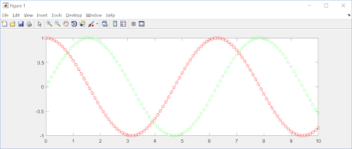
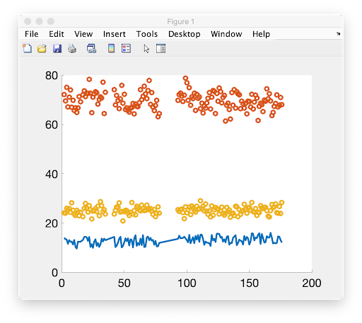
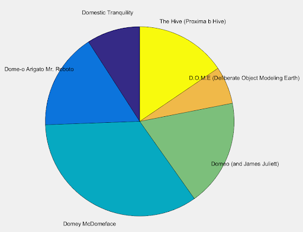
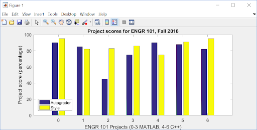

.. qnum::
   :prefix: Q
   :start: 1

.. raw:: html

   <link rel="stylesheet" href="../_static/common/css/matlab.css">
   

====================
Figures and Plotting
====================

^^^^^^^^^^^^
Introduction
^^^^^^^^^^^^
.. section 1

The following lecture material will allow you to use MATLAB to create and manipulate plots. The material covered will be

- using the scatter command
- using the plot command with vectors
- using the plot command to display functions
  - resolution of functions (choice for x-axis series)
  - customizing the display (what do you want to highlight)
  - displaying multiple sets of data on a single set of axes
- displaying grids
- customizing line plots
- the MATLAB way
  - input data, then plot the result
- plotting data from :file:`.csv` files
- MATLAB :code:`figure()` terminology
- multiple plots in one figure
- pie charts, bar charts
- good plotting habits
- plotting with scripts and functions

^^^^^^^^^^^^^^^^^^^^
Basic Plotting Setup
^^^^^^^^^^^^^^^^^^^^
.. section 2

------------------------
Introduction To Plotting
------------------------

MATLAB is designed for plotting. Given the following :code:`x` and :code:`y` vectors,

.. code-block:: matlab

  x = [1,2,3,4,5,6,7,8,9,10];
  y = [10,13,15,12,14,11,17,19,18,16];

one may generate a scatter plot with the following command

.. code-block:: matlab

  scatter(x,y);

and view the result immediately.

.. figure:: img/img1.png
  :width: 400
  :align: center

  **Figure 1.** Example output from :code:`scatter(x,y)`

What do you see?

- x axis begins at the lowest value of :code:`x` and ends at the greatest value
- y axis begins at the lowest value of :code:`y` and ends at the greatest value
- (x,y) pairs are displayed separately, that is, scattered. Note that scatter only works if the pair of vectors have the same number of elements.

An alternative display is given by :code:`plot(x,y)` below. Note that :code:`plot(x,y)` joins the points together in the order given by the separate pairs of data.

.. figure:: img/img2.png
  :width: 400
  :align: center

  **Figure 2.** Default output using :code:`plot(x,y)`. The solid line connects the (x,y) points in the order in which the (x,y) pairs are stored, that is, in increasing x-value.

.. mchoice:: ch03_02_ex_function_basics_02
  :answer_a: plot(x,y) is the same as when the x-series is ordered
  :answer_b: The plot automatically switches from a line plot to a scatter plot
  :answer_c: plot(x,y) appears to cross back over itself while scatter(x,y) does not change
  :answer_d: The plot switches axes to keep the plot a function
  :correct: c
  :feedback_a: Oops! Try running this in matlab- the plot is not the same. 
  :feedback_b: Oops! Unless you tell matlab to switch plotting styles it will not switch. 
  :feedback_c: Correct! Matlab plots in the order of the vector so having the series out of order will result in an odd looking graph. 
  :feedback_d: Oops! Matlab will not switch axes without any prompting.

  Consider the vectors :code:`x` and :code:`y`:

  .. code-block:: matlab

    x = [ 4, 7, 1, 5,10, 3, 8, 2, 9, 6];
    y = [12,17,10,14,16,15,19,13,18,11];

  What happens if the (x,y) pairs are randomly scattered in order but the pairings themselves remain the same? What will scatter(x,y)  look like -- try it and you will find that scatter hasn't changed at all. But what about plot(x,y)? (Consider trying it out in MATLAB if you're not sure!)

----------
Resolution
----------

MATLAB may be used to plot mathematical functions. Given the following vectorized code,

.. code-block:: matlab

  x = 0:10;
  y = sin(x);
  plot(x,y);

The display is shown in Figure 3. The resolution is coarse, but the display does represent the sinusoid. Why does it look so bad? 

.. figure:: img/img3.png
  :width: 400
  :align: center

  **Figure 3.** A coarse resolution display of :math:`sin(x)`.

To improve the resolution, simply add a higher density to the display by decreasing the step size. Do you remember how?

.. code-block:: matlab

 	x = 0:0.1:10;
 	y = sin(x);
 	plot(x,y);

.. figure:: img/img4.png
  :width: 400
  :align: center

  **Figure 4.** A higher resolution display of :math:`sin(x)`.

Let's plot something in MATLAB that will force an axis to approach the value Infinity, such as the tangent function. What is the purpose of the plot? Is it to highlight the full range of values along both x and y axes, or is it to highlight the behavior about a certain area of the function such as near y=0 ? The next two figures address both questions.

Try plotting the tangent function.

.. code-block:: matlab

 	x = -2.*pi: 0.01: 2.*pi;
 	y = tan(x);
 	plot(x,y);

  ..

Do not delete your figure (or close the figure window), but add the following lines of code:

.. code-block:: matlab

  xlim([-2.*pi, 2.*pi]);
  ylim([-10, 10]);

.. figure:: img/img5_2.png
  :width: 400
  :align: center

  **Figure 5.** (top) original display of :math:`tan(x)`. (bottom) Adjusting both the x and the y axes to highlight the function near :math:`(x, y) = (0, 0)`.

Without any information from the user, MATLAB software simply tries to force the appropriate axes ranges, as in the top figure, to display the entire function. Why does MATLAB show :math:`tan(x)` stopping before 1500, and why do the multiple peaks have different values? This is actually a deep question. The answer will become obvious if you display the (x,y) series and look for :code:`pi/2`, :code:`3pi/2`, etc. You will find that the x-coordinate for :code:`pi/2`, :code:`3pi/2`, etc are close but not quite the expected values due to the step size resolution of 0.01 unit. The :code:`tan(x)` values would be closer to :code:`pi/2` with a smaller step size.

Detail near the y=0 line is difficult to view. The two additional lines of code are used to restrict the display limits in both axes to just the region of interest. 

In many cases, grid lines are important in viewing and describing MATLAB graphical displays. Try the

  :code:`grid on`

command. The result is similar to the example shown below. More on customizing MATLAB plots later in the lecture. If you guessed that the command to turn off grid lines is

  :code:`grid off`

then congratulations - you are becoming a MATLAB expert.

.. figure:: img/img6.png
  :width: 400
  :align: center

  **Figure 6.** Adding a grid to a MATLAB figure is accomplished with the :code:`grid on` command.

------------------------------
Plotting Multiple Sets of Data
------------------------------

With MATLAB, it is possible to visualize multiple sets of data on a single display using either the scatter or the plot functions. For example, given the following vectorized code,

.. code-block:: matlab

  x = 0: 0.01: 10;
  plot(x, sin(x), x, cos(x), x, cos(x.^2));

where the x values are the same set for each of the three functions, MATLAB will produce the following plot.

.. figure:: img/img7.png
  :width: 400
  :align: center

  **Figure 7.** Multiple plots shown together using a single :code:`plot` command.

----------------------
Customizing Line Plots
----------------------

The :code:`help plot` command describes the many ways to customize a) the line types, b) the plot symbols, and c) the colors available within the MATLAB program. For example, the commands

.. code-block:: matlab

  x = 0: 0.01: 10;
  plot(x, sin(x), '--sg', x, cos(x), ':or') 

are interpreted as:

- a dashed (:code:`--`) line with square (:code:`s`) markers, colored (:code:`g`) green for sin(:code:`x`)
- a dotted (:code:`:`) line with circle (:code:`o`) markers, colored (:code:`r`) red for cos(:code:`x`)

  **Figure 8.** Customized plot of :math:`sin(x)` and :code:`cos(x)`.

^^^^^^^^^^^^^^^^^^^^^^^
Plotting with Data Sets
^^^^^^^^^^^^^^^^^^^^^^^
.. section 3

This section will describe how to employ MATLAB plots in your studies. This will be relevant when displaying results or data in other courses as well.

The order is

1. input data (for example, from a :code:`.csv` file)
2. extract data into columns
3. perform calculations
4. display data with MATLAB

.. youtube:: GR0vdq7DWig
  :divid: ch06_03_vid_csv_esp
  :height: 315
  :width: 560
  :align: center

.. figure:: img/img9.png
  :width: 400
  :align: center

  **Figure 9.** TODO

  **Figure 10.** TODO

  **Figure 11.** TODO

.. figure:: img/img12.png
  :width: 400
  :align: center

  **Figure 12.** TODO

  **Figure 13.** TODO

.. figure:: img/img14.png
  :width: 400
  :align: center

  **Figure 14.** TODO

  **Figure 15.** TODO

.. figure:: img/img16.png
  :width: 400
  :align: center

  **Figure 16.** TODO

.. figure:: img/img17.png
  :width: 400
  :align: center

  **Figure 17.** TODO

^^^^^^^^^^^^^^^^^^^^^^
Mean, Median, and Mode
^^^^^^^^^^^^^^^^^^^^^^
.. section 3

Three other common statistical measures of data are:

- **mean** - the average of the dataset
- **median** - the number that would appear in the middle if the numbers in the dataset were sorted in order
- **mode** - the most common number in the dataset

MATLAB has built-in functions to calculate each of these statistical measures:

- :code:`mean()` 
- :code:`median()` 
- :code:`mode()`

--------------
:code:`mean()`
--------------

The mean function returns the column-by-column mean of a matrix, similar to the sum function from Chapter 3. For example, if we had this matrix :code:`A`:

.. figure:: img/Mean_1.png
  :width: 250
  :align: center
  :alt: A is initialized with A = [2,3,4,3;4,2,3,3];

  ..

And we called :code:`mean(A)`, we would get a row vector that contains the mean values of each column of :code:`A`:

.. figure:: img/Mean_2.png
  :width: 250
  :align: center
  :alt: The result of calling mean(A) is [3, 2.5, 4, 3]

  ..

If you would instead like to work row-by-row and find the means of each row in your matrix, you may specify an additional argument of :code:`2` to specify the 2nd dimension (by rows). For example:

.. figure:: img/Mean_3.png
  :width: 400
  :align: center
  :alt: The result of calling mean(A, 2) is [3.25; 3]

  ..

.. admonition:: Heads Up!

  For a row vector, the mean function returns the mean of that row (rather than the mean of each column, which would be just the vector itself and wouldn't be very useful). This means that if you start with a vector, functions like :code:`mean()` will *always* return a single result.

Finally, if you want to get the mean of all the elements in a matrix, you have a few choices:

.. figure:: img/Mean_4.png
  :width: 400
  :align: center
  :alt: Three ways to compute the mean of all elements

  ..

- :code:`mean(mean(A))` - call the mean function twice in succession (means of columns, then the mean of those means)
- :code:`mean(A(:))` - select all the elements in A which creates a column vector; then compute the mean value of the column vector, giving you the mean value of the entire matrix
- :code:`mean(A, 'all')` - the 'all' option tells MATLAB to override the column-by-column default behavior and get all of the elements in A. **Due to circumstances beyond our control, the Engr 101 Autograder cannot handle this option, so please beware and do not use it in your projects!**

----------------
:code:`median()`
----------------

The :code:`median` function returns the median of a dataset, which is the value that would appear in the middle if the data were put into sorted order. If there is an even number of elements, the :code:`median` function averages the two elements in the middle of the sorted elements. It works with arrays in the same way as the mean function (i.e. column-by-column, selecting dimensions, etc.).

In the following example, the vector :code:`B` has 10 elements (an even number of elements). After the vector :code:`B` is sorted within the :code:`median()` function, the middle element is found. Since :code:`B` has an even number of elements, the function takes the two elements in the middle and finds the mean of those values (in this case, the mean of the values 5 and 6 is 5.5), and returns that mean value as the median value of vector :code:`B`.

.. figure:: img/Median_1.png
  :width: 450
  :align: center
  :alt: The median of the dataset [5,0,8,9,6,7,7,3,5,1] is 5.5.

  ..

.. admonition:: Danger!

  If you want to take the median of all elements in a matrix :code:`M`, don't use :code:`median(median(M))` - that's not correct because the median of the column medians is not mathematically equivalent to the median of the whole dataset. Instead, use either of the other approaches, :code:`median(M(:))` or :code:`median(M, 'all')`.

--------------
:code:`mode()`
--------------

The :code:`mode` function returns the value of the dataset that occurs most often. It works with arrays in the same way as the mean function (i.e. column-by-column, selecting dimensions, etc.).

In the following example, the vector :code:`X` has three elements with the value 8. The value 8 occurs the most times, so that is the mode for this vector:

.. figure:: img/Mode_1.png
  :width: 450
  :align: center
  :alt: The mode of the dataset [1,9,0,7,8,8,0,3,7,8] is 8.

  ..

If you use a compound return, you can also get the frequency of the mode value; the frequency is how many times the mode value occurred. Using our vector :code:`X`:

.. figure:: img/Mode_2.png
  :width: 450
  :align: center
  :alt: The mode of the dataset [1,9,0,7,8,8,0,3,7,8] is 8, which occurs 3 times.

  ..

.. admonition:: Danger!

  If you want to take the mode of all elements in a matrix :code:`M`, don't use :code:`mode(mode(M))` - that's not correct because the mode of the column modes is not mathematically equivalent to the mode of the whole dataset. Instead, use either of the other approaches, :code:`mode(M(:))` or :code:`mode(M, 'all')`.

----------------------------------
Exercise: City Latitude Statistics
----------------------------------

.. include:: ex/city_latitude_statistics.in.rst

.. admonition:: Walkthrough

  .. reveal:: ch07_03_revealwt_city_latitude_statistics
  
    .. youtube:: GR0vdq7DWig
      :divid: ch07_03_wt_city_latitude_statistics
      :height: 315
      :width: 560
      :align: center

^^^^^^^^^^
Histograms
^^^^^^^^^^
.. section 4

A histogram is a visualization of the frequency of occurrence for certain values in a dataset. Below is a histogram of the latitude of the world's most populous cities. This histogram was generated from the data in the :file:`cities.xlsx` file we used earlier.

.. figure:: img/Histogram_1.png
  :width: 450
  :align: center
  :alt: The mode of the dataset [1,9,0,7,8,8,0,3,7,8] is 8, which occurs 3 times.

  ..

This `Exploring Histograms <http://tinlizzie.org/histograms/>`__ website is a spectacular guide to histograms and how they are created. We highly recommend you read this guide before continuing on with the rest of this chapter (it's also a beautiful example of data visualization!).

MATLAB has two very useful functions for working with histograms: 

- :code:`histogram()` - creates a histogram of data by taking the dataset and sorting it into "bins"
- :code:`histcounts()` - gives you the number of elements belonging to each histogram bin

As the Exploring Histograms website shows, histograms are very sensitive to the size of the bins you use in your histograms. Watch this video to learn more about histograms, specifying bins, and getting "histcounts" in MATLAB. 

.. youtube:: kJhRNOtXtdU
  :divid: ch07_04_vid_histograms
  :height: 315
  :width: 560
  :align: center

----------------------------------
Exercise: City Longitude Histogram
----------------------------------

.. include:: ex/city_longitude_histogram.in.rst

.. admonition:: Walkthrough

  .. reveal:: ch07_04_revealwt_city_longitude_histogram
  
    .. youtube:: ZEN5PjRXrgE
      :divid: ch07_04_wt_city_longitude_histogram
      :height: 315
      :width: 560
      :align: center

^^^^^^^^^^^^^^^^^^^^^^^^^^^^^^^
Variance and Standard Deviation
^^^^^^^^^^^^^^^^^^^^^^^^^^^^^^^
.. section 5

The mean, median, and mode of a dataset are useful starting points for understanding the characteristics of a dataset, but they are single numbers that describe the average, middle, and most common values (the central tendencies) of the dataset. In engineering, we also need to accommodate the more unlikely values, which can often be much smaller or much larger relative to the mean, median, or mode.

Variance and standard deviation are measures in descriptive statistics that tell us how 'spread out' a dataset is. The standard deviation is just the square root of the variance. Here is a histogram (or *distribution*) of data that is more *narrow* - more of the data points are grouped around a central value (0 in this case):

.. figure:: img/VarStdDev_1.png
  :width: 450
  :align: center
  :alt: A histogram of a narrow distribution centered around 0 with a variance of 0.5537 and standard deviation of 0.7440.

  ..

Here is a histogram of data that is more *wide* - more of the data points are farther away from a central value (0 in this case): 

.. figure:: img/VarStdDev_2.png
  :width: 450
  :align: center
  :alt: A histogram of a wide distribution centered around 0 with a variance of 2.1975 and standard deviation of 1.4824.

  ..

The more narrow distribution's variance is smaller than the wider distribution's variance. Similarly, the more narrow distribution's standard deviation is smaller than the wider distribution's standard deviation. Therefore, the smaller the variance (or standard deviation), the more narrow the distribution will be. 

Important things to note when we compare these two figures:

- The x-axes have the same limits, and the y-axes have the same limits. This allows us to directly compare the data visually.
- These figures also have the same underlying "type" of data (normally-distributed random numbers), allowing us to directly compare the variance and standard deviation when we state, "This variance is smaller than that variance." (Comparing the variance of the height of a blade of grass to the variance of the top speed of cheetahs makes no sense.)
- Variance and standard deviation only offer an aggregate measure of the spread of a dataset. It's often important to consider the shape of the distribution as well (e.g. is it a bell curve or a uniform distribution?).

MATLAB has built-in functions to calculate the variance and standard deviation:

- :code:`var()` - variance
- :code:`std()` - standard deviation

.. admonition:: Danger!

  If you want to take the variance (or standard deviation) of all elements in a matrix :code:`M`, don't use :code:`var(var(M))` - that's not correct because the variance of the column variances is not mathematically equivalent to the variance of the whole dataset. Instead, use either of the other approaches, :code:`var(M(:))` or :code:`var(M, 0, 'all')`.

---------------------------------------
Exercise: More City Latitude Statistics
---------------------------------------

.. include:: ex/more_city_latitude_statistics.in.rst

.. admonition:: Walkthrough

  .. reveal:: ch07_05_revealwt_more_city_longitude_histogram
  
    .. youtube:: 1yqS1kCiQGc
      :divid: ch07_05_wt_more_city_longitude_histogram
      :height: 315
      :width: 560
      :align: center

^^^^^^^^^^^^^^^^^^^^^
Plots with Error Bars
^^^^^^^^^^^^^^^^^^^^^
.. section 6

Engineering data is often plotted with error bars included. Error bars can be used to convey a range of values for each point on the plot, or uncertainty about a measured value. MATLAB's errorbar function will create a plot with "error bars" at each data point, like this:

.. figure:: img/SampleErrorPlot.png
  :width: 450
  :align: center
  :alt: A plot including error bars indicates uncertainty.

  You can download the script that generates this plot: :download:`SampleErrorbarPlot.m <../_static/statistics_and_simulation/SampleErrorbarPlot.m>`

Let's investigate error bar plots more with a hypothetical example: 

We work for a company that produces smartphones. Our company wants to analyze battery lifetime throughout several years of use to see if we can make the following claims:

1. Our phones have 3 hours battery life when new.
2. After 2 years, our phones will still have 2 hours of battery life.

A battery's lifetime is defined as the length of time the battery can go before needing to be charged. A sample set of our batteries have been put through several years of simulated smartphone use. Twice per "simulated year", the lifetimes of each battery were tested and the mean and standard deviation of the for the set were recorded.

We would like to visualize the degradation of battery lifetime throughout the years as well as the amount of variability in the dataset to confirm that the company can make the two claims stated above.

The videos below show how an error bar plot is an effective tool for this analysis. If you would like to follow along with the videos, make sure to download these files first (see the chapter files box at the start of the chapter):

- :file:`batteryLife.mat`
- :file:`AnalyzeBatteries.m`

First, let's just make the plot.

.. youtube:: EKTDMx8IdCE
  :divid: ch07_06_vid_batteryLife_01
  :height: 315
  :width: 560
  :align: center

|

Now, how can we interpret these results?

.. youtube:: l1boh2CJdPE
  :divid: ch07_06_vid_batteryLife_02
  :height: 315
  :width: 560
  :align: center

.. admonition:: Did you know?

  Putting products through simulated use to test reliability is serious business, and analyses like this example are often used in industry to drive marketing. For example, some of the first phones with foldable screens were put through tens of thousands of flips to help alleviate customer fears about the durability of the screen. Check it out:

  .. youtube:: NvUi_-1wHFA
    :divid: ch07_06_vid_flip_phones
    :height: 315
    :width: 560
    :align: center

-------------------------
Exercise: Error Bar Plots
-------------------------

.. include:: ex/error_bar_plots.in.rst

.. admonition:: Walkthrough

  .. reveal:: ch07_06_revealwt_error_bar_plots
  
    .. youtube:: g296QQ3RdlY
      :divid: ch07_06_wt_error_bar_plots
      :height: 315
      :width: 560
      :align: center

^^^^^^^^^^^^^^^^^^^^^^^^^^^^^
Analyzing Data vs. Simulation
^^^^^^^^^^^^^^^^^^^^^^^^^^^^^
.. section 7

.. include:: content/linspace_intro.in.rst

-------------------------------------
Exercise: :code:`linspace()` Practice
-------------------------------------

.. include:: ex/linspace_intro.in.rst

^^^^^^^^^^^^^^^^^^^^^^^^^^^^^
Simulation: Projectile Motion
^^^^^^^^^^^^^^^^^^^^^^^^^^^^^
.. section 8

.. include:: content/projectile_motion.in.rst

--------------------------
Exercise: Throwing an Item
--------------------------

.. include:: ex/projectile_motion.in.rst

.. admonition:: Walkthrough

  .. reveal:: ch07_08_revealwt_projectile_motion
  
    .. youtube:: cteuB7_WmeI
      :divid: ch07_08_wt_projectile_motion
      :height: 315
      :width: 560
      :align: center

^^^^^^^^^^^^^^^^^^^^^^^^^^^^^^^^^^
Sampling From Random Distributions
^^^^^^^^^^^^^^^^^^^^^^^^^^^^^^^^^^
.. section 9

.. include:: content/sampling.in.rst

--------------------------
Exercise: Rolling Two Dice
--------------------------

.. include:: ex/sampling.in.rst

.. admonition:: Walkthrough

  .. reveal:: ch07_09_revealwt_sampling
  
    .. youtube:: 2b0ULygAisw
      :divid: ch07_09_wt_sampling
      :height: 315
      :width: 560
      :align: center

MATLAB supports many different random distributions in addition to the distributions we've seen here. There are discrete random distributions for describing random sets of integers; some examples include the Binomial, Multinomial, Geometric, and Poisson distributions. There are continuous random distributions for describing random numbers that can be any value; some examples include the Beta, Gamma, Exponential, Chi-square distributions. As always, check the MATLAB documentation for more information. 
