.. qnum::
   :prefix: Q
   :start: 1

.. raw:: html

   <link rel="stylesheet" href="../_static/common/css/main4.css">
   <link rel="stylesheet" href="../_static/common/css/code3.css">
   <link rel="stylesheet" href="../_static/common/css/buttons3.css">
   <link rel="stylesheet" href="../_static/common/css/exercises3.css">
   

.. include:: ../common/include_lobster_exercises.in.rst

.. raw:: html

   

================
Functions in C++
================

^^^^^^^^^^^^
Introduction
^^^^^^^^^^^^
.. section 1

So far in C++, we have introduced :code:`int main()`. This formalism is required for C++, but once established, the :code:`main()` routine may call independent functions to perform independent tasks.

A function is an abstraction. In other words, Data goes in, it gets processed, and data comes out. For example, consider the :code:`sqrt()` function:

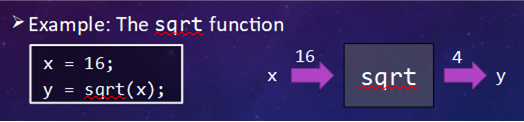

   ..

|

This video gives an introduction to functions and their syntax in C++:

.. youtube:: mCpOtAYa4mo
   :divid: ch14_01_vid_intro
   :height: 315
   :width: 560
   :align: center

|

-----------
Definitions
-----------

**Interface** - for a function, the interface describes how we use it.

**Implementation** - for a function, the implementation contains code to make the function work.

---------------
Function Syntax
---------------

.. figure:: img/img2.png
   :width: 500
   :align: center

   ..

|

In the :code:`square` function, the input is the variable :code:`n`, defined as an integer. The function name is :code:`square` and it is defined as an integer - this implies that the return, here :code:`n*n`, is also an integer.

Here is another example, the :code:`int abs` function that calculates the absolute value of an input integer :code:`n`. Again, the input variable is passed into the function by the integer :code:`n` (in the parentheses), and the return is an integer that is stored in the function variable :code:`a`.

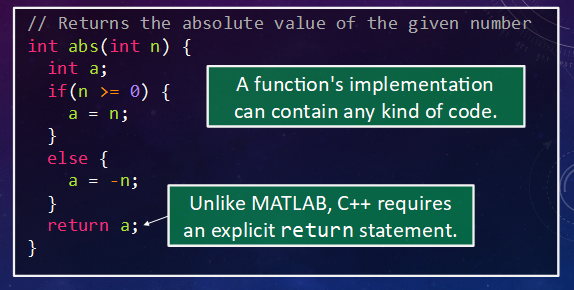

   ..

|

Finally, to call a function from the :code:`int main()` driver, simply invoke the function name(s):

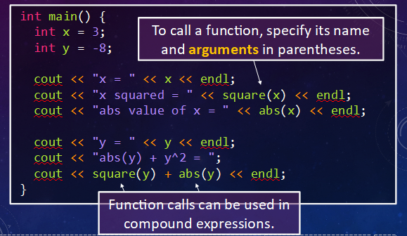

   ..

|

--------
Exercise
--------

.. mchoice:: ch14_01_ex_mph_to_kph
   :answer_a: the function is called incorrect on line 12
   :answer_b: we should be using double main() {
   :answer_c: we should be using .* rather than just * in line 5
   :answer_d: the right hand side of the equation on line 5 should use double values
   :correct: d

   What is wrong with this function?

   .. figure:: img/img5.png
      :width: 500
      :align: center

      ..

^^^^^^^^^^^
The Details
^^^^^^^^^^^
.. section 2

.. youtube:: 9Bzh27w-YOU
   :divid: ch14_02_vid_details
   :height: 315
   :width: 560
   :align: center

|

**When a function is called**:

1. The values of the argument expressions in the caller (in the preceding section, we have used :code:`int main()`) are copied into the input parameter variables of the called function.
2. The code for the function's implementation is run.
3. (Different from MATLAB) As soon as a :code:`return` statement is executed, the function ends immediately.
4. The returned value is transferred back to the caller where it is used where the function call had appeared.

**Task at Hand**: though the function :code:`int abs (int n)` described in the INTRO section works, let us investigate techniques to improve the function.

1. One can shorten the code by using multiple :code:`return` statements.

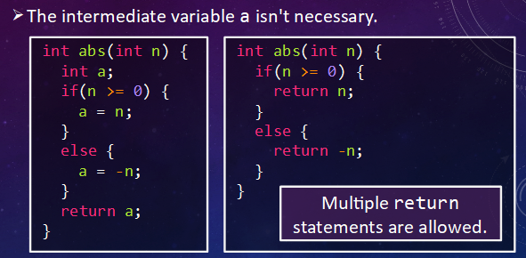

   ..

|

2. One can assume that if the selection statement is FALSE, then the code naturally will execute the next statement in the function. Either of the options below are fine - which one you use is up to personal preference!

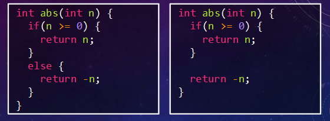

   ..

|

**What are the differences between C++ and MATLAB functions?**

1. C++ syntax does not allow the RETURN of more than one variable. Stay tuned for an option !!!
2. It is common to define several functions in the same C++ file. In MATLAB, functions are often written in separate files.
3. For C++, the :code:`return` statement determines the return value.

**Arguments and Parameters**
A useful capability of functions is that the input parameters of a function may have different types. This comes at a cost, however, in that the ordering of the arguments in the function caller must match exactly the types required by the function.

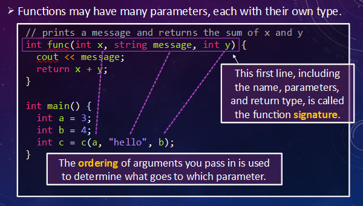

   ..

|

^^^^^^^^^^^^^^^^^^^^^^^^
Motivation for Functions
^^^^^^^^^^^^^^^^^^^^^^^^

As with the MATLAB programming language, the utility of functions assists programmers in both composing and employing individual and single-purposed blocks of code.

a. functions make code easier to write and comprehend
b. functions may be used to separate a set of steps that is repeated multiple times
c. oftentimes, a one or two-line function code makes the abstraction

Let's return to the code used to find prime numbers. Not only is the code confusing, it is difficult to visualize:

.. code-block:: none

   a while loop which decrements
   a for loop which increments
   a selection statement that uses the same Boolean variable,
      once as itself,
      and secondly as negated.

Can we make the code easier to comprehend? Where could a function assist in simplifying the code?

The original:

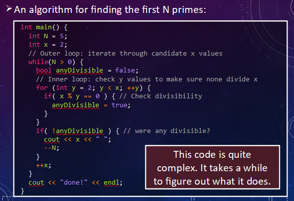

   ..

|

The logic:

.. figure:: img/img10.png
   :width: 500
   :align: center

   ..

|

When thinking of improving your code, look for **"loops"**. In the example above, the :code:`for` loop is the location where the prime number is determined, in the divisibility question. The rest of the program accumulates the prime numbers until 5 are determined.

The :code:`int main()` driver routine now looks like

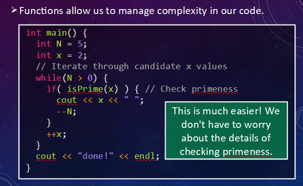

   ..

|

while the function looks like

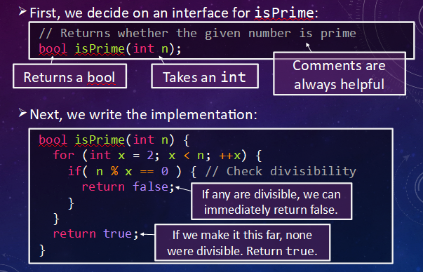

   ..

|

The code satisfies the assertions that:

a. functions make code easier to write and comprehend
b. functions may be used to separate a set of steps that is repeated multiple times

Take a test drive with the final code in Lobster:

.. raw:: html

   

      
ch14_02_ex

   

^^^^^^^^^^^^^^^^^^^^^^
:code:`void` Functions
^^^^^^^^^^^^^^^^^^^^^^
.. section 3

.. youtube:: nKhi9mq4V7g
   :divid: ch14_03_vid_void_functions
   :height: 315
   :width: 560
   :align: center

|

C++ employs :code:`void` functions, that is, functions that DO NOT return anything. A :code:`void` function works by "side effects", that is,

1. printing something or some other form of I/O
2. changing pass-by-reference parameters which will be described at the end of the lecture

We discuss point 1) here. In the diagram below, the :code:`void` function :code:`print_row_of_X` shows the correct syntax for employing a :code:`void` function. The input parameter, supplied by a caller routine, forwards an :code:`int` value for the parameter :code:`num`. So far, the function resembles previous functions described above. Look carefully at how the :code:`void` function is terminated: THERE IS NO RETURN EXPRESSION !!!

However, the effect of the :code:`void` function is manifested by a row of :code:`num` X's, :code:`num` being the input parameter to the function.

.. figure:: img/img13.png
   :width: 500
   :align: center

   ..

|

--------
Exercise
--------

Fill in the implementation of the :code:`print_triangle_X3()` function below so that it prints out the following:

.. code-block:: none

   X
   XX
   XXX
   XX
   X

You should call the :code:`print_row_of_X()` function as a helper in your implementation.

Remember that you can use the "Simulate" button to run your code. If you're not getting quite the right output, it can be really useful to take a look at what is going on at a fine-grained level!

.. raw:: html

   

      
ch14_03_ex

      

         Well done! The secret word is "toast".
      

   

.. fillintheblank:: ch14_03_ex_print_triangle_X3
  :casei:

  Complete the Lobster exercise to reveal the *secret word*. Enter it here.
  
  |blank|

  - :toast: Correct.
    :x: Incorrect. If you finished the exercise, please double check your spelling.

|

^^^^^^^^^^^^
Scope in C++
^^^^^^^^^^^^
.. section 4

.. youtube:: T0em8Do-ggU
   :divid: ch14_04_vid_scope
   :height: 315
   :width: 560
   :align: center

|

Recall:

- A variable may only be used after its declaration.
- A variable may only be used in certain places where it has been declared, that is, if the variable is used before being declared or outside its scope, there will be a compiler error. For local (or block) scope, those places are defined by the braces within which the variable has been declared.

**Global Scope**

A variable may be declared outside of a function, that is, the variable will have global scope. A similar circumstance exists in MATLAB, with the value of the constant :code:`pi` (if you missed this, open MATLAB and at the prompt, type :code:`pi`). However, in C++, if the constant :code:`pi` will be used in multiple instances, it is advantageous to provide the variable with global scope. For example, in the following code, :code:`PI` is declared using the concept of global scope as follows:

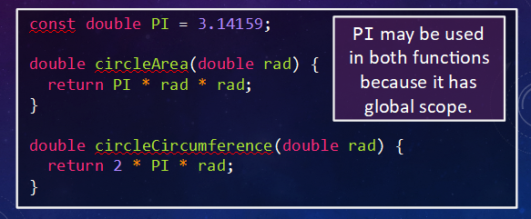

   ..

|

Here, the variable :code:`PI` may be used anywhere after it has been declared by the :code:`const` keyword.

**Function Block Scope**

Block (that is, local) scope applies to functions. In the following example, the variables :code:`x` and :code:`n` both have local scope BUT ONLY IN THE FUNCTION func, :code:`x` through its declaration in the function definition and :code:`n` through its declaration within the function.

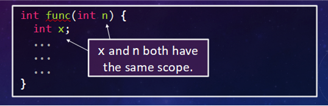

   ..

|

Consider the following example,

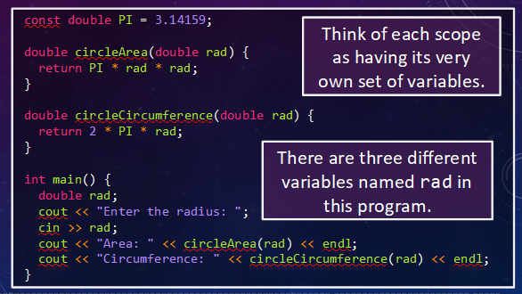

   ..

|

C++ compilation may be thought as a top-down process,

1. the variable :code:`PI` is declared as a :code:`const`, and is available for global usage
2. the function :code:`circleArea` declares and assigns block scope to the variable :code:`rad` for use in its code
3. the function :code:`circleCircumference` declares and assigns block scope to the variable :code:`rad` for use in its code
4. :code:`int main()` declares a variable :code:`rad` for use in its code

Though rad is used in 3 different blocks, these blocks use :code:`rad` independently. The variable has function block scope in the two :code:`double` functions, and local scope in the caller :code:`int main()`.

Step through the visualization of the Lobster code below to see the way variables in different scopes are handled:

.. raw:: html

   

      
ch14_04_ex

   

**Shadowing**

Consider the following code:

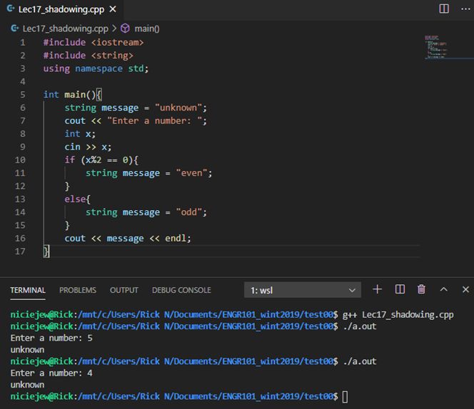

   ..

|

The code compiles and executes, but does not output the correct message, "even" if the input variable is an even number, or "odd" if the input variable is an odd number. YOU WILL ENCOUNTER THIS PROBLEM !!!

The issue is the re-declaration of the :code:`string` variable :code:`message` in lines 11 and 14. Note that :code:`message` was originally declared in line 6 and has local scope until line 17. The new declarations in line 11 and 14 shadow the original and have local scope within the individual brace pairs 11-12 and 14-15. Outside these braces, the variable :code:`message` retains its original declaration, "unknown".

^^^^^^^^^^^^^^^^^^^^^^^^^^^^^^^^^^^^^^^^^^^^^^^^^^^^^^^
Where does one place FUNCTIONS in a single C++ program?
^^^^^^^^^^^^^^^^^^^^^^^^^^^^^^^^^^^^^^^^^^^^^^^^^^^^^^^

What works, what doesn't, and how to compromise!!

A) You may prefer the following order for writing your code: always start with :code:`int main()` and add functions after the main routine.

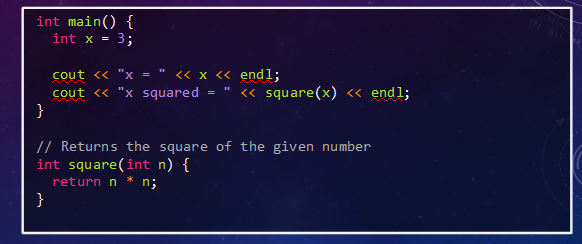

   ..

|

B) Or, you may prefer to write all your functions first and then end with :code:`int main()`

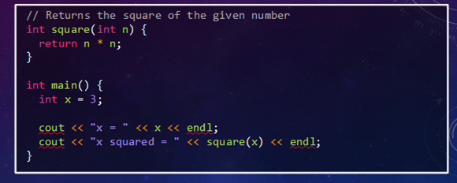

   ..

|

Both appear to meet all the requirements for good C++ coding, but your attempts at compiling A) will always result in failure. WHY?

In the C++ programming language, function behaviour is similar to variable behaviour:

- declare a variable prior to use
- declare a function prior to use

So, in case A), when the compiler reaches the command :code:`square(x)`, the compiler does not recognize this declaration and issues a compiler error. In order to declare a function prior to its definition, use a function prototype as follows:

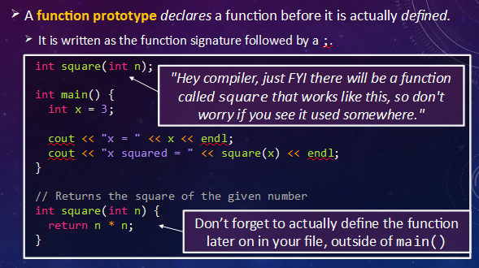

   ..

|

Thus, there is no restriction as to where a function is included in a C++ routine. So long as the compiler is aware that the function prototype is a placeholder for an as-yet-to-be-compiled function, all-is-well.

^^^^^^^^^^^^^^^^^^^^^^^^^^^^^^^^^^
Pass by Reference vs Pass By Value
^^^^^^^^^^^^^^^^^^^^^^^^^^^^^^^^^^

.. youtube:: fenRWnsPN8I
   :divid: ch14_05_vid_swap
   :height: 315
   :width: 560
   :align: center

|

Example: A routine task in programming is swapping the values between two variables. The solution is to use an auxiliary variable to prevent one variable from overwriting the other variable during the swap. The following code illustrates how the swap would be coded in the caller.

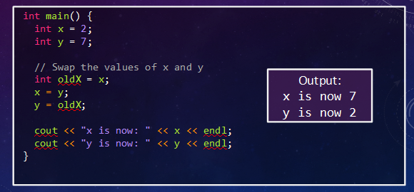

   ..

|

The functions that have been employed so far have performed a calculation and returned a value, such as the :code:`square` function. The void function was introduced earlier and it was noted that these functions work by "side-effect". Let's investigate this property. The first example executes the following code:

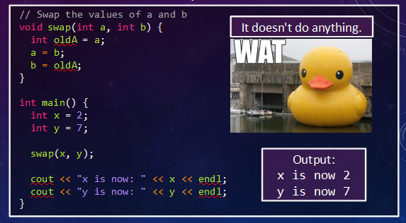

   ..

|

The void function swap receives its values via the mechanism "pass-by-value", that is, :code:`a` and :code:`b` are given copies of :code:`x` and :code:`y`. The hope was for the function to switch the values of :code:`a` and :code:`b` (which it does in the function) and to output the final swapped values in the caller routine. Running the code indicates that is not the case because the compiler considers the variables :code:`x` and :code:`y` to be completely different and independent from :code:`a` and :code:`b`.

One final tool at our disposal is the "pass-by-reference" mechanism to pass parameters in C++. The syntax rule for passing by reference is to precede the appropriate input variable(s) in the void parameter list with the & (ampersand) character. In other words, the void function refers to the variables in the caller when performing calculations. The following code illustrates the changes.

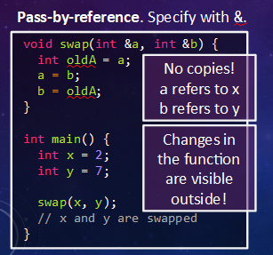

   ..

|

^^^^^^^^^^^^^^^^^^^^^^^^^^^^^^^^^^^^^^^^^^^^^^^^^^^^^^^
Summary
^^^^^^^^^^^^^^^^^^^^^^^^^^^^^^^^^^^^^^^^^^^^^^^^^^^^^^^

This is the end of the chapter! Here is a summary of what we covered in this chapter: 

* 

You can double check that you have completed everything on the "Assignments" page. Click the icon that looks like a person, go to "Assignments", select the chapter, and make sure to scroll all the way to the bottom and click the "Score Me" button.