.. qnum::
   :prefix: Q
   :start: 1

.. raw:: html

   <link rel="stylesheet" href="../_static/common/css/matlab.css">
   
   

============================
Introduction to Control Flow
============================

.. admonition:: Chapter Files

  We'll be using several files throughout this chapter's exercises. It might be helpful to go ahead and download each of them now and move them to your current folder in MATLAB. (It's also a good idea to go ahead and create a new folder for this chapter and use that as your current folder, so that you don't clutter up whatever else you were working on.)

  .. list-table:: 
    :align: left
    :widths: auto

    * - :download:`words.txt <../_static/intro_to_control_flow/words.txt>`

      - .. reveal:: words_txt_preview
          :showtitle: Preview
          :modal:
          :modaltitle: <code>words.txt</code>

          .. literalinclude:: ../_static/intro_to_control_flow/words.txt

      - A list of the 1000 most commonly occurring words in the English language

    * - :download:`loadWords.m <../_static/intro_to_control_flow/loadWords.m>`

      - .. reveal:: loadWords_m_preview
          :showtitle: Preview
          :modal:
          :modaltitle: <code>loadWords.m</code>

          .. literalinclude:: ../_static/intro_to_control_flow/loadWords.m
            :language: matlab

      - Helper function to load words from :file:`words.txt`

    * - :download:`wordGame.m <../_static/intro_to_control_flow/wordGame.m>`

      - .. reveal:: wordGame_m_preview
          :showtitle: Preview
          :modal:
          :modaltitle: <code>wordGame.m</code>

          .. literalinclude:: ../_static/intro_to_control_flow/wordGame.m
            :language: matlab

      - Starter script file for a word-guessing game in MATLAB

    * - :download:`scramble.m <../_static/intro_to_control_flow/scramble.m>`

      - .. reveal:: scramble_m_preview
          :showtitle: Preview
          :modal:
          :modaltitle: <code>scramble.m</code>

          .. literalinclude:: ../_static/intro_to_control_flow/scramble.m
            :language: matlab

      - A function file for scrambling words

    * - :download:`playRound.m <../_static/intro_to_control_flow/playRound.m>`

      - .. reveal:: playRound_m_preview
          :showtitle: Preview
          :modal:
          :modaltitle: <code>playRound.m</code>

          .. literalinclude:: ../_static/intro_to_control_flow/playRound.m
            :language: matlab

      - A function implementing a single round of the word-guessing game as an abstraction

    * - :download:`wordGame_solution.m <../_static/intro_to_control_flow/wordGame_solution.m>`

      - .. reveal:: wordGame_solution_m_preview
          :showtitle: Preview
          :modal:
          :modaltitle: <code>wordGame_solution.m</code>

          .. literalinclude:: ../_static/intro_to_control_flow/wordGame_solution.m
            :language: matlab

      - The final solution script for the word-guessing game

  .. reveal:: intro_to_control_flow_download_instructions
    :showtitle: Download Instructions
    :modal:
    :modaltitle: File Download Instructions for MATLAB
    
    .. include:: ../common/matlab_download_instructions.in.rst

^^^^^^^^^^^^
Introduction
^^^^^^^^^^^^
.. section 1

We will discuss program design including decision making in programs.

.. youtube:: 7w56dFTzEpg
   :divid: ch10_01_vid_control_flow_introduction
   :height: 315
   :width: 560
   :align: center

|

So far in MATLAB, we have discussed functions which are typically a list of things, that is, an algorithm

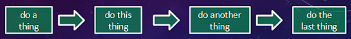

   ..

Now, we will expand on this design and have the program make a decision based on a condition

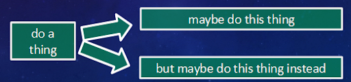

   ..

Program Design is the process where one plans or designs the algorithm prior to writing the code.

Program Design Concepts that will be discussed are

- bottom-up design
- top-down design
- abstractions (another word for functions)
- and control flow in terms of

  - iteration (loops)
  - branching (if/else statements based on a condition)

^^^^^^^^^^^^^^^^^^^^
A Word-Guessing Game
^^^^^^^^^^^^^^^^^^^^
.. section 2

Our approach involves the programming of a Word-Guessing game using MATLAB. Please view the video below, which shows shows the game in action.

.. youtube:: UeNQDXXTWzU
   :divid: ch10_02_vid_a_word_guessing_game
   :height: 315
   :width: 560
   :align: center

|

^^^^^^^^^^^^^^^^
Scrambling Words
^^^^^^^^^^^^^^^^
.. section 3

We now describe the code for the game. Please view the video below for a description of the concepts used in our program.

.. youtube:: hA-T3iGM73w
   :divid: ch10_03_vid_scrambling_words
   :height: 315
   :width: 560
   :align: center

|

The Word-Guessing Game uses a set of 1000 commonly used words stored in the file :file:`words.txt`. These words are loaded into MATLAB with using the function :file:`loadWords.m`.

-------------------------
Example: Bottom-Up Design
-------------------------

A feature that is required for our game is the ability to randomly scramble the letters in a word. These are the steps described in the previous videos:

**Step A**: A routine to randomly mix a set of N integers, taken from the group 1:N is randperm. To understand how randperm works, type

.. code-block:: matlab

   help randperm

in the MATLAB command window. The help file suggests using

.. code-block:: matlab

   P = randperm(N)
   
which returns a vector :code:`P`, of length :code:`N`, with values :code:`1:N`

**Step B**: try out randperm with a test word

.. code-block:: matlab

   word = 'hello'                ; % sample word 
   N = length(word) = 5          ; % length or size of the word
   P = randperm(N) = [3 1 4 2 5] ; % the integers 1:5 randomly scrambled
   word(P) = 'lhleo'             ; % the corresponding scrambled version of 'hello'

combining the individual elements of our test example suggests that one may create a function with the line

.. code-block:: matlab

   scrambledWord = word(randperm(length(N)))

------------------------
Example: Top-Down Design
------------------------

This often involves the use of a flowchart or a similar design tool. The intent is to diagram the flow of a program (here, a MATLAB script) that employs a number of functions (such as scrambledWord) to solve the engineering requirements

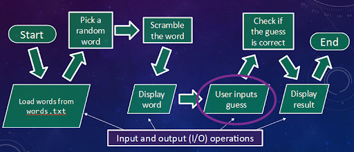

   Flowchart of A Simplified Version of the Game

The flow in the chart is from Start to End, following the arrows. The bottom tilted boxes refer to input/output operations, while the rectangular boxes in the top row may be individual MATLAB functions. A MATLAB script file controls the flow of the game. These elements are described in our Flowchart Components table 

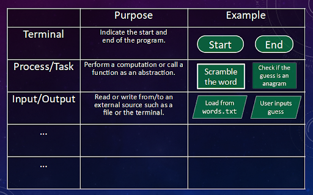

   Flowchart Components

^^^^^^^^^^^^^^^^^^^^
Coding the Word Game
^^^^^^^^^^^^^^^^^^^^
.. section 4

Let's start coding. Open the script file :file:`wordGame.m`. Follow the flowchart below and fill in the blank lines of code in the script file. A set of MATLAB commands is given below to assist in your selections.

.. figure:: img/img5.png
   :width: 150
   :align: center

   ..

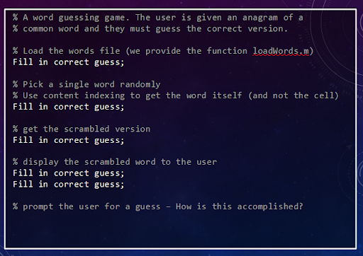

   Code: A Simplified Version of the Game - part 1

.. parsonsprob:: par_ex_group1

   Arrange these lines of code to correctly match the program outlined in the image above.
   -----
   words = loadWords('words.txt');
   =====
   word = words{randi(length(words))};
   =====
   scrambledWord = scramble(word);
   =====
   disp('Unscramble this word:');
   disp(scrambledWord);

Finally, let's add two more lines of code, one to request an input guess from the user, and the other to display if the guess and the word are the same. These use two new MATLAB functions:

   :code:`input()` and :code:`isequal()`

Please use the MATLAB help facility to understand how these two functions work. Excluding the solution for the above work, the script now looks like

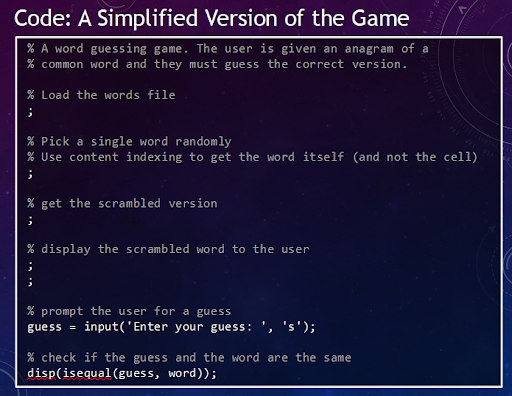

   ..

^^^^^^^^^
Iteration
^^^^^^^^^
.. section 4

.. youtube:: er-mcv0eFC4
   :divid: ch10_04_vid_iteration
   :height: 315
   :width: 560
   :align: center

|

Let's say that we wish to repeat the code in the box 5 times. This is a perfect scenario for using iteration techniques in MATLAB. Specifically, since we know how many times we wish to repeat the code, we would use the :code:`for` loop.

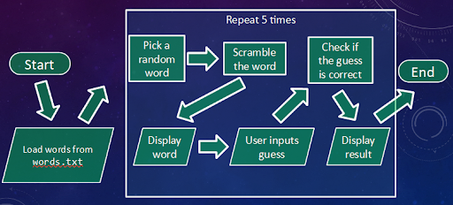

   ..

In this flowchart, the words are loaded once (they do not change because of the iteration), and the steps within the box are repeated a set number of times. In MATLAB programming, repeating code a set number of times is called a :code:`for` loop.

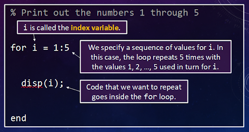

   ..

The :code:`for` loop requires an index variable to cover the range of the loop. Used in the range :code:`i = 1:5` causes the for loop to perform the loop sequence 5 times, incrementing the value of i after each iteration.

.. shortanswer:: ch10_04_ex_for_loops

   Now that we're comfortable with for loops, let's do a little exercise. Consider the vector below:

   .. raw:: html

      

         [10,8,6,4,2,0]
      

   Let's review how to make a vector using colon operators. Adjust the range notation in the MatCrab example here to create the vector above.

   .. raw:: html

      

         

            <table><tbody>
            <tr>
               <td style="text-align: center">
                  
                   
                  <a role="button" class="btn btn-success matcrab-run">Run</a>
                   
                  <a role="button" class="btn btn-warning matcrab-reset">Reset</a>
               </td>
               <td>
                  <textarea class="form-control matcrab-entry" style="resize: none">
                  1:3:10
                  </textarea>
               </td>
               <td>
                  

                  

               </td>
            </tr>
            </tbody></table>
         

      

   |

   Next we want to use that vector to iterate through a for loop. Review how to write for loops from the videos/text above. In the box below, write a MATLAB loop to count down from 10 by increments of 2, displaying the index value each time through.

We can incorporate iteration in our word-guessing game to allow the game to play multiple rounds.

.. figure:: img/img11.png
   :width: 500
   :align: center

   ..

It is good programming form to indent the contents of a for loop a few spaces to make code-reading easier.

The code proceeds through the loop 5 times and then continues with any further code after the end statement. Since the loop is self-contained, it is a candidate for abstraction !!!

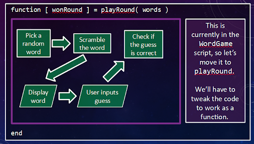

   ..

A function, :code:`playRound()`, a part of our current script, may be pulled and crafted into a separate code.The input to the function will be the list of words read from words.txt and the output will be a logical value, wonRound, TRUE if the guess is correct, FALSE otherwise.

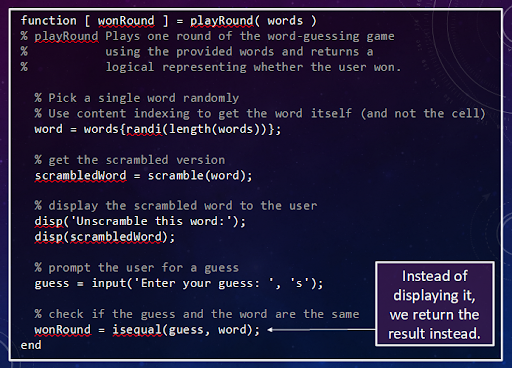

   ..

This results in a streamlined script illustrated below.

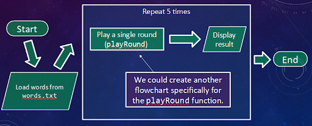

   ..

The calling script is now

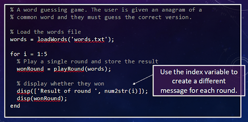

   ..

Note that the displayed output message in the for loop includes information related to the index variable, providing the player with useful feedback. However, something is lacking in the message!!?

"Did the player pick the right guess for the scrambled word?"

We introduce one final programming tool which allows the coder this freedom of choice, the branching capability in the form of an IF statement.

^^^^^^^^^
Branching
^^^^^^^^^
.. section 5

.. youtube:: EqmGgYU-TRE
   :divid: ch10_05_vid_branching
   :height: 315
   :width: 560
   :align: center

|

A conditional statement allows MATLAB to make a decision as to which branch of commands to execute, if any. In such a statement, there will be a conditional expression which will either be TRUE or FALSE. If there is more than one branch, each 'branch' will consist of a group of commands that could be executed.

For example, typing the following in the MATLAB Command Window

.. code-block:: matlab

   >> a=4;b=5;
   >> if a<b display('a<b')
   end

results in the output

.. code-block:: matlab

   a<b

If one were to try

.. code-block:: matlab

   >> if a>b display('a>b')
   end

that is, there would be no output !!!

The first attempt generates a logical 1, that is TRUE, and executes the display command. The second attempt is FALSE, that is logical 0, and the display command is not executed.

In a more complex example,

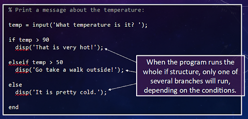

   ..

one of three possibilities is executed, dependent upon the value of 'temp'. **PLEASE NOTE: If the first conditional expression is TRUE, 'That is very hot!' is displayed and the code jumps immediately to end. If FALSE, then the second conditional expression is executed and another TRUE/FALSE decision is made. If FALSE, then the third statement is displayed.**

That's all there is to it !!
Our code may now be given some smarts using branching operations -- 

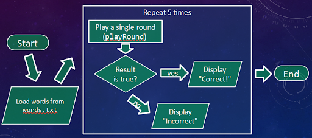

   ..

In code, this would be

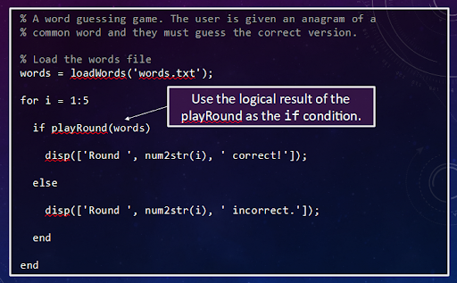

   ..

The use of program control constructs has permitted exciting and thoughtful possibilities to our simple word-guessing game. The complexity of our word-guessing game has evolved to the point that we may imagine adding new features. For example, rather than running through the game 5 times (using the for loop), we want to run through the game until we make 3 incorrect guesses. This may mean running through ONLY 3 times, or it could mean 10's or 100's of correct guesses. **LET THE PROGRAM DECIDE !!!**

There is one final flow control command which is useful, the conditional while-end loop. It is useful in the situation just described, that is, for-end loop style looping is desired, but the number of runs through the loop is unknown ahead of time. Here is the flowchart:

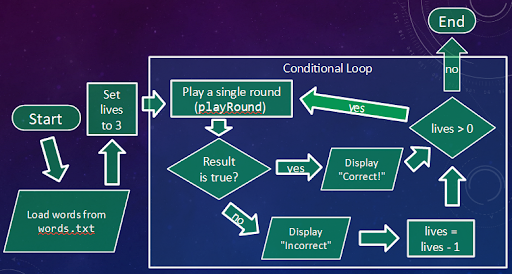

   ..

and here is the code

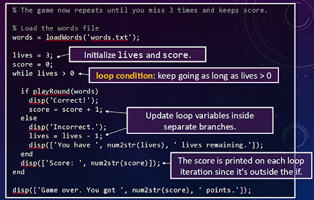

   ..

The while-end loop has replaced the for-end loop, but functions in a similar fashion. After each iteration in the loop, the value of lives is compared to 0, resulting in a logical TRUE/FALSE value. If TRUE, the while loop is executed one more time and control once again asks the same question. If FALSE, execution of the loop is terminated and program control statements following the while-end loop are executed.

We have now completed the controlling script for :code:`wordGame.m`. You have seen how bottom-up design and top-down design are useful tools for designing and then programming code for a specific task.

--------------------
Flowchart Components
--------------------

Here is the final table of flowchart components which includes branching and iteration.

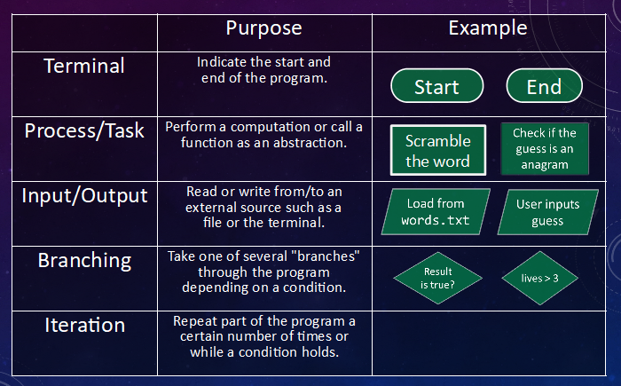

   ..

In the second half of ENGR 101, you will design your own control flow code with C++ and will use flowcharts to construct your code. However, there are still some unanswered questions regarding "Why did we wait so long to discuss control flow in MATLAB?" If you have not viewed video 5.Branching, the following summarizes the rationale:

a. vectorization is faster than most branching/iteration operations in MATLAB
b. prefer Vectorized Array Operation to Loops
c. prefer Logical Indexing to Loops
d. prefer Ranges to Loops
e. when to use loops in MATLAB: the topic of this lecture is one such circumstance

^^^^^^^^^^^^^^^^^^^^^^^^^^^^^^^^^^^^^^^^^^^^^^^^^^^^^^^
Summary
^^^^^^^^^^^^^^^^^^^^^^^^^^^^^^^^^^^^^^^^^^^^^^^^^^^^^^^

This is the end of the chapter! Here is a summary of what we covered in this chapter: 

* 

You can double check that you have completed everything on the "Assignments" page. Click the icon that looks like a person, go to "Assignments", select the chapter, and make sure to scroll all the way to the bottom and click the "Score Me" button.
