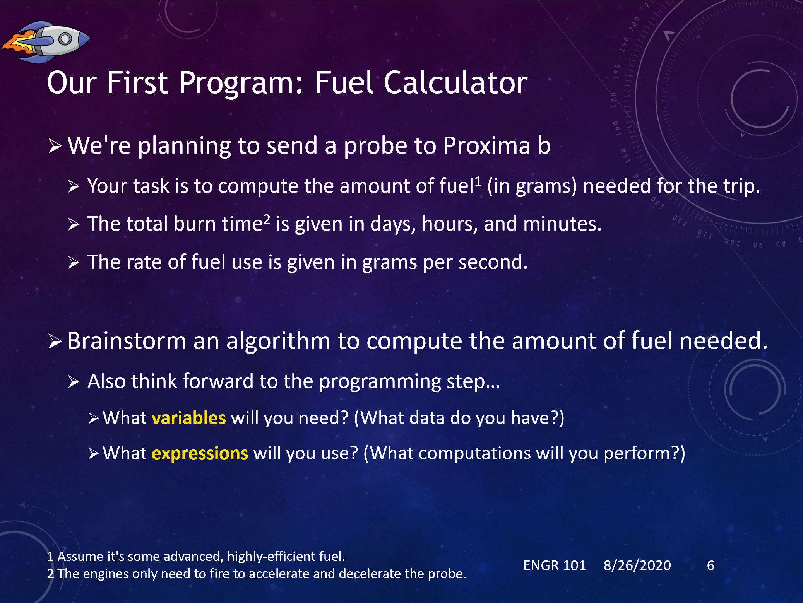
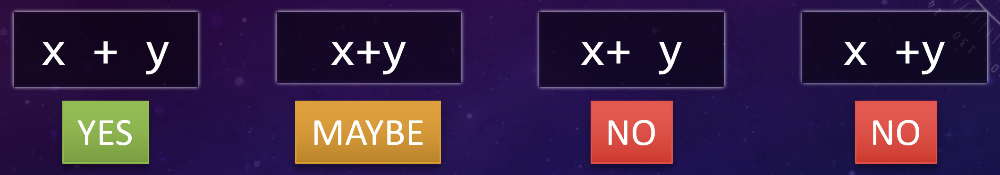
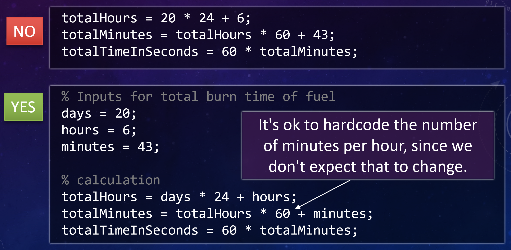

.. qnum::
   :prefix: Q
   :start: 1

======================
Introduction to MATLAB
======================

.. ^^^^^^^^
.. Welcome!
.. ^^^^^^^^

Welcome to Engr 101! In Engr 101, we will be learning basic principles of programming computer code and simple algorithms used to tackle engineering problems. We will learn these concepts by first programming in MATLAB (which is really good at processing data and visualizing it) and then C++ (which is really good at automating decisions and creating a process). We have done our best to use wide-ranging real-world examples for as much of the class as possible. 

**Why are we using Runestone?**

We believe that the best way to learn programming is to practice with each new programming skill and concept as it is introduced. This is hard to do in a traditional lecture but easy to do with the Runestone platform. Each Runestone chapter has sections that each follow the same general pattern: introduce a concept, show some examples, check your understanding, and practice the concepts. 

The Runestone chapter sections use a variety of approaches for these steps, including short videos, text and images, multiple choice and true/false questions, actual coding practice, and "mixed up code" problems (where you're given the lines of code and you need to arrange the code so that program works correctly). Each question and practice exercise has some type of feedback for you. You can check your answers to true/false and multiple choice questions right away, and Runestone will either tell you correct or give you a hint about what to think about to get to the correct answer. The coding practice questions have walkthrough videos that you can watch if you get stuck or want to verify that you've solved the problem correctly. 

**Who Are All These People in the Videos?** 

There are many short, instructional videos woven throughout this Runestone book. These videos have been created especially for Engr 101 by the faculty, GSIs, and IAs. Some of these people are currently teaching Engr 101, and some of them are past members of our Engr 101 teaching team. So, if you see someone you don't recognize, that's okay!  

----------------------------------
A Quick Tour of MATLAB
----------------------------------

MATLAB is a programming language and environment often used in engineering applications. Let's take a quick tour of how it works.

.. youtube:: iFrEd4x8g_k
  :divid: ch01_02_vid_variables_and_expressions
  :height: 315
  :width: 560
  :align: center

|

Some fundamental tools in programming are *literals*, *variables*, and *expressions*:

* **Literals** are simply data written directly into our code. They might be numbers like :code:`3` or :code:`-2.85`, but we'll also see other kinds of data. For example, text literals can be written with single quotes like :code:`'hello world!'`.

* **Variables** are used to store data in the computer's memory, for example :code:`x`, :code:`ans`, or :code:`fuel_rate`.

  - **Assignment** is used to give a variable a value. In MATLAB (and many other programming languages), the :code:`=` operator is used for assignment.

  - Variables may be assigned a new value several times, overwriting the old value. Just because we run :code:`x = 5` doesn't mean we won't come back later and run :code:`x = 10` to update it.

* **Expressions** are used to manipulate and compute new data, often by combining variables and literals, or even other sub-expressions. They generally use **operators** like :code:`+`, :code:`*`, etc.

^^^^^^^^^^^^^^^^^^^^^^^^^^^^^^^^^^^^^^^^^^^^^^^
Exercise: Variables and Expressions
^^^^^^^^^^^^^^^^^^^^^^^^^^^^^^^^^^^^^^^^^^^^^^^

.. tip::
  By the way, we end up using a lot of terms interchangably to refer to the content of programs, like *code*, *lines of code*, *commands*, *instructions*, *statements*, etc. Likewise, when we "make a program go", we might say we *run* it, *execute* it, or *launch* it. They all mean essentially the same thing and can be used interchangeably.

Consider the following MATLAB code, which might be used to calculate the net income for a server at Proxima Tea, a new drink stand we're planning to open in one of the Proxima b settlements. (If the rate seems weird, that's because it's in Proxima b currency.)

.. code-block:: matlab

  hours = 3 + 0 + 4 + 5 + 3;
  rate = 100.5;
  wage = hours * rate;
  tax = 0.24 * wage;
  net = wage - tax;

.. shortanswer:: ch01_02_ex_programming_constructs_01

  Give an example of a *variable* from the code above.

.. shortanswer:: ch01_02_ex_programming_constructs_02

  Give an example of a *literal* from the code above.

.. shortanswer:: ch01_02_ex_programming_constructs_03

  Give an example of an *expression* from the code above.

.. .. admonition:: Walkthrough

..   .. reveal:: ch01_02_revealwt_programming_constructs_01

..     .. youtube:: Tu4ZUHTl65w
..       :divid: ch01_02_wt_programming_constructs_01
..       :height: 315
..       :width: 560
..       :align: center

----------------------------------
Scripts
----------------------------------

In MATLAB, a **script** is sequence of commands written out, saved into a file, and then run all at once. When we want to write a program that does something non-trivial and that we might run multiple times, a script is one of our go-to tools.

Let's take a look at an example, and along the way we'll write up our first "useful" MATLAB program.

^^^^^^^^^^^^^^^^^^^^^^^^^^^^^^^^^^^^^^^^^^^^^^^
Example: A Fuel Calculator
^^^^^^^^^^^^^^^^^^^^^^^^^^^^^^^^^^^^^^^^^^^^^^^

.. youtube:: A1Beuyvju08
  :divid: ch01_03_vid_scripts_01
  :height: 315
  :width: 560
  :align: center

^^^^^^^^^^^^^^^^^^^^^^^^^^^^^^^^^^^^^^^^^^^^^^^
Exercise: Fuel Calculator Algorithm
^^^^^^^^^^^^^^^^^^^^^^^^^^^^^^^^^^^^^^^^^^^^^^^

For reference, here's the problem discussed in the video above:

|

.. shortanswer:: ch01_03_ex_fuel_calculator_algorithm

  Briefly decsribe an algorithm you could use to compute the total amount of fuel needed for the probe, and also give a few examples of *variables* and *expressions* that could be used in a program implementing that algorithm.

  .. tip::
    An **algorithm** is just a formal set of steps for solving a problem that contains enough details to be clear and unambiguous. A good way to check is to think "would someone else understand my solution by reading this?".

^^^^^^^^^^^^^^^^^^^^^^^^^^^^^^^^^^^^^^^^^^^^^^^
Implementing the Fuel Calculator in MATLAB
^^^^^^^^^^^^^^^^^^^^^^^^^^^^^^^^^^^^^^^^^^^^^^^

.. youtube:: Nmg8blikrjY
  :divid: ch01_03_vid_scripts_02
  :height: 315
  :width: 560
  :align: center

|

-----------------------------
Debugging
-----------------------------
When we write code, we're trying to implement an algorithm so that our computer can understand the steps of the algorithm and execute the steps correctly. But sometimes we make mistakes in code; these mistakes are called *bugs*. 

A **bug** is anything that causes a program to not implement an algorithm correctly. Some common bugs are: 

* mistyping a variable name
* typing the wrong number
* telling the computer to do one thing when you *really* meant that it should do a different thing
* so many other things that we'll see as we go along in this course...

It turns out that it can sometimes be challenging to translate an algorithm into the correct code for our computer to execute, and we inadvertently have bugs throughout our code, especially in the "first draft" of our code. **Debugging** is the process we use to narrow down where in our program a bug occurs and then correct the bug. 

.. admonition:: Did you know?

  The terms "bug" and "buggy" are used to decribe defects in programs - small mistakes that can cause a whole system to malfunction. While the terms have been around since the late 1800s, one notable example occurred in 1947 when a moth (a real bug!) managed to infiltrate a Mark II computer and interferred with the operation of one of its relays.

  .. image:: img/bug.jpg
    :width: 560
    :align: center
    :alt: A moth taped to a page from a logbook.

^^^^^^^^^^^^^^^^^^^^^^^^^^^^^^^^^^^^^^^^^^^^^^^
Exercise: Debugging the Fuel Calculator Script
^^^^^^^^^^^^^^^^^^^^^^^^^^^^^^^^^^^^^^^^^^^^^^^

This exercise involves three slightly different versions of the fuel calculator script, each containing a bug. Download each file, put them in your current MATLAB folder, and run them (by typing the name of the script, e.g. :code:`FuelCalculatorBuggy1`, in the command window). Use your knowledge of the way the script *should* work to help deciper error messages or incorrect results and track down the bug.

.. fillintheblank:: ch01_03_ex_buggy_01

  Find the bug in :download:`FuelCalculatorBuggy1.m <../_static/intro_to_matlab/FuelCalculatorBuggy1.m>` (click to download).

  .. literalinclude:: ../_static/intro_to_matlab/FuelCalculatorBuggy1.m
    :language: matlab
    :linenos:

  Which line contains the bug?

  - :15: Correct! Variable names in MATLAB are case sensitive.
    :x: Nope, try again!

.. fillintheblank:: ch01_03_ex_buggy_02

  Find the bug in :download:`FuelCalculatorBuggy2.m <../_static/intro_to_matlab/FuelCalculatorBuggy2.m>` (click to download).

  .. literalinclude:: ../_static/intro_to_matlab/FuelCalculatorBuggy2.m
    :language: matlab
    :linenos:

  Which line contains the bug?

  - :11: Correct! :code:`totalHours` should be used instead of :code:`hours`.
    :x: Nope, try again!

.. fillintheblank:: ch01_03_ex_buggy_03

  Find the bug in :download:`FuelCalculatorBuggy3.m <../_static/intro_to_matlab/FuelCalculatorBuggy3.m>` (click to download).

  .. literalinclude:: ../_static/intro_to_matlab/FuelCalculatorBuggy3.m
    :language: matlab
    :linenos:

  Which line contains the bug?

  - :12: Correct! There should only be one :code:`60 *` on this line.
    :x: Nope, try again!

----------
Style Tips
----------

As you program, you will likely develop your own "style" of coding -- how you like to name variables, how much whitespace you put between chuncks of code, how you tend to arrange your code. Coding is a style of writing, and everyone has their own style. It's precisely *because* of these differences in person style that commenting your code is so very important -- well, that and because if you haven't looked at your own code in a few weeks you'll have forgotten what you wrote it for! As you start to develop your own programming style, here are some style tips to get you started. 

**Variable Names**

You get to choose the variable names used in your program, but some variable names are better than others. In general, you want to choose a variable name that describes the data being stored in the variable. We call this using *descriptive* variable names. For example, in the fuel calculator program, we have a variable that represents the rate of fuel use. We need a name for this variable:

.. image:: img/variable_names.png
  :width: 400
  :align: center
  :alt: Use meaningful, descriptive variable names.

|

**Operator Spacing**

Spacing is also important in writing expressions. The best style is to pad your binary operators with spaces, like this:

|

**Intermediate Variables**
There's a general tradeoff between *intermediate variables* and the use of *compound expressions*. From the fuel calculator program, we could calculate the number of seconds using several intermediate variables, like this:

.. code-block:: matlab

  % Algorithm #1 from earlier
  secondsFromDays = 24 * 60 * 60 * days;
  secondsFromHours = 60 * 60 * hours;
  secondsFromMinutes = 60 * minutes;
  seconds = secondsFromDays + secondsFromHours + secondsFromMinutes;

Or we could use one compound expression, like this:

.. code-block:: matlab

  % Algorithm #3 from earlier
  seconds = 24 * 60 * 60 * days + 60 * 60 * hours + 60 * minutes;

Both approaches work equally well in this case, and both are "correct" since they each perform the correct calculations. In your programs, judge which approach best fits the needs of your code and is the easiest to understand. You should also consider whether you need to use any of the intermediate values in other calculations.

**Hardcoding**

We say a value is *hardcoded* into a program when it appears in an expression as a literal (i.e. without using a variable). Hardcoding is generally okay if the value won't reasonably change. Hardcoding is NOT okay if the value is an input, or if it might change.

|

----------------------------
Update Assignments
----------------------------

Variables in programming are different than variables in math. In math, when you say *x = 1*, you mean it. *x* is equal to 1 and always will be (at least until the next problem!). But in programming, :code:`x = 1` just means "put the value 1 in :code:`x` for now", and its value may be updated later.

We can even update the value of a variable based on its previous value! This is called an **update assignment** (or **update expression**). Let's take a look...

.. youtube:: c_O66AfWbK4
  :divid: ch01_04_vid_update_assignments
  :height: 315
  :width: 560
  :align: center

^^^^^^^^^^^^^^^^^^^^^^^^^^^^
Exercise: Update Assignments
^^^^^^^^^^^^^^^^^^^^^^^^^^^^

.. fillintheblank:: ch01_04_ex_buggy_01

  Consider the following code:

  .. code-block:: matlab

    x = 2;
    x = x * x + 1;
    y = x * (x + 1);
    x = y * x;
    disp(x);
    disp(y);

  What values are displayed when this code is run?

  - :150: Correct! The sequence of values for :code:`x` is 2, 5, 150.
    :x: The sequence of values for :code:`x` is 2, 5, 150. Double check which line you have that doesn't match. (Note that line 3 doesn't directly change the value of :code:`x`, although it does change :code:`y`, which will matter for line 4.)

  - :30: Correct! :code:`y` is updated once, based on the value of :code:`x` at line 3, which is 5.
    :x: Try again. Hint: :code:`y` is updated once, based on the value of :code:`x` at line 3, which is 5.

.. admonition:: Walkthrough

  .. reveal:: ch01_04_revealwt_update_assignments

    .. youtube:: -6EfvOQhUHc
      :divid: ch01_04_wt_update_assignments
      :height: 315
      :width: 560
      :align: center

----------------------------
Functions
----------------------------

Expressions in MATLAB can also use **functions** to compute results or perform operations. MATLAB has *many* built-in functions for math, data analysis, and engineering applications. You can even write your own!

.. youtube:: 1eu-RFIusOg
  :divid: ch01_05_vid_intro_to_functions
  :height: 315
  :width: 560
  :align: center

----------------------------
So what else can MATLAB do?
----------------------------

MATLAB is way more than just a really fancy calculator. We will cover a lot more of what MATLAB can do as we go through the course, but let’s take a quick look to see how powerful MATLAB can be!

**Vectors and Matrices**

A key strength of MATLAB is support for working with vectors and matrices just as easily as scalar values. A scalar is just a plain old number, like 12 or 97.4. 

A vector is a one-dimensional sequence of numbers:

.. image:: img/vector.png
  :width: 200
  :align: center
  :alt: A row vector containing [1, 3, 6, 7, 9].

|

A matrix is a two-dimensional grid of numbers:

.. image:: img/matrix.png
  :width: 150
  :align: center
  :alt: A 2-by-3 matrix containing [7, 3, 9 ; 5, 7, 2].

|

Vectors and matrices can hold lots of different types of values, not just the integers shown in these examples. We will use vectors and matrices to represent real-world data (which is often more than just a single number!) and quickly analyze that data to help make decisions about things.

**Saving and Loading Workspaces**

You can save all the variables in your MATLAB workspace to a file using the :code:`save` command. Typing this line into the command window will save all the variables in the workspace to a file called :file:`weatherData.mat`:

.. code-block:: matlab

  save('weatherData.mat');

You can restore a saved workspace using the :code:`load` command. Typing this line into the command window will bring all the variables (and their values!) into the workspace from the file :code:`AnnArborTemps.mat`:

.. code-block:: matlab

  load('AnnArborTemps.mat');

The load and save commands are also available from the MATLAB menu. All workspace files use the :file:`.mat` file extension.

**Analyzing Data**

Vectors and matrices can hold a lot of data, which is very helpful. But we really need to analyze that data, not just store it. We need to know things like the biggest value, or the smallest value, or the most common value. MATLAB has a lot of built-in functions that can help us analyze data. 

**Plotting Data**

In addition to numerical analysis of data, like "what is the biggest value?", we often want to visualize how one set of data relates to another. MATLAB has a staggeringly large number of ways to plot data. We will cover some of the most commonly-used plotting styles in this class, as well as ways to make your plots clear and professional.

Watch the demo below to see examples of how we can use MATLAB to manipulate data. (The workspace file used in the demo is :download:`AnnArborTempsAug2019.mat <../_static/intro_to_matlab/AnnArborTempsAug2019.mat>`.) Much more detail to come in later chapters!

.. youtube:: mO9a57T8NJg
  :divid: ch01_06_vid_what_else
  :height: 315
  :width: 560
  :align: center

----------
Summary
----------

This is the end of the chapter! Here is a summary of what we covered in this chapter: 

* We use the term *MATLAB* refers to both the program (that you open on your computer) and the programming language itself.
* Fundamental tools in programming are 

  - literals
  - variables 
  - expressions

* In MATLAB, a **script** is sequence of commands written out, saved into a file, and then run all at once. 
* An **algorithm** is just a formal set of steps for solving a problem that contains enough details to be clear and unambiguous. 
* A **bug** is anything that causes a program to not implement an algorithm correctly.
* **Debugging** is the process we use to narrow down where in our program a bug occurs and then correct the bug.
* You can update the value of a variable based on its previous value using an **update assignment** (or **update expression**). 
* A **function** is an abstraction over a chunk of computation. There are built-in functions and functions that you write yourself.
* MATLAB is really good at working with vectors and matrices and processing data. The next chapter will introduce vectors and matrices in MATLAB.

You can double check that you have completed everything on the "Assignments" page. Click the icon that looks like a person, go to "Assignments", select the chapter, and make sure to scroll all the way to the bottom and click the "Score Me" button.
