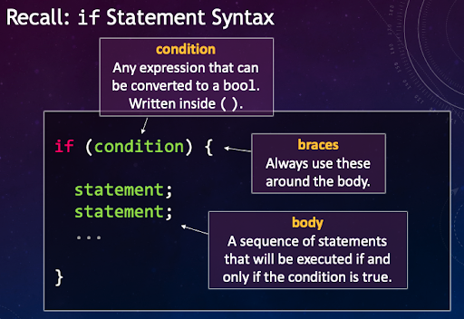
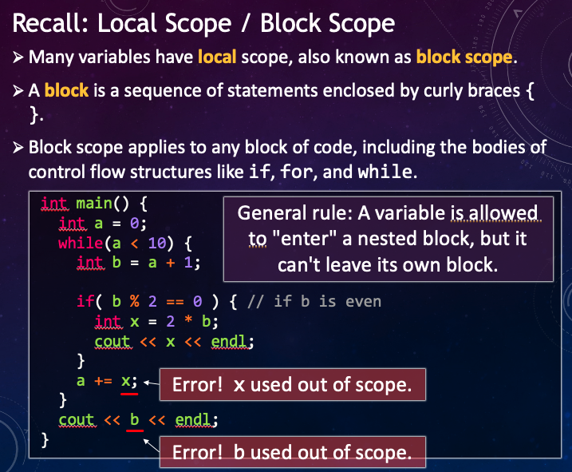
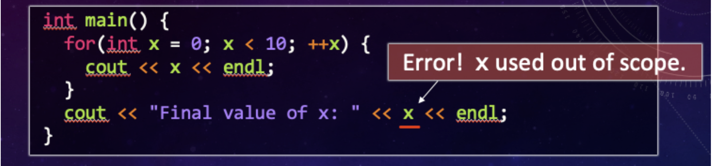

.. qnum::
   :prefix: Q
   :start: 1

.. raw:: html

   <link rel="stylesheet" href="../_static/common/css/main4.css">
   <link rel="stylesheet" href="../_static/common/css/code3.css">
   <link rel="stylesheet" href="../_static/common/css/buttons3.css">
   <link rel="stylesheet" href="../_static/common/css/exercises3.css">
   
   

.. raw:: html

   

=========
Iteration
=========

^^^^^^^^^^^^
Introduction
^^^^^^^^^^^^
.. section 1

When you run a program, the line of code that is currently executing is said to have "control" in the program. Two techniques to manage the **control flow** in our programs are **branching** and **iteration**. 

- **Branching** - creating multiple paths that your code can take based on the results of logical expressions, like :code:`if` and :code:`else` statements

- **Iteration** - traversing through code systematically based on some defined order or condition, like :code:`for` and :code:`while` **loops**.

In this chapter we will introduce the control flow structures used for iteration, practice using them and then combine iteration and branching to solve problems using C++.

^^^^^^^^^^^^^^^^^^^
:code:`while` Loops
^^^^^^^^^^^^^^^^^^^
.. section 2

.. youtube:: N3W-hlUBwXk
   :divid: ch13_02_vid_while_loops
   :height: 315
   :width: 560
   :align: center

|

To recap, here's the general syntax for a :code:`while` loop:

.. code-block:: cpp

   while ( condition ) {
     statement1;
     statement2;
     statement3;
     ...
   }

The condition may be any expression that can be interpreted as a boolean, and often expresses some limit on the value of a variable. The "body" of the :code:`while` loop may contain any number of statements, surrounded by the curly braces.

-----------------------------
Exercise: :code:`while` Loops
-----------------------------

In the Lobster exercise below, write code that uses a :code:`while` loop to print out the following:

.. code-block::

  9 7 5 3 1 done!

Note that each number is followed by a space. The code to print "done!" at the end is provided for you.

.. raw:: html

   

      
ch13_02_ex

      

         Well done! The secret word is "emoji".
      

   

.. fillintheblank:: ch13_02_ex_while_loops
  :casei:

  Complete the Lobster exercise to reveal the *secret word*. Enter it here.
  
  |blank|

  - :emoji: Correct.
    :x: Incorrect. If you finished the exercise, please double check your spelling.

.. admonition:: Walkthrough

  .. reveal:: ch13_02_revealwt_while_loops
  
    .. youtube:: A6KQ-1zcNQY
      :divid: ch13_02_wt_while_loops
      :height: 315
      :width: 560
      :align: center

|

^^^^^^^^^^^^^^^^^^^^^^^^^^^^^^^^^
Increment and Decrement Operators
^^^^^^^^^^^^^^^^^^^^^^^^^^^^^^^^^
.. section 3

C++ provides special operators (:code:`+=`, :code:`++`, :code:`-=`, and :code:`--`) for the common tasks of increasing or decreasing a variable. Each operator is shown below with an example of the equivalent update expression that it implements.

.. figure:: img/img1.png
   :width: 500
   :align: center

   ..

|

-------------------------------------------
Exercise: Increment and Decrement Operators
-------------------------------------------

Modify the code below to replace the update expressions in each of the loops with an equivalent using the shorthand :code:`++` and :code:`--` operators above (do not use :code:`+=` or :code:`-=`, unfortunately those are not supported by Lobster yet). The overall output of the program should not change.

.. raw:: html

   

      
ch13_03_ex

      

         Well done! The secret word is "boat".
      

   

.. fillintheblank:: ch13_03_ex_increment_and_decrement
  :casei:

  Complete the Lobster exercise to reveal the *secret word*. Enter it here.
  
  |blank|

  - :boat: Correct.
    :x: Incorrect. If you finished the exercise, please double check your spelling.

^^^^^^^^^^^^^^^^^
:code:`for` Loops
^^^^^^^^^^^^^^^^^
.. section 4

Initializing a loop variable, incrementing it, and checking a condition are often components of common iteration patterns. A :code:`for` loop is built around these components, with a specific location for each in it syntax.

.. youtube:: hiQaIcSPJlU
  :divid: ch07_04_vid_for_loops
  :height: 315
  :width: 560
  :align: center

|

To recap, here's the general syntax for a :code:`for` loop:

.. code-block:: cpp

   for ( initial; condition; increment ) {
     statement1;
     statement2;
     statement3;
     ...
   }

---------------------------------------------------------------
Exercise: Converting a :code:`while` loop to a :code:`for` loop
---------------------------------------------------------------

Modify the code below to use a :code:`for` loop instead of a :code:`while` loop, while still writing the same output to :code:`cout`:

.. code-block::

   1 2 4 8 16 32 done!

Think about which steps already present in the :code:`while` loop would fit into the :code:`for` loop pattern. Lobster has some checkpoints below for each piece of the loop.

.. raw:: html

   

      
ch13_04_ex

      

         Well done! The secret word is "coffee".
      

   

.. fillintheblank:: ch13_04_ex_for_loops
  :casei:

  Complete the Lobster exercise to reveal the *secret word*. Enter it here.
  
  |blank|

  - :coffee: Correct.
    :x: Incorrect. If you finished the exercise, please double check your spelling.

.. admonition:: Walkthrough

  .. reveal:: ch13_04_revealwt_for_loops
  
    .. youtube:: qRgResPUGZM
      :divid: ch13_04_wt_for_loops
      :height: 315
      :width: 560
      :align: center

|

^^^^^^^^^^^^
Nested Loops
^^^^^^^^^^^^
.. section 5

Recall the syntax of an :code:`if` statement:

   ..

|

Many variables have **local scope**, also known as block scope. A **block** is a sequence of statements enclosed by curly braces :code:`{}`. Block scope applies to any block of code, including the bodies of control flow structures like :code:`if`, :code:`for`, and :code:`while`.

   ..

|

For scoping purposes, the top of a :code:`for` loop is treated as if it were inside the loop body.

   ..

|

To use a variable after the loop, move its declaration outside. Take some time to appreciate the difference between the figure below and the previous version.

.. figure:: img/img5.png
   :width: 500
   :align: center

   ..

|

Watch the following video to learn how scope comes into play when you nest loops within each other.

.. youtube:: Gvg99nU4oks
  :divid: ch07_05_vid_nested_loops
  :height: 315
  :width: 560
  :align: center

----------------------
Exercise: Nested Loops
----------------------

Write code below to print out a "triangle" of :code:`'X'` characters with a size specified by the variable :code:`N`. For example, if :code:`N` is set to :code:`5`, the program should print out five rows of X's, each row with an increasing number of X's up to 5:

.. code-block::

   X
   XX
   XXX
   XXXX
   XXXXX

Remember that you can use the "Simulate" button to run your code. If you're not getting quite the right output, it can be really useful to take a look at what is going on at a fine-grained level!

.. raw:: html

   

      
ch13_05_ex

      

         Well done! The secret word is "snail".
      

   

.. fillintheblank:: ch13_05_ex_nested_loops
  :casei:

  Complete the Lobster exercise to reveal the *secret word*. Enter it here.
  
  |blank|

  - :snail: Correct.
    :x: Incorrect. If you finished the exercise, please double check your spelling.

.. admonition:: Walkthrough

  .. reveal:: ch13_05_revealwt_nested_loops
  
    .. youtube:: drtMOUOLShA
      :divid: ch13_05_wt_nested_loops
      :height: 315
      :width: 560
      :align: center

|

^^^^^^^^^^^^^^^^^^^^^^^^^^^^^^^^^^
Application: Finding Prime Numbers
^^^^^^^^^^^^^^^^^^^^^^^^^^^^^^^^^^
.. section 6

Let's look at an application of nested loops - finding prime numbers. A **prime number** is any integer larger than one that is not divisible by any smaller numbers. For example, :math:`5` and :math:`13` are prime numbers, but :math:`21` is not because it is divisible by :math:`3` and :math:`7`.

How can we use nested loops to find these numbers? Basically, our **outer loop** will iterate through different candidate numbers, working our way up. For each of those candidates, the inner loop will iterate through all the smaller numbers to see if any of them divides our candidate. If we find any, the candidate is not prime and is rejected. But if we make it all the way through our inner loop without finding any factors, we've found a prime number!

.. admonition:: Did you know?

  Prime numbers have a variety of uses in real-world applications, including everything from modern cryptography (the ubiquitous RSA cryptosystem involves very large prime numbers) to studying the emergence cycles of periodic cicadas (which reappear reliably every 13 or 17 years - it is thought the prime cycle helps them avoid cyclic predators and/or competition for resources).

|

----------------------
Exercise: Divisibility
----------------------

Before moving on to the full application, let's start with a simplified problem to give you some practice. Given two numbers, :code:`a` and :code:`b`, write a program that finds the first :code:`N` numbers that are NOT divisible by either of the two. That is, you should only find numbers that are NOT divisble by :code:`a` *and* NOT divisible by :code:`b`.

.. tip:: 

   You can use the modulo operator :code:`%` to check for divisibility. Since the operator computes the remainder:

   :code:`x` is divisible by :code:`y` if and only if :code:`x % y == 0`.

Fill in the missing pieces of the code below. Note that the correct output should be :code:`1 5 7 11 13 done!`.

.. raw:: html

   

      
ch13_06_ex

      

         Well done! The secret word is "optimus".
      

   

.. fillintheblank:: ch13_06_ex_divisibility
  :casei:

  Complete the Lobster exercise to reveal the *secret word*. Enter it here.
  
  |blank|

  - :optimus: Correct.
    :x: Incorrect. If you finished the exercise, please double check your spelling.

.. admonition:: Walkthrough

  .. reveal:: ch13_06_revealwt_divisibility
  
      The walkthrough for this exercise is included at the begining of the video in the next section below.

|

---------------------------
Demo: Finding Prime Numbers
---------------------------

Finally, let's take a look at a program that extends these ideas to find prime numbers using the general algorithm described above.

The previous example of checking divisibility is a first step toward an algorithm for finding prime numbers:

- We checked whether x was NOT divisible by 2 or by 3.
- For primes, we need to check that x is NOT divisible by any number between 2 and x-1.

In the Lobster code below, we've implemented the following algorithm for finding the first N primes:

 - **Outer Loop** Loop through numbers :code:`x`, starting at :code:`0`, until we find :code:`N` that are prime.
 - **Inner Loop** To determine if a number :code:`x` is prime, loop through all numbers :code:`y` from :code:`2` through :code:`x-1` and check that :code:`x` is not divisible by any of them.

You don't need to change any of the code, but we encourage you to read through it, take a look at it using the simulation view, and try to understand how it works.

.. raw:: html

   

      
ch13_06_ex_2

   

.. youtube:: MjQHDoJ07Ws
  :divid: ch07_06_vid_prime_numbers
  :height: 315
  :width: 560
  :align: center

^^^^^^^^^^^^^^^^^^^^^^^^^^^^^^^^^^^^^^^^^^^^^^^^^^^^^^^
Summary
^^^^^^^^^^^^^^^^^^^^^^^^^^^^^^^^^^^^^^^^^^^^^^^^^^^^^^^

This is the end of the chapter! Here is a summary of what we covered in this chapter: 

* 

You can double check that you have completed everything on the "Assignments" page. Click the icon that looks like a person, go to "Assignments", select the chapter, and make sure to scroll all the way to the bottom and click the "Score Me" button.