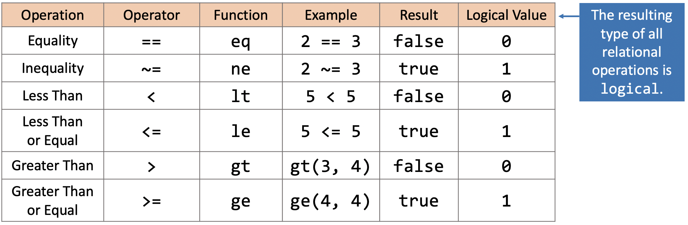
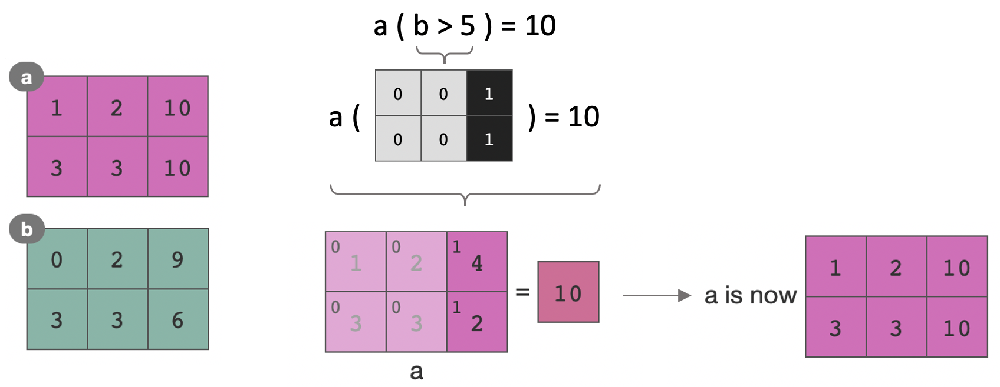
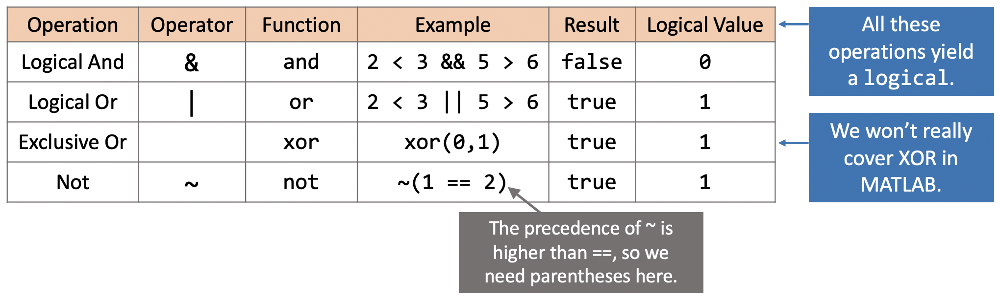
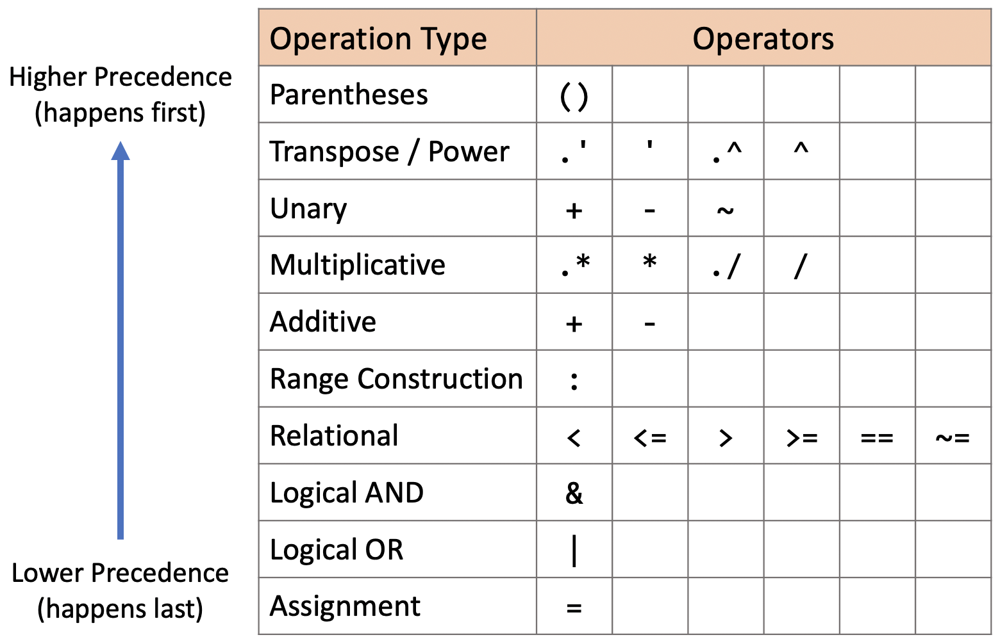
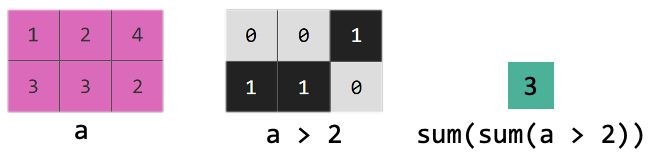

.. qnum::
   :prefix: Q
   :start: 1

.. raw:: html

   <link rel="stylesheet" href="../_static/common/css/matlab.css">
   
   

===============================
Logical Operations and Indexing
===============================

.. admonition:: Chapter Files

  We'll be using several files throughout this chapter's exercises. It might be helpful to go ahead and download each of them now and move them to your current folder in MATLAB. (It's also a good idea to go ahead and create a new folder for this chapter and use that as your current folder, so that you don't clutter up whatever else you were working on.)

  .. list-table:: 
    :align: left
    :widths: auto

    * - :download:`rocks.csv <../_static/logical_indexing/rocks.csv>`

      - .. reveal:: rocks_csv_preview
          :showtitle: Preview
          :modal:
          :modaltitle: <code>rocks.csv</code>

          .. literalinclude:: ../_static/logical_indexing/rocks.csv
            :lines: 1-7
            :append: ...

      - Data file with rock samples and properties

    * - :download:`analyzeRocks.m <../_static/logical_indexing/analyzeRocks.m>`

      - .. reveal:: analyze_rocks_m_preview
          :showtitle: Preview
          :modal:
          :modaltitle: <code>analyzeRocks.m</code>

          .. literalinclude:: ../_static/logical_indexing/analyzeRocks.m
            :language: matlab

      - Starter script for loading/analyzing data from rocks.csv
    
  .. reveal:: logical_indexing_download_instructions
    :showtitle: Download Instructions
    :modal:
    :modaltitle: File Download Instructions for MATLAB
    
    .. include:: ../common/matlab_download_instructions.in.rst
      

^^^^^^^^^^^^^^^^^^^^^^^^^^^^^^^^^^^^^^^^^^^^^^^^^^^^^^^
Introduction and Relational Operators
^^^^^^^^^^^^^^^^^^^^^^^^^^^^^^^^^^^^^^^^^^^^^^^^^^^^^^^
.. section 1

We've seen that MATLAB supports *arithmetic* operations (e.g. :code:`+`, :code:`.*`, etc.), which allow us to write expressions that compute a *numeric* result. MATLAB (and most other programming languages!) also allow us to compare different values/variables to each other using *relational* operators that produce a *logical* (i.e. true or false) result. We'll introduce the basic idea and then give you a chance to practice.

.. youtube:: I13q-SPw9eo
  :divid: ch04_01_vid_relational_operators
  :height: 315
  :width: 560
  :align: center

|

To recap, relational operators check for equality or perform comparisons:

   

--------------------------------------------
Exercise: Practice with Relational Operators
--------------------------------------------

.. include:: ex/relational_operations.in.rst

.. admonition:: Walkthrough

  .. reveal:: ch04_01_revealwt_relational_operations

    .. youtube:: umNofgBK-Kk
      :divid: ch04_01_wt_relational_operations
      :height: 315
      :width: 560
      :align: center

^^^^^^^^^^^^^^^^^^^^^^^^^^^^^^^^^^^^^^^^^
Using Logical Values and Logical Indexing
^^^^^^^^^^^^^^^^^^^^^^^^^^^^^^^^^^^^^^^^^
.. section 2

Let's take a look at some of the practical ways we can use logical results like the ones we get back from our relational operators.

.. youtube:: kgNw0oKcchg
  :divid: ch04_02_vid_logical_indexing
  :height: 315
  :width: 560
  :align: center

|

To recap, logical indexing is when you use a logical array to index into an array, instead of regular indexing. Locations that correspond to a :code:`true` value are selected, and locations that correspond to a :code:`false` value are not selected: 

------------------------------
Exercise: Analyzing Some Rocks
------------------------------

.. figure:: img/rocks.png
   :width: 300
   :align: center
   :alt: rocks.png

   *a rock*

.. include:: ex/logical_indexing.in.rst

.. admonition:: Walkthrough

  .. reveal:: ch04_02_revealwt_analyzing_rocks

    .. youtube:: 4_rSCo3CN0Q
      :divid: ch04_02_wt_analyzing_rocks
      :height: 315
      :width: 560
      :align: center

^^^^^^^^^^^^^^^^^^^^^^^^^^
Logical Operators (and/or)
^^^^^^^^^^^^^^^^^^^^^^^^^^
.. section 3

Sometimes we want to ask complex questions about our data, for example "Which rocks have a high density *and* low metallicity?". We can do that in MATLAB.

.. youtube:: uzv0ZfLf_aM
  :divid: ch04_03_vid_logical_operators
  :height: 315
  :width: 560
  :align: center

|

To recap, logical operators combine two truth values in a particular way:

And remember, if we want to check whether a value is within a range of numbers, we need to compare the value to the lower bound and upper bound separately and then use the :code:`&` operator to combine the two truth values:

.. code-block:: matlab

  % Check if the value of x is between 0 and 10 (exclusive)
  0 < x & x < 10

----------------------------
Exercise: More Rock Analysis
----------------------------

.. figure:: img/rocks.png
   :width: 300
   :align: center
   :alt: rocks.png

   *hi it's me again*

.. include:: ex/logical_operators.in.rst

.. admonition:: Walkthrough

  .. reveal:: ch04_03_revealwt_more_rocks

    .. youtube:: mJCtyjeiD40
      :divid: ch04_03_wt_more_rocks
      :height: 315
      :width: 560
      :align: center

^^^^^^^^^^^^^^^^^^^
Operator Precedence
^^^^^^^^^^^^^^^^^^^
.. section 4

Now that we have quite a few operators to work with, it makes sense to discuss how MATLAB determines order of operations according to the **precedence** of each operator.

.. youtube:: U8hXZPxLIsg
  :divid: ch04_04_vid_indexing_and_assignment
  :height: 315
  :width: 560
  :align: center

|

Here's that table of the order of precedence again, for future reference:

^^^^^^^^^^^^^^^^^^^^^^^^^^^^^^^
Logical Indexing and Assignment
^^^^^^^^^^^^^^^^^^^^^^^^^^^^^^^
.. section 5

Let's take a look at some of the practical ways we can use logical results like the ones we get back from our relational operators and logical operators.

.. youtube:: XGycZcWcU2I
  :divid: ch04_05_vid_indexing_and_assignment
  :height: 315
  :width: 560
  :align: center

|

-------------------------------------------
Exercise: Logical Indexing and Assignment
-------------------------------------------

.. include:: ex/indexing_and_assignment.in.rst

.. admonition:: Walkthrough

  .. reveal:: ch04_03_revealwt_indexing_and_assignment

    .. youtube:: MPxRCVp5Clk
      :divid: ch04_03_wt_indexing_and_assignment
      :height: 315
      :width: 560
      :align: center

^^^^^^^^^^^^^^^^^^^^^^^^^^^^^^^^^^^^^^^^^^^^^^^^^^^^^^^
Common Patterns With Logical Operations
^^^^^^^^^^^^^^^^^^^^^^^^^^^^^^^^^^^^^^^^^^^^^^^^^^^^^^^
.. section 6

Logical operations let us select data in an array for analysis. Here are some common "patterns" for analyzing data in MATLAB using logical operations. 

------------------------------------------------------------
Finding If Any Elements Are True: The :code:`any` Function
------------------------------------------------------------

The :code:`any` function returns :code:`true` if at least one element in the function's argument is :code:`true`; otherwise, the function returns :code:`false`. The :code:`any` function only returns :code:`false` when all of the elements are :code:`false`.

The :code:`any` function is especially useful if you need to check whether at least one element in an array matches some condition, such as "are any of the elements greater than 2?". 

.. raw:: html

  

    

      

        x = [1,2,3];
      

      <table><tbody>
        <tr>
          <td style="text-align: center">
            
             
            <a role="button" class="btn btn-warning matcrab-reset">Reset</a>
          </td>
          <td>
            

          </td>
          <td>
            <textarea class="form-control matcrab-entry" style="resize: none">
              y = any( x > 2 )
            </textarea>
          </td>
          <td>
            

            

          </td>
        </tr>
      </tbody></table>
    

  

|

.. Note::

  The :code:`any` function, like many of the other MATLAB functions we've used so far, operates first on each column.  To check for "any elements" across the rows of a matrix, use use :code:`any(x,2)`. To check for "any elements" across a whole matrix, use :code:`any(any(x))` or :code:`any(x(:))`.

.. raw:: html

  

    

      

        x = [1,2,3;4,5,6];
      

      <table><tbody>
        <tr>
          <td style="text-align: center">
            
             
            <a role="button" class="btn btn-warning matcrab-reset">Reset</a>
          </td>
          <td>
            

          </td>
          <td>
            <textarea class="form-control matcrab-entry" style="resize: none">
              y = any(any( x > 4 ))
            </textarea>
          </td>
          <td>
            

            

          </td>
        </tr>
      </tbody></table>
    

  

|

**Caution!** The expression :code:`any(A) & any(B)` is not the same as :code:`any(A & B)`. Try out these MATLAB statements in the MatCrab below to see the difference:

.. code-block:: matlab
  
  x = any(W > 7) & any(Z < 3);
  y = any(W > 7 & Z < 3);

.. raw:: html

  

    

      

        W = [8,1,6;3,5,7;4,9,2];
        Z = [1,4,7;2,2,5;1,6,7];
      

      <table><tbody>
        <tr>
          <td style="text-align: center">
            
             
            <a role="button" class="btn btn-warning matcrab-reset">Reset</a>
          </td>
          <td>
            

          </td>
          <td>
            <textarea class="form-control matcrab-entry" style="resize: none">

            </textarea>
          </td>
          <td>
            

            

          </td>
        </tr>
      </tbody></table>
    

  

|

.. mchoice:: ch04_06_ex_any_function
  :answer_a: any = x >= 4
  :answer_b: any( x >= 4 )
  :answer_c: any( any( x >= 4 ) )
  :answer_d: any( x(:), >=4 )
  :correct: c
  :feedback_a: This statement creates a logical type variable called "any" that contains the locations of where x is greater than or equal to 4. Look again at how the "any" function is used.
  :feedback_b: Almost! You have called the "any" function correctly, but this expression will result in a vector of logical values. How can you get a single true/false value? 
  :feedback_c: Correct! This expression correctly calls the "any" function twice in succession to check across the whole matrix for "elements of x greater than or equal to 4".
  :feedback_d: Oops! Look again at how to call the "any" function -- you want to pass one argument to the function.

  Which expression below returns :code:`true` if any single element anywhere in :code:`x` is greater than or equal to 4?

  .. raw:: html

    

      x = [4,0,6,7;8,2,5,3;1,1,8,1];
    

|

--------------------------------------------------------------
Finding If All Elements Are True: The :code:`all` Function
--------------------------------------------------------------

The :code:`all` function returns :code:`true` if all of the elements in the function's argument are :code:`true`; otherwise, the function returns :code:`false`. If even one element is :code:`false`, the :code:`all` function will return :code:`false`.

The :code:`all` function is especially useful if you need to check whether all of the elements in an array match some condition, such as "are all of the elements less than or equal to 4?". 

.. raw:: html

  

    

      

        x = [1,2,3,4];
      

      <table><tbody>
        <tr>
          <td style="text-align: center">
            
             
            <a role="button" class="btn btn-warning matcrab-reset">Reset</a>
          </td>
          <td>
            

          </td>
          <td>
            <textarea class="form-control matcrab-entry" style="resize: none">
              y = all( x <= 4 )
            </textarea>
          </td>
          <td>
            

            

          </td>
        </tr>
      </tbody></table>
    

  

|

.. Note::

  The :code:`all` function, like many of the other MATLAB functions we've used so far, operates first on each column. To check for "all elements" across the rows of a matrix, use use :code:`all(x,2)`. To check for "all elements" across a whole matrix, use :code:`all(all(x))` or :code:`all(x(:))`

.. raw:: html

  

    

      

        x = [1,2,3;4,5,6];
      

      <table><tbody>
        <tr>
          <td style="text-align: center">
            
             
            <a role="button" class="btn btn-warning matcrab-reset">Reset</a>
          </td>
          <td>
            

          </td>
          <td>
            <textarea class="form-control matcrab-entry" style="resize: none">
              y = all(all( x < 5 ))
            </textarea>
          </td>
          <td>
            

            

          </td>
        </tr>
      </tbody></table>
    

  

|

.. mchoice:: ch04_06_ex_all_function
  :answer_a: all( 4 <= x(:) & x(:) <= 8 )
  :answer_b: all( any( 4 <= x & x <= 8 ) )
  :answer_c: all( 4 <= x & x <= 8 )
  :answer_d: all( 4 <= x(:) <= 8 )
  :correct: a
  :feedback_a: Correct! This expression correctly calls the "all" function on all of the elements in x to check across the whole matrix for "elements of x between 4 and 8".
  :feedback_b: This expression will return true if all of the elements in x are between 4 and 8, but it will also return true if at least one element in each column is between 4 and 8, which isn't the same as having ALL of the elements between 4 and 8. You can try this out in MATLAB/MatCrab to see the difference! 
  :feedback_c: Almost! You have called the "all" function correctly and identified the range correctly, but this expression will result in a vector of logical values. How can you get a single true/false value? 
  :feedback_d: This expression runs and gives a single logical value, but it's not necessarily the correct value. Look back at the logical operators section to see how to check if a value is within a range. 

  Which expression below returns :code:`true` if all elements anywhere in :code:`x` are between 4 and 8 (inclusive)?

  .. raw:: html

    

      x = [4,0,6,7;8,2,5,3;1,1,8,1];
    

|

----------------------------------------------------
Counting Elements that Match
----------------------------------------------------

We've seen this pattern in this chapter already, but we wanted to formally describe it here so you can quickly refer back to this pattern later. You can use the :code:`sum` function, combined with a logical operation, to count the number of elements that match certain criteria. Here's an example of how to count how many elements are greater than 2 in a matrix:
 

^^^^^^^^^^^^^^^^^^^^^^^^^^^^^^^^^^^^^^^^^^^^^^^^^^^^^^^
Summary
^^^^^^^^^^^^^^^^^^^^^^^^^^^^^^^^^^^^^^^^^^^^^^^^^^^^^^^

This is the end of the chapter! Here is a summary of what we covered in this chapter: 

* **Relational operators** (e.g., greater than, less than) check for equality or perform comparisons, and return a **logical** result (either truth or false). True is often encoded as 1, and false is often encoded as 0. Relational operators work on matrices, as well as scalars.
* You can use relational operators to count the number of elements that match certain criteria (by using :code:`sum()` with a logical operation).
* **Logical arrays** can be used to index a source matrix. All the elements from the source matrix that correspond to positions with a 1 in the logical matrix are selected.
* **Logical operators** combine two truth values using logic. The :code:`&` (and) operator returns true only if both operands are true. Otherwise, it returns false. The :code:`|` (inclusive or) operator returns true if either of the operands, or both, are true. The :code:`xor` (exclusive or) operator returns true if either of the operands, but not both, are true. The :code:`~` (not) operator returns true if the operand if false, and false if the operand is true.
* If there are multiple operations in a single statement, **operator precedence** determines the order that the operations occur in.
* You can use a logical matrix to select part of a matrix and then assign into that part of the matrix.
* You can use a logical matrix derived from one matrix to index into a separate, parallel matrix (the parallel matrix needs to be the same size as the original matrix).
* Some common patterns that are used with logical operations are: determining if any or all elements match some criteria and counting the number of elements that match some criteria.

You can double check that you have completed everything on the "Assignments" page. Click the icon that looks like a person, go to "Assignments", select the chapter, and make sure to scroll all the way to the bottom and click the "Score Me" button.
