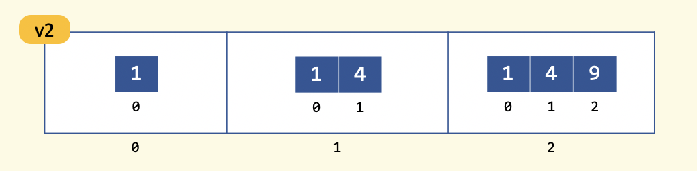
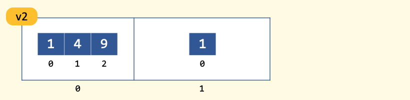
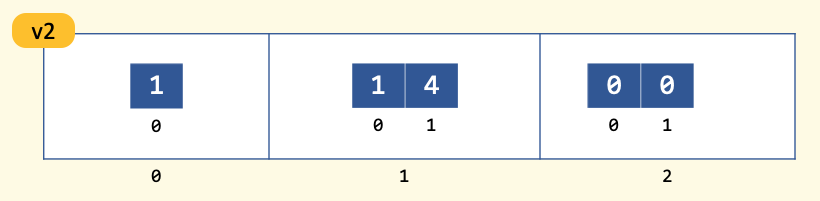

.. qnum::
   :prefix: Q
   :start: 1

.. raw:: html

   <link rel="stylesheet" href="../_static/common/css/main4.css">
   <link rel="stylesheet" href="../_static/common/css/code3.css">
   <link rel="stylesheet" href="../_static/common/css/buttons3.css">
   <link rel="stylesheet" href="../_static/common/css/exercises3.css">
   
   

.. raw:: html

   

====================
More Data Structures
====================

^^^^^^^^^^^^
Introduction
^^^^^^^^^^^^
.. section 1

.. youtube:: xeLYCWvmQHk
   :divid: ch19_01_introduction
   :height: 315
   :width: 560
   :align: center

|

^^^^^^^^^^^^^^^^^^^^^^^^^^^^^^^^^^^^^^^^^^^^^^^^^^
Warm-Up Exercise: Printing a Vector of :code:`int`
^^^^^^^^^^^^^^^^^^^^^^^^^^^^^^^^^^^^^^^^^^^^^^^^^^
.. section 2

Let's get our C++ brains started today by writing a function that prints out the contents of a vector of :code:`int`. Remember, if you have done something similar to this in lab, on a project, or in an earlier Runestone chapter, go ahead and reuse your own code! You can adapt it to suit your needs here, and this function will come in handy later in this chapter.

.. raw:: html

   

      
ch19_ex_printVecOfInts

      

         Well done! The secret word is "shrubbery".
      

   

.. fillintheblank:: ch19_02_ex_printVecOfInts
  :casei:

  Complete the Lobster exercise to reveal the *secret word*. Enter it here.
  
  |blank|

  - :shrubbery: Correct.
    :x: Incorrect. If you finished the exercise, please double check your spelling.

.. admonition:: Walkthrough

  .. reveal:: ch19_02_revealwt_printVecOfInts
  
    .. youtube:: RaNhCTmsrZE
      :divid: ch19_02_wt_printVecOfInts
      :height: 315
      :width: 560
      :align: center

^^^^^^^^^^^^^^^^^^
Vectors of Vectors
^^^^^^^^^^^^^^^^^^
.. section 3

.. youtube:: jlCBOvx8Cb4
   :divid: ch19_03_vectors_of_vectors
   :height: 315
   :width: 560
   :align: center

|

**Knowledge Check:** Here is a vector of vectors named :code:`v2`:

.. figure:: img/VectorOfVectors1.png
   :width: 600
   :align: center
   :alt: A vector of vectors containing 3 vectors. The first inner vector contains 5, 2, 23, 8. The second inner vector contains 42, 42. The third inner vector contains 2, 3, 5, 7, 11, 13.

   ..

.. mchoice:: ch19_03_ex_v2_01

   What is the base type of this vector of vectors?

   - :code:`double`
   
     - Incorrect. Look again at the type of data stored in the inner vectors.

   - :code:`int`
   
     + Correct! The inner vectors store :code:`int` values.

   - :code:`char`
   
     - Incorrect. Look again at the type of data stored in the inner vectors.

   - :code:`string`
   
     - Incorrect. Look again at the type of data stored in the inner vectors.

   - :code:`bool`
   
     - Incorrect. Look again at the type of data stored in the inner vectors.

.. fillintheblank:: ch19_03_ex_v2_02

  The **outer** vector in :code:`v2` has how many elements? |blank|
  
  - :3: Correct!
    :x: No, try again.

.. fillintheblank:: ch19_03_ex_v2_03

  The **first inner** vector in :code:`v2` has how many elements? |blank|
  
  - :4: Correct!
    :x: No, try again.

**Knowledge Check:** Here is a vector of vectors named :code:`c2`:

.. figure:: img/VectorOfVectors2.png
   :width: 600
   :align: center
   :alt: A vector of vectors containing 4 vectors. The inner vectors contain characters. The first inner vector contains H, a, i, l, !. The second inner vector contains T, o. The third inner vector contains t, h, e. The fourth inner vector contains V, i, c, t, o, r, s.

   ..

.. mchoice:: ch19_03_ex_c2_01

   What is the base type of this vector of vectors?

   - :code:`double`
   
     - Incorrect. Look again at the type of data stored in the inner vectors.

   - :code:`int`
   
     - Incorrect. Look again at the type of data stored in the inner vectors.

   - :code:`char`
   
     + Correct! The inner vectors store :code:`char` values.

   - :code:`string`
   
     - Incorrect. Look again at the type of data stored in the inner vectors.

   - :code:`bool`
   
     - Incorrect. Look again at the type of data stored in the inner vectors.

.. fillintheblank:: ch19_03_ex_c2_02

  The **outer** vector in :code:`c2` has how many elements? |blank|
  
  - :4: Correct!
    :x: No, try again.

.. fillintheblank:: ch19_03_ex_c2_03

  The **last inner** vector in :code:`c2` has how many elements? |blank|
  
  - :7: Correct!
    :x: No, try again.

^^^^^^^^^^^^^^^^^^^^^^^^^^^^^^^^^
Indexing Into a Vector of Vectors
^^^^^^^^^^^^^^^^^^^^^^^^^^^^^^^^^
.. section 4

.. youtube:: 38YTRH2sahE
   :divid: ch19_04_indexing_into_a_vector_of_vectors
   :height: 315
   :width: 560
   :align: center

|

**Knowledge Check:** Here is a vector of vectors named :code:`v2`:

.. figure:: img/VectorOfVectors1.png
   :width: 600
   :align: center
   :alt: A vector of vectors containing 3 vectors. The first inner vector contains 5, 2, 23, 8. The second inner vector contains 42, 42. The third inner vector contains 2, 3, 5, 7, 11, 13.

   ..

.. fillintheblank:: ch19_04_ex_v2_indexing_01

  What is the value of :code:`v2[1]`? |blank|
  
  - :[^0-9]*42[^0-9]*42[^0-9]*: Correct!
    :x: No, try again.

.. fillintheblank:: ch19_04_ex_v2_indexing_02

  What is the value of :code:`v2.at(0)`? |blank|
  
  - :[^0-9]*5[^0-9]*2[^0-9]*23[^0-9]*8[^0-9]*: Correct!
    :x: No, try again.

.. fillintheblank:: ch19_04_ex_v2_indexing_03

  What is the value of :code:`v2[0][1]`? |blank|
  
  - :[^0-9]*2[^0-9]*: Correct!
    :x: No, try again.

.. fillintheblank:: ch19_04_ex_v2_indexing_04

  What is the value of :code:`v2[2][5]`? |blank|
  
  - :[^0-9]*13[^0-9]*: Correct!
    :x: No, try again.

---------------------------------------------
Exercise: Printing a Vector of Vectors
---------------------------------------------

This image of :code:`v2` is very helpful for understanding what is in :code:`v2`:

.. figure:: img/VectorOfVectors1.png
   :width: 600
   :align: center
   :alt: A vector of vectors containing 3 vectors. The first inner vector contains 5, 2, 23, 8. The second inner vector contains 42, 42. The third inner vector contains 2, 3, 5, 7, 11, 13.

   ..

But C++ can't make this representation of :code:`v2`; we need to figure out a different way to print out the contents of a vector of vectors. Something like this should work okay:

.. code-block:: none

   { 5 2 23 8 }
   { 42 42 }
   { 2 3 4 5 11 13 }

This isn't the prettiest representation of the data in :code:`v2`, but we can still see all the values so it's fine for our purposes here. The first "row" in this representation corresponds to the vector in :code:`v2.at(0)` (or :code:`v2[0]` if you prefer to use the :code:`[]` method), the second "row" corresponds to the vector in :code:`v2.at(1)` (or :code:`v2[1]` ), and so on until all the data is printed. Let's write a function to print out a vector of vectors of :code:`int` using this representation. 

Download the :download:`printVectorOfVectors.cpp <../_static/more_data_structures/printVectorOfVectors.cpp>` file and complete the missing parts of the :code:`printVecOfVecs` function. Compile the code using the :code:`-std=c++11` flag like this: 

.. code-block:: console

   g++ -std=c++11 printVectorOfVectors.cpp -o printVectorOfVectors

.. fillintheblank:: ch19_04_ex_printVectorOfVectors

  Run the :file:`printVectorOfVectors` program and enter what is printed to the terminal. (Your program should print five lines - enter each line in one of the boxes below.)

  |blank|

  |blank|

  |blank|

  |blank|
  
  |blank|
  
  - :[^0-9]*1[^0-9]*2[^0-9]*3[^0-9]*4[^0-9]*: Line 1 Correct!
    :x: Line 1 Incorrect.
  
  - :[^0-9]*1[^0-9]*2[^0-9]*3[^0-9]*: Line 2 Correct!
    :x: Line 2 Incorrect.
  
  - :[^0-9]*1[^0-9]*2[^0-9]*3[^0-9]*6[^0-9]*7[^0-9]*8[^0-9]*9[^0-9]*: Line 3 Correct!
    :x: Line 3 Incorrect.
  
  - :[^0-9]*: Line 4 Correct!
    :x: Line 4 Incorrect.
  
  - :[^0-9]*0[^0-9]*: Line 5 Correct!
    :x: Line 5 Incorrect.

.. admonition:: Walkthrough

  .. reveal:: ch19_04_revealwt_printVectorOfVectors
  
    .. youtube:: HfNT6RLoRLM
      :divid: ch19_04_wt_printVectorOfVectors
      :height: 315
      :width: 560
      :align: center

^^^^^^^^^^^^^^^^^^^^^^^^^^^^^^^^^^^^^^^^^
Building and Modifying Vectors of Vectors
^^^^^^^^^^^^^^^^^^^^^^^^^^^^^^^^^^^^^^^^^
.. section 5

.. youtube:: ZIJ2fHP4y9w
   :divid: ch19_05_vid_building_vectors_of_vectors
   :height: 315
   :width: 560
   :align: center

|

**Knowledge Check:** Creating a vector of vectors

.. mchoice:: ch19_05_ex_building_01

   Which diagram shows the contents of :code:`v2` after this code is run?

   .. code-block:: cpp

      vector< vector<int> > v2; // starts empty 
      vector<int> v; // starts empty 

      for (int i = 1; i < 4; ++i) {
        v.push_back(i*i);
        v2.push_back(v);
      }

   .. figure:: img/v2Diagrams.png
      :width: 600
      :align: center

      ..

   - ..
   
     - Incorrect. Look again how :code:`v`, the inner vector, changes each time through the loop… and what its value is when it is added as an element of the outer vector.

   - ..
   
     - Oops! Think again about how :code:`.push_back()` works.

   - ..
   
     - Incorrect. Look again how :code:`v`, the inner vector, changes each time through the loop… and what its value is when it is added as an element of the outer vector.

   - ..
   
     + Correct! The inner vector, :code:`v`, adds an element each time through the loop, and that version of the inner vector is added as an element to the outer vector.

|

----------------------------------------------------
Exercise: Modifying Elements in a Vector of Vectors
----------------------------------------------------

For the questions below, consider the vector :code:`v2` shown in an initial state that we'll call "State 1".

   State 1

We would like to change the contents of :code:`v2` to match "State 2":

   State 2

Arrange the lines of code below such that they would change :code:`v2` from "State 1" to "State 2". Some lines contain mistakes or are unnecessary - these lines should not be used.

.. parsonsprob:: ch19_05_ex_building_02
   :language: cpp

   -----
   v2[0] = v2[2];
   =====
   v2.pop_back();
   =====
   v2[1].pop_back();
   =====
   v2[0] = v2[1]; #distractor
   =====
   v2[1].push_back(4); #distractor
   =====
   vector&lt;int&gt; temp(2,0); #distractor
   =====
   v2.push_back(temp); #distractor
   =====

Now, let's try to change "State 2" to "State 3":

   State 2

   State 3

Arrange the lines of code below such that they would change :code:`v2` from "State 2" to "State 3". Some lines contain mistakes or are unnecessary - these lines should not be used.

.. parsonsprob:: ch19_05_ex_building_03
   :language: cpp

   -----
   v2[0] = v2[1];
   =====
   v2[1].push_back(4);
   =====
   vector&lt;int&gt; temp(2,0);
   =====
   v2.push_back(temp);
   =====
   v2[0] = v2[2]; #distractor
   =====
   v2.pop_back(); #distractor
   =====
   v2[1].pop_back(); #distractor
   =====

.. admonition:: Walkthrough

  .. reveal:: ch19_05_revealwt_building
  
    .. youtube:: RJXsP6Lz8ss
      :divid: ch19_05_wt_building
      :height: 315
      :width: 560
      :align: center

^^^^^^^^^^^^^^^^^^^^^^^^^^^
Uses for Vectors of Vectors
^^^^^^^^^^^^^^^^^^^^^^^^^^^
.. section 6

.. youtube:: FooSTlapMIQ
   :divid: ch19_06_vid_uses_for_vectors_of_vectors
   :height: 315
   :width: 560
   :align: center

|

^^^^^^^^^^^^^^^^^^^^^^^^^^^^^^^^^^^^^^^
Application: Analyzing Data in a Matrix
^^^^^^^^^^^^^^^^^^^^^^^^^^^^^^^^^^^^^^^
.. section 7

As we saw in MATLAB, a common computing task is analyzing data. Let's practice using the vector of vectors data structure by writing a program to read in data to a matrix and then analyze the data. 

.. admonition:: Download

   - :download:`testData.txt <../_static/more_data_structures/testData.txt>`
   - :download:`analyzeData.cpp <../_static/more_data_structures/analyzeData.cpp>`

The :file:`testData.txt` file has some sample test data in it. Here is the contents of the file: 

.. code-block:: none

   numRows 5
   numCols 7

   1 2 3 4 5 6 7
   8 9 10 11 12 13 14
   15 16 17 18 19 20 21
   22 23 24 25 26 27 28
   29 30 31 32 33 34 35

This is a small dataset so it's easier for us to work with here in Runestone. But real datasets can have millions of data points, so we should write our program to be as reasonably flexible as possible.

---------------------
Designing the Program
---------------------

.. youtube:: RmcLiuJ95Qw
   :divid: ch19_07_vid_designing_the_program
   :height: 315
   :width: 560
   :align: center

|

Recap: We want to read in some data and then calculate the sum of each row, the sum of each column, and the sum of all the elements together. Here is the pseudocode for our :code:`main` function:

.. code-block:: none

   int main() {
     open the test data file
   
     if it did not open correctly
       display error message and end program
   
     make vector of vectors with correct # of empty elements
     loadData()
   
     sumOfRows()
     sumOfCols()
     sum()
   
     print out the results
   
   }

|

----------------------------
Writing the Helper Functions
----------------------------

There are four helper functions that we need to write:

- :code:`loadData()`
- :code:`sumOfRows()`
- :code:`sumOfCols()`
- :code:`sum()`

Let's write some pseudocode for the helper functions to help us implement these functions.

.. youtube:: kqAX_vhQUU4
   :divid: ch19_07_vid_helper_function_pseudocode
   :height: 315
   :width: 560
   :align: center

|

-----------------------------------------
Exercise: A :code:`loadData` Function
-----------------------------------------

Complete the :code:`loadData` function in the :file:`analyzeData.cpp` file. Here is the pseudocode for the :code:`loadData` function:

.. code-block:: none

   void loadData(vector of vectors, input stream from file) { 
   
     get number of rows from vector of vectors
     get number of columns from vector of vectors
     
     make a temporary variable to store numbers in from >> operator
   
     loop on outer vector
       loop on inner vector
         read a number from input stream
         store that number in the correct element of the vec of vecs
       end of loop on inner vector
     end of loop on outer vector
   
   }

.. shortanswer:: ch19_07_ex_loadData

   Copy your :code:`loadData` function here:

.. admonition:: Walkthrough

  .. reveal:: ch19_07_revealwt_loadData
  
    .. youtube:: uakxmBHRpcA
      :divid: ch19_07_wt_loadData
      :height: 315
      :width: 560
      :align: center

-----------------------------------------
Exercise: A :code:`sumOfRows` Function
-----------------------------------------

Complete the :code:`sumOfRows` function in the :file:`analyzeData.cpp` file. Here is the pseudocode for the :code:`sumOfRows` function:

.. code-block:: none

   void sumOfRows(vector of vectors, vector) { 
   
     traverse the outer vector to go through each row one by one
       traverse the inner vector 
         use the "accumulator" pattern to find the sum of each row
       end of loop on inner vector
     end of loop on outer vector
     
   }

.. shortanswer:: ch19_07_ex_sumOfRows

   Copy your :code:`sumOfRows` function here:

.. admonition:: Walkthrough

  .. reveal:: ch19_07_revealwt_sumOfRows
  
    .. youtube:: aUqrjYakr7U
      :divid: ch19_07_wt_sumOfRows
      :height: 315
      :width: 560
      :align: center

-----------------------------------------
Exercise: A :code:`sumOfCols` Function
-----------------------------------------

Complete the :code:`sumOfCols` function in the :file:`analyzeData.cpp` file. Here is the pseudocode for the :code:`sumOfCols` function:

.. code-block:: none

   void sumOfCols(vector of vectors, vector) { 
   
     traverse an inner vector to go through each column one by one
       traverse the outer vector 
         use the "accumulator" pattern to find the sum of each column
       end of loop on outer vector
     end of loop on inner vector
   
   }

.. shortanswer:: ch19_07_ex_sumOfCols

   Copy your :code:`sumOfCols` function here:

.. admonition:: Walkthrough

  .. reveal:: ch19_07_revealwt_sumOfCols
  
    .. youtube:: sf2ItguQdSQ
      :divid: ch19_07_wt_sumOfCols
      :height: 315
      :width: 560
      :align: center

-----------------------------------------
Exercise: A :code:`sum` Function
-----------------------------------------

Complete the :code:`sum` function in the :file:`analyzeData.cpp` file. Here is the pseudocode for the :code:`sum` function:

.. code-block:: none

   int sum(vector of vectors) { 
   
     traverse the outer vector to go through each row one by one
       traverse the inner vector 
         use the "accumulator" pattern to find the total sum
       end of loop on inner vector
     end of loop on outer vector
     
     return sum of all elements
   
   }

.. shortanswer:: ch19_07_ex_sum

   Copy your :code:`sum` function here:

.. admonition:: Walkthrough

  .. reveal:: ch19_07_revealwt_sum
  
    .. youtube:: oDcirGsul0w
      :divid: ch19_07_wt_sum
      :height: 315
      :width: 560
      :align: center

------------------
Analyzing the Data
------------------

Now that we have all of our functions written, let's compile and run the program! Compile the code using the :code:`-std=c++11` flag like this: 

.. code-block:: console

   g++ -std=c++11 analyzeData.cpp -o analyzeData

.. fillintheblank:: ch19_07_ex_analyzeData

  Run the :code:`analyzeData` program and fill in the boxes below based on what is printed to the terminal:

  | row sums:   
  | { |BLANK| }
  
  | column sums:   
  | { |BLANK| }
  
  The sum of all the elements is: |blank|
  
  - :[^0-9]*28[^0-9]*77[^0-9]*126[^0-9]*175[^0-9]*224[^0-9]*: Box 1 Correct!
    :x: Box 1 Incorrect.
  
  - :[^0-9]*75[^0-9]*80[^0-9]*85[^0-9]*90[^0-9]*95[^0-9]*100[^0-9]*105[^0-9]*: Box 2 Correct!
    :x: Box 2 Incorrect.
  
  - :[^0-9]*630[^0-9]*: Box 3 Correct!
    :x: Box 3 Incorrect.

|

---------------------
Debugging the Program
---------------------

Is your program not compiling and/or not running? To debug your program, you need to find where in the code things are not working correctly. Here are some ways to find the place(s) where your code's behavior deviates from what you want it to do:

1. Use the :code:`printVecOfInts` and :code:`printVecOfVecs` helper functions to print out the values in your vectors and vectors of vectors at different points in your code. There is an example of this in the main function: the :code:`printVecOfVecs` helper function is used to print out the values of the "matrix" so that we can check if what we read in matches what is in the text file. After you have verified the data, you can comment out these lines.
2. Use :code:`cout` statements like, :code:`"This is the start of the sumOfRows function"` to help you see how far your program gets before it crashes, throws an error, or otherwise stops working correctly.
3. Use :code:`cout` statements that print out the value of the index variable in a for loop to help debug loops, especially nested loops. 

If your code compiles and runs but then gets to a point where it "doesn't seem to do anything", then you might have one of these situations: 

A. There is a stray :code:`cin` statement somewhere and the program is "not doing anything" because it's waiting for you to type something and hit enter. (Note: this particular program does not require user input via :code:`cin`, so :code:`cin` should not be anywhere in your finished program.)
B. There is an infinite loop somewhere. In this case, fall back on method #3 above to help you debug the loop. 

If you've tried all these tricks and your program still won't compile and/or run, please watch the Walkthroughs!

^^^^^^^^^^^^^^^^^^^^^^^^^^^^^^^^^^^^^^^^^^^^^^^^^^^^^^^
Summary
^^^^^^^^^^^^^^^^^^^^^^^^^^^^^^^^^^^^^^^^^^^^^^^^^^^^^^^

This is the end of the chapter! Here is a summary of what we covered in this chapter: 

* 

You can double check that you have completed everything on the "Assignments" page. Click the icon that looks like a person, go to "Assignments", select the chapter, and make sure to scroll all the way to the bottom and click the "Score Me" button.