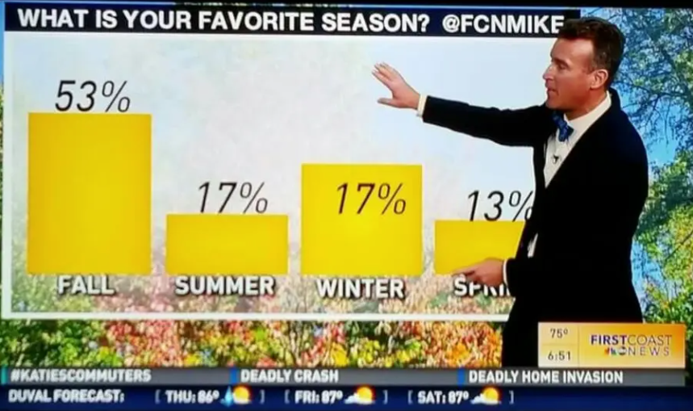
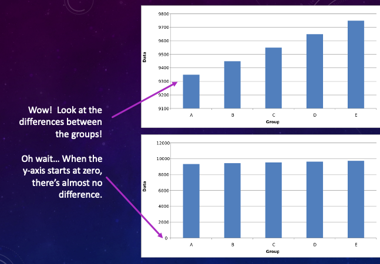
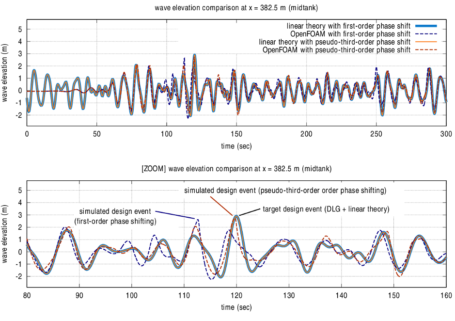

.. qnum::
   :prefix: Q
   :start: 1

.. raw:: html

   <link rel="stylesheet" href="../_static/common/css/matlab.css">
   
   

====================
Plotting and Figures
====================

^^^^^^^^^^^^^^^^^^^^^^^^^^^^^^^^^^^^^^^^^^^^^^^^^^^^^^^
Introduction
^^^^^^^^^^^^^^^^^^^^^^^^^^^^^^^^^^^^^^^^^^^^^^^^^^^^^^^

Data, data, data! As engineers, all of you will be working with data on a regular basis. Maybe you will have empirical results from stress testing a new product, or measurements from how a bridge holds up under high wind speeds, or records of how many new users visited your phone app in the last month. Whatever data you are working with, it's important to be able to visualize your data using graphs and figures. A good graph can show relationships between data that are difficult, if not impossible, to explain with words. Graphs and figures can help you (and your audience) grasp what equations and data actually *mean*.

MATLAB has a great variety of tools to help you make informative graphs. In this chapter, we'll cover making line plots, scatter plots, pie charts, and bar charts. We'll also talk about how to make graphs that accurately represent your data, and are not accidentally misleading. For example, consider this graph:

|
  
.. mchoice:: ch06_01_weather_graph
  :answer_a: The bar for summer should be higher than the bar for spring.
  :answer_b: The bars for summer and winter should be the same height.
  :answer_c: The scale of the y-axis is uneven.
  :answer_d: All of the above
  :correct: d
  :feedback_a: Oops! This is a problem, but do you see more problems in this graph?
  :feedback_b: Oops! This is a problem, but do you see more problems in this graph?
  :feedback_c: Oops! This is a problem, but do you see more problems in this graph?
  :feedback_d: Correct! There are a multitude of problems with this graph.
  
Even though this graph was meant to be informative and interesting, it ended up being misleading because best practices weren't followed. As you create your graphs, it's important to think about what your graphs are communicating and if they are a fair representation of your data. We'll talk more about best practices for graphs in this chapter.

Before we get started, go ahead and download the files that we will use for this chapter. I would recommend creating a new MATLAB folder to store the scripts and data files that we will be using.

.. admonition:: Data File

  .. list-table::
    :align: left
    :widths: auto

    * - :download:`InternetUsers.m <../_static/plotting_and_figures/InternetUsers.m>`

      - .. reveal:: InternetUsers_m_preview
          :showtitle: Preview
          :modal:
          :modaltitle: <code>InternetUsers.m</code>

          .. literalinclude:: ../_static/plotting_and_figures/InternetUsers.m
            :lines: 1-24
            :append: ...

      - Starter script for plotting the number of Internet and Facebook users
      
    * - :download:`star_data.xlsx <../_static/plotting_and_figures/star_data.xlsx>`

      - .. reveal:: star_data_xlsx_preview
          :showtitle: Preview
          :modal:
          :modaltitle: <code>star_data.xlsx</code>

          .. image:: img/star_data_xlsx_preview.png
            :width: 400
            :align: center

      - Data on 75 known star systems within 16.3 lightyears
      
    * - :download:`AnalyzeStars.m <../_static/plotting_and_figures/AnalyzeStars.m>`

      - .. reveal:: AnalyzeStars_m_preview
          :showtitle: Preview
          :modal:
          :modaltitle: <code>AnalyzeStars.m</code>

          .. literalinclude:: ../_static/plotting_and_figures/AnalyzeStars.m
            :lines: 1-32
            :append: ...

      - Starter script for analyzing the star data

^^^^^^^^^^^^^^^^^^^^^^^^^^^^^^^^^^^^^^^^^^^^^^^^^^^^^^^
Line Plots
^^^^^^^^^^^^^^^^^^^^^^^^^^^^^^^^^^^^^^^^^^^^^^^^^^^^^^^

For the following video, make sure that you've downloaded :code:`InternetUsers.m` from the File Download box above. Follow along with the video using this starter script; the exercise after the video will ask you to make some additional changes.

(video going through plotting Internet and Facebook users)

Let's review some of the commands that we used to create line plots. If we have a vector of x-values (say, :code:`internet_years`) and a vector of y-values (say, :code:`internet_users`), we can create a line plot.

.. code-block:: matlab

  plot(internet_years, internet_users);
  
We can add a title, x-axis and y-axis labels, and a legend. In this example, we are placing the legend in the "Northwest" (e.g., upper left) corner of the plot.

.. code-block:: matlab

    title('Growth in Internet Users');
    xlabel('Year');
    ylabel('Number of Users (millions)');
    legend("Internet Users", "Location", "Northwest");
    
We can also customize the line style, marker type, and color for the plotted line. For example, the following example uses a dashed, blue line with circles at the data points. Refer to the documentation for :code:`plot` for more customization examples.

.. code-block:: matlab

    plot(internet_years, internet_users, 'b--o');
    
If we want to plot two lines on the same graph (e.g., Internet users *and* Facebook users), there are two ways to do it. First, we can give additional arguments to the :code:`plot` function.

.. code-block:: matlab

    plot(internet_years, internet_users, facebook_years, facebook_users);
    
Second, we can create a :code:`figure` and use :code:`hold on` to call :code:`plot` multiple times. (Use :code:`hold off` to turn off this behavior.)

.. code-block:: matlab

    figure();
    plot(internet_years, internet_users);
    hold on;
    plot(facebook_years, facebook_users);

------------------------------------
Exercise: Customizing Line Plots
------------------------------------

For this exercise, use the starter script :code:`InternetUsers.m` (which you can download at the top of this chapter), and build off of the plots that we made in the previous video.

Take the following steps to customize these line plots further:

1. Choose a different line color and line type for the line plotting :code:`facebook_years` vs. :code:`facebook_users`. (hint: MATLAB's documentation for :code:`plot` has additional examples that you can use to help you.)
2. Move the legend to the lower right-hand corner.

.. shortanswer:: ch06_01_line_plot_customization

  Paste in a copy of your completed :file:`InternetUsers.m` script file.
  
  
^^^^^^^^^^^^^^^^^^^^^^^^^^^^^^^^^^^^^^^^^^^^^^^^^^^^^^^
Scatter Plots
^^^^^^^^^^^^^^^^^^^^^^^^^^^^^^^^^^^^^^^^^^^^^^^^^^^^^^^

Now that we've seen some of the basics of plotting, let's use a larger dataset and make some scatter plots! You may have noticed that in the previous exercise, the data was stored in the MATLAB script in vectors. As we saw in Ch. 3, this can cause problems. For instance, what if I had accidentally mistyped a number when I was typing my data into the script? A better way to handle data is to store it in a separate data file, and then read it into your MATLAB script.

For the next few examples, we're going to work with a dataset of 75 known star systems within 16.3 light-years of Earth. (Of great interest, this dataset includes Proxima Centauri, the closest star to the sun, and the star that our planet Proxima b orbits!)

.. image:: img/proxima_centauri.jpg
  :width: 560
  :align: center
  :alt: An image of Proxima Centauri taken by the Hubble Space Telescope in 2013. The bright lines are diffraction spikes (lines radiating from bright light sources).
  
  An image of Proxima Centauri taken by the Hubble Space Telescope in 2013. The bright lines are diffraction spikes (lines radiating from bright light sources).

|

Open up the dataset file (:code:`star_data.xlsx`) in Excel, Numbers, or a similar program. You'll see lots of interesting data about stars contained here! We have the name of each star, and its distance from the Earth in light-years. We also have the mass of each star, which is measured using the Sun as a reference point (e.g., the Sun has a mass of 1, and every other star has a mass relative to this). The apparent magnitude measures how bright each star is as observed from Earth. The lower the number is, the brighter the star appears. That's why the Sun has such a low value (-26.74) - it's clearly the brightest object in the sky! Finally, we have the number of confirmed planets orbiting each Sun (hello, Proxima b) and the stellar class of each star. The stellar class is a classification system based on the temperature of the star (e.g., red dwarfs are much cooler than white dwarfs).

An important thing to note about this data: some of the stars don't have information about their mass or magnitude. In those cases, I filled in the missing data with a 0 value. When you work with the mass and magnitude data, you'll want to eliminate all of the stars that have a 0 in those categories. You can do this using logical indexing.

.. image:: img/star_life.jpg
  :width: 560
  :align: center
  :alt: The life and death of a star.
  
|

We can make some really neat plots with all of this data. Make sure that you've downloaded :code:`AnalyzeStars.m` from the beginning of this chapter. We will use this as a starter script for making plots.

(video making scatter plot of mass v. number of planets)

In the previous video, we read in our data from an Excel file and used it to create a scatter plot. In general, when we are plotting a dataset, we will take the following steps:

1. Input data (for example, from a :code:`.csv` file or an Excel file).
2. Extract data into vectors.
3. Perform calculations on the data.
4. Display data in a plot.

We specifically created a scatter plot. If we have a vector of x-values (say, :code:`selected_mass`) and a vector of y-values (say, :code:`selected_planets`), we can create a scatter plot.

.. code-block:: matlab

  scatter(selected_mass, selected_planets);
  
We can set the range (e.g., the minimum and maximum values) of the x-axis and y-axis using the following commands.

.. code-block:: matlab

    xlim([0, 3]);
    ylim([-1, 9]);
    
We can also display the grid on our plots using :code:`grid on` (similarily, :code:`grid off` turns off the grid).

.. mchoice:: ch06_02_ex_plot
    Consider the following vectors.

  .. code-block:: matlab
  
    x_ordered = [ 1, 2, 3, 4, 5];
    y_ordered = [10,20,30,40,50];
    
    x_unordered = [ 3, 5, 2, 1, 4];
    y_unordered = [30,50,20,10,40];
    

  In the above code, :code:`x_unordered` and :code:`y_unordered` contain the same pairings as :code:`x_ordered` and :code:`y_ordered`, but they are in a different order. If you call :code:`scatter(x_ordered, y_ordered)` and :code:`scatter(x_unordered, y_unordered)`, you will get the same result. But what if you call :code:`plot(x_ordered, y_ordered)` and :code:`plot(x_unordered, y_unordered)`? Will the two calls to :code:`plot` give you the same result? (If you're not sure, try it out in MATLAB!)

  :answer_a: :code:`plot(x_ordered, y_ordered)` and :code:`plot(x_unordered, y_unordered)` will give you the same result.
  :answer_b: When you run :code:`plot(x_unordered, y_unordered)`, the plot automatically switches from a line plot to a scatter plot.
  :answer_c: :code:`plot(x_unordered, y_unordered)` appears to cross back over itself.
  :answer_d: When you run :code:`plot(x_unordered, y_unordered)`, the plot switches axes to keep the plot a mathematical function.
  :correct: c
  :feedback_a: Oops! Try running this in MATLAB - the plot is not the same.
  :feedback_b: Oops! Unless you tell MATLAB to switch plotting styles, it will not switch.
  :feedback_c: Correct! MATLAB plots in the order of the vector so having the series out of order will result in an odd-looking line graph.
  :feedback_d: Oops! MATLAB will not switch axes without any prompting.
  
------------------------------------
Exercise: Creating a Scatter Plot
------------------------------------

For this exercise, use the starter script :code:`AnalyzeStars.m` and the dataset :code:`star_data.xlsx` (which you can download at the top of this chapter).

.. tip::
    If you want to create this scatter plot in the same script as we created the previous scatter plot in, you will need to create a new figure for the new plot. To do this, before doing the steps below, call :code:`figure();` in your MATLAB script. This tells MATLAB that you are creating a new plot, and it will put it in a new figure, and the two plots won't overlap.

Create a new scatter plot using these steps:

1. Select all the elements of :code:`mass` where the mass doesn't equal 0 and the corresponding magnitude doesn't equal 0. Save this in a variable :code:`selected_mass`.
2. Select all the elements of :code:`magnitude` where the corresponding mass doesn't equal 0 and the magnitude doesn't equal 0. Save this in a variable :code:`selected_magnitude`.
3. Plot a scatter graph of :code:`selected_mass` vs. :code:`selected_magnitude`.
4. Add appropriate labels to the x-axis and y-axis.
5. Turn the grid lines on.

.. shortanswer:: ch06_02_creating_scatter_plot

  Paste in a copy of your completed :file:`AnalyzeStars.m` script file.
  
(walkthrough video)

^^^^^^^^^^^^^^^^^^^^^^^^^^^^^^^^^^^^^^^^^^^^^^^^^^^^^^^
Pie Charts
^^^^^^^^^^^^^^^^^^^^^^^^^^^^^^^^^^^^^^^^^^^^^^^^^^^^^^^

Make sure that you've downloaded :code:`AnalyzeStars.m` and :code:`star_data.xlsx` from the beginning of this chapter. We will use this as a starter script and dataset for making plots.

(video making pie chart of stellar classes)

To review what we covered in the video, if we have a vector of counts (e.g., :code:`all_counts`), we can make a pie chart of these counts.

.. code-block:: matlab

    pie(all_counts);

There are two ways to add labels to our pie chart. We can add the labels directly to the pie chart by passing them as a parameter to :code:`pie`.

.. code-block:: matlab

    pie(all_counts, stellar_class_labels);
    
We can also create a separate legend for the labels.

.. code-block:: matlab

    pie(all_counts);
    legend(stellar_class_labels);
    
In MATLAB, figures are used to display graphics in a separate window. There may be several figures visible at any one time. Each figure has a unique number, usually beginning with Figure 1, Figure 2, … The current figure will be the target of the MATLAB display. To manage figures, use the figure function.

.. code-block:: matlab

    % creates a new figure, which becomes the current figure
    figure();

    % sets figure n to be the current figure, creating one if not defined
    figure(n);
    
To close the current figure, use :code:`close`. To close all figures, use :code:`close all`. To close a particular figure n, use :code:`close n`.

.. mchoice:: ch06_03_ex_figure
  Consider the following code.

  .. code-block:: matlab

    figure();
    plot(mass, magnitude);

    figure();
    scatter(magnitude, planets);
    
  If you run this script, Figure 2 is a scatter plot of :code:`magnitude` v. :code:`planets`. Now, suppose you type the following into the command window:

  .. code-block:: matlab

    figure(2);
    plot(mass, planets);

  What happened to Figure 2?

  :answer_a: Figure 2 remains unchanged.
  :answer_b: The original Figure 2 was replaced by the new :code:`figure(2)` command.
  :correct: b
  :feedback_a: Oops! Calling :code:`figure(2)` again will overwrite the existing Figure 2.
  :feedback_b: Correct! The original figure gets replaced by MATLAB when you call :code:`figure(2)` a second time.

------------------------------------
Exercise: Creating a Pie Chart
------------------------------------

For this exercise, use the starter script :code:`AnalyzeStars.m` and the dataset :code:`star_data.xlsx` (which you can download at the top of this chapter).

Create a new pie chart using these steps:

1. Close all previous figures, and create a new figure in your script.
2. Count the number of stars with zero planets. Store this in a variable :code:`zero_counts`. Do the same for stars with one planet, two planets, three planets, four planets, and eight planets. (There are no stars with five, six, seven, or greater than eight planets.)
3. Put all of the counts from step 2 into a vector :code:`all_counts`.
4. Create a vector of labels. Include the labels "zero", "one", "two", "three", "four", and "eight".
5. Create a pie chart of :code:`all_counts`.
6. Try including the labels on the pie chart by including them as a parameter of :code:`pie`. Try also including the labels as a separate legend (you may need to move the location of the legend). Keep whichever version looks better.

.. shortanswer:: ch06_03_creating_pie_chart

  Paste in a copy of your completed :file:`AnalyzeStars.m` script file.
  
(walkthrough video)

^^^^^^^^^^^^^^^^^^^^^^^^^^^^^^^^^^^^^^^^^^^^^^^^^^^^^^^
Bar Charts
^^^^^^^^^^^^^^^^^^^^^^^^^^^^^^^^^^^^^^^^^^^^^^^^^^^^^^^

Make sure that you've downloaded :code:`AnalyzeStars.m` and :code:`star_data.xlsx` from the beginning of this chapter. We will use this as a starter script and dataset for making plots.

(video making bar chart)

Let's review some of the commands for making bar charts. To plot a bar chart with only one bar for each x-value, put your data in a column vector (e.g., :code:`magnitude_averages`).

.. code-block:: matlab

    bar(magnitude_averages);
    
If you want to have multiple bars for each x-value, create multiple column vectors and combine them into a matrix when calling :code:`bar`. **(Make sure to use column vectors, not row vectors here.)

.. code-block:: matlab

    bar([magnitude_averages, distance_averages]);
    
If you are going to make a plot multiple times, you can put it in a function to make it easier to call repeatedly. You can also pass parameters into this function to customize the plot.
    
To further customize a plot, use :code:`gca` ("get current axes"). You can call :code:`gca` and store it in a variable, and then you can modify any of the axis characteristics. Here are some examples.

.. code-block:: matlab

    % get current axes in the variable ax
    ax = gca;
    
    % modify via ax, [NOTE, CaseSensitive !!!]
    ax.FontSize = 20;          % Change the font size
    ax.YLim = [0,20];          % Change the y-axis range
    ax.XLim = [0,4];           % Change the x-axis range
    ax.XTickLabel = labels;    % Change the x-tick labels
    ax.YGrid = 'on';           % Turn the y-axis grid on
    ax.GridColor = [1,0,0];    % Change the grid color [R, G, B]
    ax.GridAlpha = 1;          % Grid color on full
    
This only scratches the surface of the kind of customization you can do to your plots in MATLAB! There's so many more options! Here's the truth: *Nobody memorizes all the different kinds of plots and the ways you can customize them.* Refer to online documentation for general guidance, and search online if there's something specific you're looking for.

Here's a few examples of things you can do:

.. image:: img/matlab_plots.png
  :width: 560
  :align: center
  :alt: Many kinds of MATLAB plots.
  
  Refer to `this page <https://www.mathworks.com/help/matlab/creating_plots/types-of-matlab-plots.html>` for more info (and even more types of plots!).

|

.. mchoice:: ch06_04_bar_charts
  In the previous video, we created a bar chart where we plotted average magnitude and average distance on the same chart. Why is this problematic?
  
  :answer_a: This isn't problematic.
  :answer_b: Average magnitude and average distance aren't related to each other, so they shouldn't be on the same plot.
  :answer_c: Average magnitude and average distance are measured in different units, so the y-axis isn't the same for both of these.
  :correct: c
  :feedback_a: Oops! Try clicking on some of the other answers to find out why this problematic.
  :feedback_b: Oops! Because these are both characteristics of stars, they are potentially related to each other. There is a stronger answer to this question.
  :feedback_c: Correct! Magnitude and distance have different units of measurement, so plotting them on the same y-axis can be misleading.
  
^^^^^^^^^^^^^^^^^^^^^^^^^^^^^^^^^^^^^^^^^^^^^^^^^^^^^^^
A Few Final Thoughts
^^^^^^^^^^^^^^^^^^^^^^^^^^^^^^^^^^^^^^^^^^^^^^^^^^^^^^^

.. image:: img/img13.png
  :width: 400
  :align: center
  :alt: Meme: Yes, Yes, Excellent.
  
|

As an engineer, it's very possible that your graphs will out-live you, and that they will go on to have a life of their own. As a responsible engineer, you need to make clear graphs that can "stand on their own" (e.g., it is obvious what they are trying to convey). Here are some good practices to follow:

1. Don't be misleading in your plots.

  
|

In the top graph above, it looks like there's a big different between all of the groups. But, that graph is really just showing a small segment of the y-axis. If we zoom out and look at the graph in perspective, when the y-axis starts at 0, we see that there's very little difference between the groups. It's important to make sure that your graphs are communicating the truth about your data. For more information, check out this `Wikipedia page <https://en.wikipedia.org/wiki/Misleading_graph>`.

2. Do maximize your "Signal-Noise Ratio".

Consider these two graphs:

  
|

Both graphs are presenting the same information. Which graph is easier to understand? The second one is much clearer! The second one frames the data more clearly; the audience doesn't have to hunt for the data or try to puzzle out what the meaning of the graph is. If you make your audience work too hard, you've lost them.

Here are a few things we can learn from these graphs:

* Use legends vs. labels appropriately (the first graph uses a legend; the second uses labels).
* If you HAVE to have a title, it should describe what your audience should learn from the graph.
* Plot on a white background.
* Include horizontal and vertical grid lines (unless you have a REALLY good reason not to).
* Choose high contrast colors (watch out for color blindness!).

For more inspiration, check out `reddit.com/r/dataisbeautiful <reddit.com/r/dataisbeautiful>`.

^^^^^^^^^^^^^^^^^^^^^^^^^^^^^^^^^^^^^^^^^^^^^^^^^^^^^^^
Summary
^^^^^^^^^^^^^^^^^^^^^^^^^^^^^^^^^^^^^^^^^^^^^^^^^^^^^^^

This is the end of the chapter! Here is a summary of what we covered in this chapter: 

* 

You can double check that you have completed everything on the "Assignments" page. Click the icon that looks like a person, go to "Assignments", select the chapter, and make sure to scroll all the way to the bottom and click the "Score Me" button.
