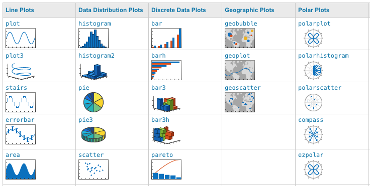

.. qnum::
   :prefix: Q
   :start: 1

.. raw:: html

   <link rel="stylesheet" href="../_static/common/css/theme-overrides.css">

.. raw:: html

   <link rel="stylesheet" href="../_static/common/css/matlab.css">
   
   

====================
Plotting and Figures
====================

|

.. image:: img/img13.png
  :width: 400
  :align: center
  :alt: Meme: Yes, Yes, Excellent.

.. raw:: html

    
<i>No, not that kind of plotting.</i>

    
|

.. admonition:: Chapter Files

  We’ll be using several files throughout this chapter’s exercises. It might be helpful to go ahead and download each of them now and move them to your current folder in MATLAB. (It’s also a good idea to go ahead and create a new folder for this chapter and use that as your current folder, so that you don’t clutter up whatever else you were working on.)

  .. list-table::
    :align: left
    :widths: auto

    * - :download:`InternetUsers.m <../_static/plotting_and_figures/InternetUsers.m>`

      - .. reveal:: InternetUsers_m_preview
          :showtitle: Preview
          :modal:
          :modaltitle: <code>InternetUsers.m</code>

          .. literalinclude:: ../_static/plotting_and_figures/InternetUsers.m
            :lines: 1-24
            :append: ...

      - Starter script for plotting the number of Internet and Facebook users
      
    * - :download:`star_data.xlsx <../_static/plotting_and_figures/star_data.xlsx>`

      - .. reveal:: star_data_xlsx_preview
          :showtitle: Preview
          :modal:
          :modaltitle: <code>star_data.xlsx</code>

          .. image:: img/star_data_xlsx_preview.png
            :width: 400
            :align: center

      - Data on 75 known star systems within 16.3 lightyears
      
    * - :download:`AnalyzeStars.m <../_static/plotting_and_figures/AnalyzeStars.m>`

      - .. reveal:: AnalyzeStars_m_preview
          :showtitle: Preview
          :modal:
          :modaltitle: <code>AnalyzeStars.m</code>

          .. literalinclude:: ../_static/plotting_and_figures/AnalyzeStars.m
            :lines: 1-32
            :append: ...

      - Starter script for analyzing the star data

^^^^^^^^^^^^^^^^^^^^^^^^^^^^^^^^^^^^^^^^^^^^^^^^^^^^^^^
Introduction
^^^^^^^^^^^^^^^^^^^^^^^^^^^^^^^^^^^^^^^^^^^^^^^^^^^^^^^

.. include:: ex/introduction.in.rst

^^^^^^^^^^^^^^^^^^^^^^^^^^^^^^^^^^^^^^^^^^^^^^^^^^^^^^^
Line Plots
^^^^^^^^^^^^^^^^^^^^^^^^^^^^^^^^^^^^^^^^^^^^^^^^^^^^^^^

.. include:: ex/line_plots.in.rst

------------------------------------
Exercise: Customizing Line Plots
------------------------------------

.. include:: ex/line_plots_exercise.in.rst
  
.. admonition:: Walkthrough

  .. reveal:: ch06_03_revealwt_line_plots
  
    .. youtube:: p8CcGFVh2w4
      :divid: ch06_03_wt_line_plots
      :height: 315
      :width: 560
      :align: center
  
^^^^^^^^^^^^^^^^^^^^^^^^^^^^^^^^^^^^^^^^^^^^^^^^^^^^^^^
Scatter Plots
^^^^^^^^^^^^^^^^^^^^^^^^^^^^^^^^^^^^^^^^^^^^^^^^^^^^^^^

.. include:: ex/scatter_plots.in.rst
  
------------------------------------
Exercise: Creating a Scatter Plot
------------------------------------

.. include:: ex/scatter_plots_exercise.in.rst

.. admonition:: Walkthrough

  .. reveal:: ch06_05_revealwt_scatter_plots
  
    .. youtube:: J-I3DqH147M
      :divid: ch06_05_wt_scatter_plots
      :height: 315
      :width: 560
      :align: center

^^^^^^^^^^^^^^^^^^^^^^^^^^^^^^^^^^^^^^^^^^^^^^^^^^^^^^^
Pie Charts
^^^^^^^^^^^^^^^^^^^^^^^^^^^^^^^^^^^^^^^^^^^^^^^^^^^^^^^

.. include:: ex/pie_charts.in.rst

^^^^^^^^^^^^^^^^^^^^^^^^^^^^^^^^^^^^^^^^^^^^^^^^^^^^^^^
Bar Charts
^^^^^^^^^^^^^^^^^^^^^^^^^^^^^^^^^^^^^^^^^^^^^^^^^^^^^^^

.. include:: ex/bar_charts.in.rst

^^^^^^^^^^^^^^^^^^^^^^^^^^^^
Customizing Plots
^^^^^^^^^^^^^^^^^^^^^^^^^^^^

There are multiple ways to customize a graph in MATLAB. We've seen that you can directly call functions like :code:`title()` and :code:`legend()`.

There are two other ways of customizing plots that we are going to look: **getting the current axes** (:code:`gca`) and **graphics objects**

------------------------
GCA ("Get Current Axes")
------------------------
    
:code:`gca` is short for "get current axes". You can call :code:`gca` and store it in a variable, and then you can modify any of the axis characteristics. Here are some examples.

.. code-block:: matlab

    % get current axes in the variable ax
    ax = gca;
    
    % modify via ax, [NOTE, CaseSensitive !!!]
    ax.FontSize = 20;          % Change the font size
    ax.YLim = [0,20];          % Change the y-axis range
    ax.XLim = [0,4];           % Change the x-axis range
    ax.XTickLabel = labels;    % Change the x-tick labels
    ax.YGrid = 'on';           % Turn the y-axis grid on
    ax.GridColor = [1,0,0];    % Change the grid color [R, G, B]
    ax.GridAlpha = 1;          % Grid color on full
    
.. tip::
    When working with :code:`gca`, you can also use the :code:`set` function instead of the dot notation.
    
    .. code-block:: matlab
    
        set(ax,'FontSize',20); % does the same thing as ax.FontSize = 20
        
    In rare cases (or older versions of MATLAB), only the approach using the :code:`set` function will work.
    
.. admonition:: Danger!

    It's tempting to try something like this:
    
    .. code-block:: matlab
    
        gca.FontSize = 20;
        
    This doesn't work! (It actually creates a variable called :code:`gca` that interferes with the regular :code:`gca`. You'll also need to run :code:`clear gca;` before it will work again.)
    
    You always need to "store" the current axes in a variable first:
    
    .. code-block:: matlab
    
        ax = gca;
        ax.FontSize = 20;
        
----------------
Graphics Objects
----------------

In addition to :code:`gca`, you can use graphics objects to customize a MATLAB plot. Plotting functions return graphics objects that can be used to customize the appearance of the plot.

.. code-block:: matlab

    % create a scatterplot
    % store the return graphics object in s
    s = scatter(mass, magnitude);
    
    % modify properties through s
    s.Marker = 'x';
    s.LineWidth = 3;
    s.MarkerEdgeColor = 'red';
    
If you plot more than one thing at a time, you'll get a vector of graphics objects. Index into it to modify properties.

.. code-block:: matlab

    % plot multiple functions
    % store the returned graphics objects in p
    p = plot(internet_years, internet_users, facebook_years, facebook_users)
    
    % modify properties through p
    % index to select which plot
    % the first plot (internet users)
    p(1).LineStyle = ':';
    p(1).Color = 'green';
    p(1).LineWidth = 4;
    
    % the second plot (facebook users)
    p(2).LineStyle = '--';
    p(2).Color = 'red';
    p(2).LineWidth = 2;
    
This only scratches the surface of the kind of customization you can do to your plots in MATLAB! There's so many more options! Here's the truth: *Nobody memorizes all the different kinds of plots and the ways you can customize them.* Refer to online documentation for general guidance, and search online if there's something specific you're looking for.

Here's a few examples of things you can do:

  
|
  
Refer to `this page <https://www.mathworks.com/help/matlab/creating_plots/types-of-matlab-plots.html>`_ for more info (and even more types of plots!).

^^^^^^^^^^^^^^^^^^^^^^^^^^^^
The :code:`subplot` Function
^^^^^^^^^^^^^^^^^^^^^^^^^^^^

.. include:: ex/subplot.in.rst
  
^^^^^^^^^^^^^^^^^^^^^^^^^^^^^^^^^^^^^^^^^^^^^^^^^^^^^^^
A Few Final Thoughts
^^^^^^^^^^^^^^^^^^^^^^^^^^^^^^^^^^^^^^^^^^^^^^^^^^^^^^^

.. include:: ex/final_thoughts.in.rst

^^^^^^^^^^^^^^^^^^^^^^^^^^^^^^^^^^^^^^^^^^^^^^^^^^^^^^^
Summary
^^^^^^^^^^^^^^^^^^^^^^^^^^^^^^^^^^^^^^^^^^^^^^^^^^^^^^^

This is the end of the chapter! Here is a summary of what we covered in this chapter: 

* Create line plots using :code:`plot(x_values, y_values, 'b--o')`.
* To plot multiple line plots on the same figure, you can pass more parameters to :code:`plot` (e.g., :code:`plot(x_values1, y_values1, 'b--o', x_values2, y_values2)`). You can also create a :code:`figure()`, use :code:`hold on`, and call :code:`plot` multiple times.
* Use :code:`print` to save an image to a file.
* Create scatter plots using :code:`scatter(x_values, y_values)`.
* Create a pie chart using :code:`pie(counts)`.
* Create a bar chart using :code:`bar(values)`.
* Add a title using :code:`title()`. Add x-axis and y-axis labels using :code:`xlabel()` and :code:`ylabel()`. Add a legend using :code:`legend()`.
* Set the minimum and maximum of the x-axis and y-axis using :code:`xlim()` and :code:`ylim()`.
* Turn the grid on and off using :code:`grid on` and :code:`grid off`.
* Add a legend using :code:`legend()`.
* To create a new figure, use :code:`figure()`. To close all figures, use :code:`close all`.
* Further customize a plot using :code:`gca` ("get current axes"). Assign :code:`gca` to a variable, and then do many, many customizations.
* Another way to customize a plot is using **graphics objects**. Plotting functions return graphics objects; if you plot more than one thing at a time, you’ll get a vector of graphics objects. Index into it to modify properties.
* The :code:`subplot()` function lets you have multiple axes per figure. The axes are arranged in a grid-like configuration.
* You can always look up more ways to customize your plots! Here's a link to the `MATLAB plot library documentation <https://www.mathworks.com/help/matlab/creating_plots/types-of-matlab-plots.html>`_.

You can double check that you have completed everything on the "Assignments" page. Click the icon that looks like a person, go to "Assignments", select the chapter, and make sure to scroll all the way to the bottom and click the "Score Me" button.