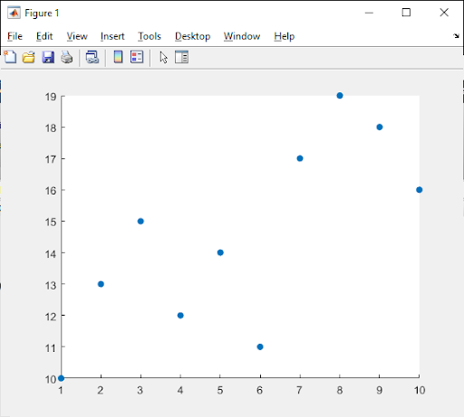
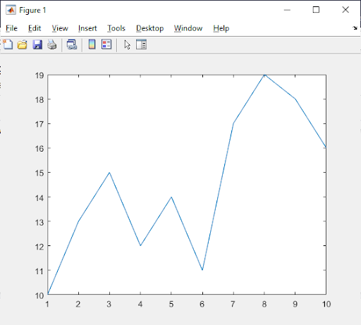
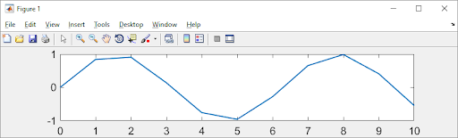
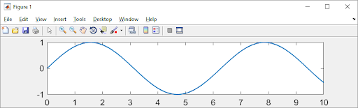
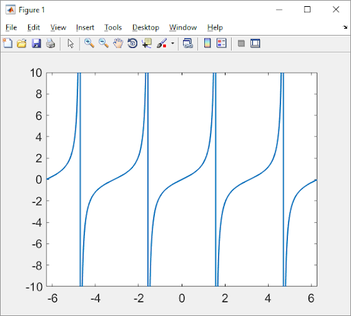
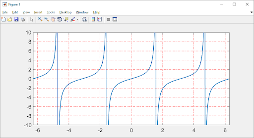
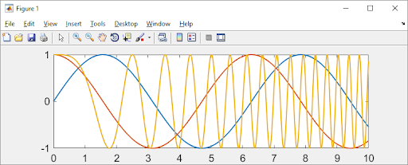
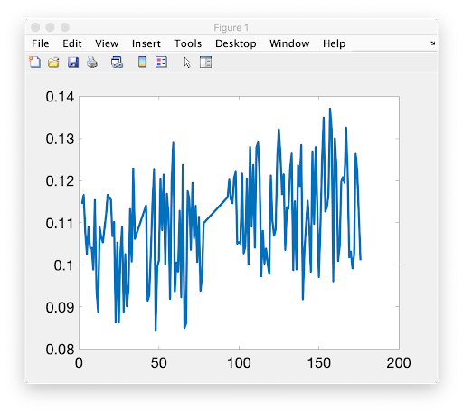
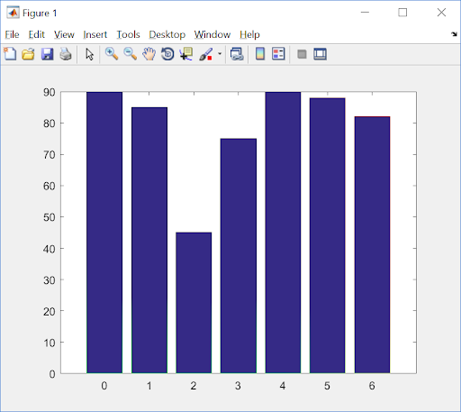
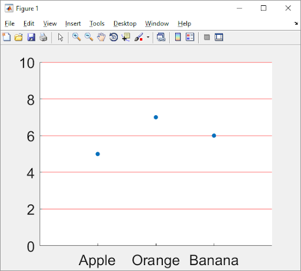

.. qnum::
   :prefix: Q
   :start: 1

.. raw:: html

   

====================
Plotting and Figures
====================

^^^^^^^^^^^^
Introduction
^^^^^^^^^^^^
.. section 1

The following lecture material will allow you to use MATLAB to create and manipulate plots. The material covered will be

- using the scatter command
- using the plot command with vectors
- using the plot command to display functions

  - resolution of functions (choice for x-axis series)
  - customizing the display (what do you want to highlight)
  - displaying multiple sets of data on a single set of axes

- displaying grids
- customizing line plots
- the MATLAB way
  - input data, then plot the result
- plotting data from :file:`.csv` files
- MATLAB :code:`figure()` terminology
- multiple plots in one figure
- pie charts, bar charts
- good plotting habits
- plotting with scripts and functions

^^^^^^^^^^^^^^^^^^^^
Basic Plotting Setup
^^^^^^^^^^^^^^^^^^^^
.. section 2

------------------------
Introduction To Plotting
------------------------

MATLAB is designed for plotting. Given the following :code:`x` and :code:`y` vectors,

.. code-block:: matlab

  x = [1,2,3,4,5,6,7,8,9,10];
  y = [10,13,15,12,14,11,17,19,18,16];

one may generate a scatter plot with the following command

.. code-block:: matlab

  scatter(x,y);

and view the result immediately.

  **Figure 1.** Example output from :code:`scatter(x,y)`

What do you see?

- x axis begins at the lowest value of :code:`x` and ends at the greatest value
- y axis begins at the lowest value of :code:`y` and ends at the greatest value
- (x,y) pairs are displayed separately, that is, scattered. Note that scatter only works if the pair of vectors have the same number of elements.

An alternative display is given by :code:`plot(x,y)` below. Note that :code:`plot(x,y)` joins the points together in the order given by the separate pairs of data.

  **Figure 2.** Default output using :code:`plot(x,y)`. The solid line connects the (x,y) points in the order in which the (x,y) pairs are stored, that is, in increasing x-value.

.. mchoice:: ch06_02_ex_plot
  :answer_a: plot(x,y) is the same as when the x-series is ordered
  :answer_b: The plot automatically switches from a line plot to a scatter plot
  :answer_c: plot(x,y) appears to cross back over itself while scatter(x,y) does not change
  :answer_d: The plot switches axes to keep the plot a function
  :correct: c
  :feedback_a: Oops! Try running this in matlab- the plot is not the same. 
  :feedback_b: Oops! Unless you tell matlab to switch plotting styles it will not switch. 
  :feedback_c: Correct! Matlab plots in the order of the vector so having the series out of order will result in an odd looking graph. 
  :feedback_d: Oops! Matlab will not switch axes without any prompting.

  Consider the vectors :code:`x` and :code:`y`:

  .. code-block:: matlab

    x = [ 4, 7, 1, 5,10, 3, 8, 2, 9, 6];
    y = [12,17,10,14,16,15,19,13,18,11];

  What happens if the (x,y) pairs are randomly scattered in order but the pairings themselves remain the same? What will scatter(x,y)  look like -- try it and you will find that scatter hasn't changed at all. But what about plot(x,y)? (Consider trying it out in MATLAB if you're not sure!)

----------
Resolution
----------

MATLAB may be used to plot mathematical functions. Given the following vectorized code,

.. code-block:: matlab

  x = 0:10;
  y = sin(x);
  plot(x,y);

The display is shown in Figure 3. The resolution is coarse, but the display does represent the sinusoid. Why does it look so bad? 

  **Figure 3.** A coarse resolution display of :math:`sin(x)`.

To improve the resolution, simply add a higher density to the display by decreasing the step size. Do you remember how?

.. code-block:: matlab

 	x = 0:0.1:10;
 	y = sin(x);
 	plot(x,y);

  **Figure 4.** A higher resolution display of :math:`sin(x)`.

Let's plot something in MATLAB that will force an axis to approach the value Infinity, such as the tangent function. What is the purpose of the plot? Is it to highlight the full range of values along both x and y axes, or is it to highlight the behavior about a certain area of the function such as near y=0 ? The next two figures address both questions.

Try plotting the tangent function.

.. code-block:: matlab

 	x = -2.*pi: 0.01: 2.*pi;
 	y = tan(x);
 	plot(x,y);

.. figure:: img/img5_1.png
  :width: 400
  :align: center

  ..

Do not delete your figure (or close the figure window), but add the following lines of code:

.. code-block:: matlab

  xlim([-2.*pi, 2.*pi]);
  ylim([-10, 10]);

  **Figure 5.** (top) original display of :math:`tan(x)`. (bottom) Adjusting both the x and the y axes to highlight the function near :math:`(x, y) = (0, 0)`.

Without any information from the user, MATLAB software simply tries to force the appropriate axes ranges, as in the top figure, to display the entire function. Why does MATLAB show :math:`tan(x)` stopping before 1500, and why do the multiple peaks have different values? This is actually a deep question. The answer will become obvious if you display the (x,y) series and look for :code:`pi/2`, :code:`3pi/2`, etc. You will find that the x-coordinate for :code:`pi/2`, :code:`3pi/2`, etc are close but not quite the expected values due to the step size resolution of 0.01 unit. The :code:`tan(x)` values would be closer to :code:`pi/2` with a smaller step size.

Detail near the y=0 line is difficult to view. The two additional lines of code are used to restrict the display limits in both axes to just the region of interest. 

In many cases, grid lines are important in viewing and describing MATLAB graphical displays. Try the

.. code-block:: matlab

  grid on

command. The result is similar to the example shown below. More on customizing MATLAB plots later in the lecture. If you guessed that the command to turn off grid lines is

.. code-block:: matlab

  grid off

then congratulations - you are becoming a MATLAB expert.

  **Figure 6.** Adding a grid to a MATLAB figure is accomplished with the :code:`grid on` command.

------------------------------
Plotting Multiple Sets of Data
------------------------------

With MATLAB, it is possible to visualize multiple sets of data on a single display using either the scatter or the plot functions. For example, given the following vectorized code,

.. code-block:: matlab

  x = 0: 0.01: 10;
  plot(x, sin(x), x, cos(x), x, cos(x.^2));

where the x values are the same set for each of the three functions, MATLAB will produce the following plot.

  **Figure 7.** Multiple plots shown together using a single :code:`plot` command.

----------------------
Customizing Line Plots
----------------------

The :code:`help plot` command describes the many ways to customize a) the line types, b) the plot symbols, and c) the colors available within the MATLAB program. For example, the commands

.. code-block:: matlab

  x = 0: 0.01: 10;
  plot(x, sin(x), '--sg', x, cos(x), ':or') 

are interpreted as:

- a dashed (:code:`--`) line with square (:code:`s`) markers, colored (:code:`g`) green for sin(:code:`x`)
- a dotted (:code:`:`) line with circle (:code:`o`) markers, colored (:code:`r`) red for cos(:code:`x`)

.. figure:: img/img8.png
  :width: 400
  :align: center

  **Figure 8.** Customized plot of :math:`sin(x)` and :code:`cos(x)`.

^^^^^^^^^^^^^^^^^^^^^^^
Plotting with Data Sets
^^^^^^^^^^^^^^^^^^^^^^^
.. section 3

This section will describe how to employ MATLAB plots in your studies. This will be relevant when displaying results or data in other courses as well.

The order is

1. input data (for example, from a :code:`.csv` file)
2. extract data into columns
3. perform calculations
4. display data with MATLAB

.. youtube:: LGJ2ZQQA4pU
  :divid: ch06_03_vid_csv_esp
  :height: 315
  :width: 560
  :align: center

-----------------------------------
Input data from a :code:`.csv` file
-----------------------------------

Data is often stored in a readable "comma separated values" file, with the extension :code:`.csv`. Figure 9 displays a representative example. Each line contains one row of data with each datum separated by a comma. A descriptive key is usually included in the first line. Here, the first item is day number, followed by the amount of various alkali elements measured in soil samples.

.. code-block::

  Day,Sodium,Potassium,Calcium,Magnesium
  1,13.586,68.86,23.157,11.334
  2,14.068,72.09,24.169,12.551
  3,13.42,69.546,23.98,8.1577
  4,13.326,75.041,26.037,9.2911
  5,11.576,67.136,25.333,8.7825
  ...

To input the data, use the MATLAB function csvread:

.. code-block:: matlab

  samples = csvread('soil_samples_2019.csv', 1, 0);

Here, the file name is 'soil_samples_2019.csv'. To start reading data from the file, a (row, column) offset is employed. Here, (1, 0) is used to indicate skipping one row (the description row) and zero columns, that is, start reading data at line 2. Recall that the MATLAB help function may be used to assist in calling built-in MATLAB functions. The :code:`csvread` operation stores the input data into a matrix, whose characteristics are given by running the MATLAB command

.. code-block:: matlab

  whos samples

This indicates a size of 155 x 5, that is, 155 rows and 5 columns.

The input data are separated into column vectors as shown below.

.. code-block:: matlab

  % first, clear any existing data from the workspace
  clear

  % read the data
  samples = csvread('soil_samples_2019.csv', 1, 0);

  % extract individual columns
  days = samples(:,1);
  sodium = samples(:,2);
  potassium = samples(:,3);
  calcium = samples(:,4);
  magnesium = samples(:,5);

Recall from the Practice Project that the ESP, Exchangeable Sodium Percentage, was calculated from the ratio of sodium to the sum of all elements. Try calculating the :code:`ESP_values` for the vectors in Figure 10.

Once the :code:`ESP_values` column vector is created, the data sets may be displayed with MATLAB. Try to create the following display with :code:`plot(days, ESP_values)`

  **Figure 9.** Result of :code:`plot(days, ESP_values)`. The x-values correspond to day numbers, while the y-values are the resultant ESP calculations.

As a reminder, the function to calculate ESP is

.. code-block:: matlab

  function [e] = ESP(Na, K, Ca, Mg)
    E = Na ./ (K + Ca + Mg + Na);
  end

^^^^^^^^^^^^^^
MATLAB Figures
^^^^^^^^^^^^^^
.. section 4

----------------
Creating Figures
----------------

In MATLAB, figures are used to display graphics in a separate window. There may be several figures visible at any one time. Each figure has a unique number, usually beginning with figure 1, figure 2, ... The current figure will be the target of the MATLAB display. To manage figures, use the :code:`figure` function. For example,

.. code-block:: matlab

  % creates a new figure, which becomes the current figure
  figure();

  % sets figure n to be the current figure, creating one if not defined
  figure(n);

.. mchoice:: ch06_02_ex_figure
  :answer_a: figure(2) remains unchanged
  :answer_b: The original figure(2) was replaced by the new figure(2) command
  :correct: b
  :feedback_a: Oops! Run the code in matlab and try again
  :feedback_b: Correct! The original figure gets replaced by matlab when you call it a second time

  Add the following code to your script to analyze the soil samples:

  .. code-block:: matlab

    figure();
    plot(days, ESP_values);

    figure();
    scatter(calcium, potassium);

    figure(42);
    scatter(sodium, ESP_values);

  Then run your script.

  Now, using the command window, type:

  .. code-block:: matlab

    figure(2);
    plot(days, magnesium);

  What happened to figure(2)?

---------------
Closing Figures
---------------

To close the current figure, use

.. code-block:: matlab

  close

To close all figures, use

.. code-block:: matlab

  close all

To close a particular figure, such as figure n, use

.. code-block:: matlab

  close n

----------------------------
Multiple Plots in One Figure
----------------------------

.. code-block:: matlab

  figure();
  plot(days, ESP_values);
  plot(days, magnesium);

the :code:`ESP_values` plot is replaced by the magnesium plot. However, it is possible to keep the two datasets on one set of axes. There are two options.

- **Option 1**: call plot with multiple sets of data. For example:

.. code-block:: matlab

  plot(days, magnesium, days, calcium)

- **Option 2**: use the :code:`hold` command. This command will add a new set of axes instead of replacing the old plot. Try the following:

.. code-block:: matlab

  figure();
  hold on;
  plot(days, sodium);
  scatter(days, potassium);
  scatter(days, calcium);
  hold off;    % a new plot will again replace the old plot

.. figure:: img/img10.png
  :width: 400
  :align: center

  **Figure 10.** Multiple series on a single plot using the above Option 2.

^^^^^^^^^^^^^^^^^^^^^^^
Other Plotting Displays
^^^^^^^^^^^^^^^^^^^^^^^
.. section 5

----------
Pie Charts
----------

Pie charts may be displayed with code such as

.. code-block:: matlab

  votes = [20, 36, 75, 40, 14, 34];
  names = {'Domestic Tranquility', 'Dome-o Arigato Mr. Roboto',
    'Domey McDomeface', 'a', 'b', 'c'};
  pie(votes, names);

.. figure:: img/img11.png
  :width: 400
  :align: center

  **Figure 11.** A sample pie chart.

----------
Bar Charts
----------

Bar charts, with vertical bars:

.. code-block:: matlab

  projects = [0, 1, 2, 3, 4 5, 6];
  scores = [90, 85, 45, 75, 90, 88, 82];

  **Figure 12.** Representative example of a bar chart.

^^^^^^^^^^^^^^^^^^^^
Good Plotting Habits
^^^^^^^^^^^^^^^^^^^^
.. section 6

.. figure:: img/img13.png
  :width: 400
  :align: center

  ..

.. mchoice:: ch06_06_ex_whats_wrong
  :answer_a: There is no Title
  :answer_b: There are no Axis Labels
  :answer_c: The data would be better represented as a pie chart
  :answer_d: There is no Legend
  :correct: b,c,d
  :feedback_a: correct
  :feedback_b: correct
  :feedback_c: Because there are two sets of data a pie chart is unlikely to be a good representation
  :feedback_d: correct

  .. figure:: img/img14.png
    :width: 400
    :align: center

    ..

  What's wrong with this plot?

Good news: a title is already there so we know it has something to do with project scores for ENGR 101 during the Fall 2016 semester. The plot is not too cluttered and it is easy to focus on the vertical bars. Bad news: there is nothing else to identify the axes or the vertical bars !!!

.. youtube:: xBjAza1Me88
  :divid: ch06_06_vid_customizing_plots
  :height: 315
  :width: 560
  :align: center

|

It is important to include information about your plot that will permit others to understand the importance of your work. You will be graded on the following items when you submit plots:

1. A title is important

.. code-block:: matlab

  title('Project scores for ENGR 101, Fall 2016');

2. Add axis labels

.. code-block:: matlab

  xlabel('ENGR 101 Projects (0-3 MATLAB, 4-6 C++');
  ylabel('Project score (percentage)');

3. Add a legend if plotting multiple parameters

.. code-block:: matlab

  legend('Autograder', 'Style', 'Location', 'Southwest');

.. figure:: img/img15.png
  :width: 400
  :align: center

  **Figure 13.** A sufficiently annotated plot for ENGR 101. The title provides the context, the axes labels identify the location and the value of the vertical bars, and the legend identifies the two different scores that are associated with each Project. 

^^^^^^^^^^^^^^^^^^^^^^^^^^^^^^
Plotting and Scripts/Functions
^^^^^^^^^^^^^^^^^^^^^^^^^^^^^^
.. section 7

Scripts and/or functions may be used to collect together all the commands used to customize your plots. You can change a line or two and then rerun the code. For example, the previous plot was created with the function

.. code-block:: matlab

  function [ ] = plot101Grades(projects, autograder, style)
  % creates a vertical bar chart of average project grades for the Fall'16 term
    figure();
    bar(projects, [autograder, style]);
    title('Project scores for ENGR 101, Fall 2016');
    xlabel('ENGR 101 Projects (0-3 MATLAB, 4-6 C++)');
    ylabel('Project score (percentage)');
    legend('Autograder', 'Style');
  end

^^^^^^^^^^^^^^^^^^^^^^^^^^^^^^^^
:code:`gca` ("get current axes")
^^^^^^^^^^^^^^^^^^^^^^^^^^^^^^^^
.. section 8

You can use gca to modify properties of the axes for the current figure. It is important that gca be called and placed in a variable prior to modifying any axis characteristics. For example,

.. code-block:: matlab

  % create a simple scatter chart
  scatter([1,2,3], [5,7,6], 'filled');

  % get current axes in the variable ax
  ax = gca;

  % modify via ax, [NOTE, CaseSensitive !!!]
  ax.FontSize = 20;
  ax.YLim = [0,10];
  ax.XLim = [0,4];
  ax.XTick = [1,2,3];
  ax.XTickLabel = {'Apple', 'Orange', 'Banana'};
  ax.Ygrid = 'on';
  ax.GridColor = [1,0,0];   % [R, G, B]
  ax.GridAlpha = 1;         % Grid color on full

Applying the individual changes to limit ranges, ticks, and y-axis grid characteristics improves the utility of Figure 16.

  **Figure 14.** Displays the result of fine tuning individual plotting characteristics.

.. mchoice:: ch06_08_gca
  :answer_a: ax = gca;
  :answer_b: Ax.ygrid='on';
  :answer_c: ax.FontSize = 25;
  :answer_d: ax.GridColor = Red;
  :correct: a,c
  :feedback_a: True
  :feedback_b: False - don't forget matlab commands are case sensitive 
  :feedback_c: True
  :feedback_d: False - matlab defaults to RGB colors so make sure to input the desired color as an RGB triple i.e. [1,0,0]

  Which of the following axes commands are correct and will not return an error when run in matlab?

^^^^^^^^^^^^^^^^^^^^^^^
Final Words on Plotting
^^^^^^^^^^^^^^^^^^^^^^^
.. section 9

.. youtube:: IR7nDMczaZE
  :divid: ch06_09_vid_final_words
  :height: 315
  :width: 560
  :align: center