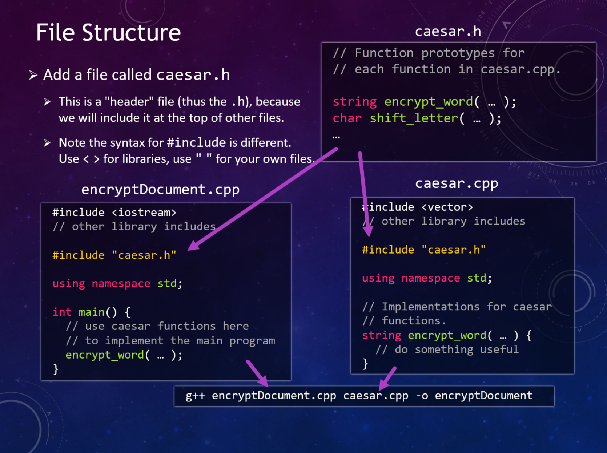

.. qnum::
   :prefix: Q
   :start: 1

.. raw:: html

   <link rel="stylesheet" href="../_static/common/css/main4.css">
   <link rel="stylesheet" href="../_static/common/css/code3.css">
   <link rel="stylesheet" href="../_static/common/css/buttons3.css">
   <link rel="stylesheet" href="../_static/common/css/exercises3.css">
   
   

.. raw:: html

   

=====================
Program Design in C++
=====================

^^^^^^^^^^^^
Introduction
^^^^^^^^^^^^
.. section 1

.. youtube:: AhGH8kn1E9A
   :divid: ch17_01_introduction
   :height: 315
   :width: 560
   :align: center

|

^^^^^^^^^^^^^^^^^^^^^^^^^^^^^^^^^^^^^^
Getting Started: Shifting a Character
^^^^^^^^^^^^^^^^^^^^^^^^^^^^^^^^^^^^^^
.. section 2

We can look at program design from two general, complementary perspectives: "top-down" and "bottom-up".

Let's start with a bottom-up design perspective - we think of some functionality that would be useful for our program and go ahead and implement some of the pieces. For example, we know we're going to need to shift letters (i.e. characters) if we want to implement a Caesar Cipher to encrypt (or decrypt!) messages.

Often times, bottom-up design is realized in the implementations of functions that will form the building blocks for our program. Let's create a :code:`shift_letter` function that takes in an original character, shifts it by a given amount, and returns a new character. Here's a few examples of how we might use shift letter:

- :code:`shift_letter('b', 3)` should return :code:`'e'`
- :code:`shift_letter('y', 3)` should return :code:`'b'` (it wraps around after :code:`z`)
- :code:`shift_letter('e', -1)` should return :code:`'d'`

Alright, let's implement it:
  
.. youtube:: OA4-rNK_jxI
   :divid: ch17_02_shift_letter
   :height: 315
   :width: 560
   :align: center

|

^^^^^^^^^^^^^^^^^^^^^^^^^^^^
Next Step: Encrypting a Word
^^^^^^^^^^^^^^^^^^^^^^^^^^^^
.. section 3

Write an implementation for the :code:`encrypt_word` function below that encrypts a word according to a Caesar Cipher with the given offset. You should iterate through each character in the word and call :code:`shift_letter()` to compute a new word.

However, the parameter to :code:`encrypt_word()` is passed by const reference - you're not able to change it. Instead, we suggest you should make a local copy of the word, using a line like :code:`string copy = text;` at the beginning of your function. Then, you can modify and return that copy.

.. raw:: html

   

      
ch17_ex_encrypt_word

      

         Well done! The secret word is "luigi".
      

   

.. fillintheblank:: ch17_03_ex_encrypt_word
  :casei:

  Complete the Lobster exercise to reveal the *secret word*. Enter it here.
  
  |blank|

  - :luigi: Correct.
    :x: Incorrect. If you finished the exercise, please double check your spelling.

.. admonition:: Walkthrough

  .. reveal:: ch17_03_revealwt_encrypt_word
  
    .. youtube:: EUlRb1_8Ep8
      :divid: ch17_03_wt_encrypt_word
      :height: 315
      :width: 560
      :align: center

^^^^^^^^^^^^^^^^^^^^^^^^^^^^
Multi-File Program Structure
^^^^^^^^^^^^^^^^^^^^^^^^^^^^
.. section 4

We've got some of the basics functions for our program implemented, but let's take a step back before moving on to the driver program in :code:`main()`. To keep our code more organized, let's take a look at the way C++ allows us to split our code into separate modules in different :code:`.cpp` source files. We'll also see how :code:`.h` header files are used to enable code in one file to call and use functions defined in a separate file.

.. youtube:: f-LDCdnu9EE
   :divid: ch17_04_file_structure
   :height: 315
   :width: 560
   :align: center

|

To recap, the high-level structure of a program with multiple modules looks like this:

   ..

A "module" might consist of both a :file:`.cpp` and :file:`.h` **header** file, for example, :file:`caesar.cpp` and :file:`caesar.h`. The important rules/principles to remember are:

1. Header files with the :file:`.h` extension generally contain function prototypes.
2. The actual implementations of those functions go in a corresponding :file:`.cpp` file.
3. If a :file:`.cpp` file has a corresponding :file:`.h` file, it should generally go ahead and include its own :file:`.h` for convenience.
4. Then, the :file:`.h` file is included in any other :file:`.cpp` files that also want to use that module's functions, so that the compiler has access to their prototypes.
5. Finally, a :file:`.cpp` file for each module needs to be specified in the compilation command to :code:`g++`.

In general:

- :file:`.h` files should be used with :code:`#include` at the top of other files, but should *never* be specified in the :code:`g++` compilation command.
- :file:`.cpp` files should be given to :code:`g++` to compile, but should *never* be used with a :code:`#include`.

.. mchoice:: ch17_04_ex_file_structure_01

   **Exercise**

   Let's say we're writing a program to help compute grades for ENGR 101. We have a whole bunch of helper functions dedicated to pulling data from the autogrdader, as well as a main function that calls those functions on data pulled from a variety of sources.

   Which of the following is a reasonable organization for our project?

   - Put the :code:`main()` function in a file :file:`grades.cpp`. Put the helper functions for the autograder in a file :file:`autograder.h`, and then use :code:`#include 'autograder.h'` at the top of :file:`grades.cpp` to bring in those functions.

     - Not quite. This will mostly work in the short term, but it's generally not a good idea to put actual function code in a :file:`.h` file, and can even lead to errors. :file:`.h` files should primarily contain function prototypes.

   - Put all the code in a single file, :file:`grades.cpp`, since this is the only way to ensure the compiler has access to the helper functions while it is compiling the code in :code:`main()`.

     - Nope! There are multi-file approaches that will work, for example, using :code:`#include` and a header file to let the code in :code:`main()` know about the prototypes of the other functions.

   - Put the :code:`main()` function in a file :file:`grades.cpp`. Put the helper functions for the autograder in a file :file:`autograder.cpp`, with a corresponding :file:`autograder.h` file containing prototypes for those functions. Then, use :code:`#include 'autograder.h'` at the top of :file:`grades.cpp` to ensure those functions are declared before they are used in :code:`main()`.

     + Correct!

   - Put the :code:`main()` function in a file :file:`grades.cpp`. Put the helper functions for the autograder in a file :file:`autograder.cpp`, and then use :code:`#include 'autograder.cpp'` at the top of :file:`grades.cpp` to bring those functions into :file:`grades.cpp` as well.

     - Not quite. As a general rule, you'll almost never want to :code:`#include` a :file:`.cpp` file.

|

Let's go ahead apply these rules to our actual code:

.. youtube:: fqbRAraFd0U
   :divid: ch17_04_file_structure_applied
   :height: 315
   :width: 560
   :align: center

|

.. mchoice:: ch17_04_ex_file_structure_02

   **Exercise**

   Think back to the example grading program described in the previous exercise, including three files:

   - :file:`grades.cpp`
   - :file:`autograder.h`
   - :file:`autograder.cpp`

   Which of the following compile commands is correct?

   - :code:`g++ grades.cpp -o grades`

     - Not quite. The :file:`autograder.cpp` file is missing.

   - :code:`g++ grades.cpp autograder.cpp -o grades`

     + Correct!

   - :code:`g++ grades.cpp autograder.h autograder.cpp -o grades`

     - Not quite. In general, a :file:`.h` header file is never included in the compile command. (Instead, in this case, it would be included with :code:`#include` at the top of the other files.)

^^^^^^^^^^^^
Unit Testing
^^^^^^^^^^^^
.. section 5

One more thing before we move on... we just made some very useful functions, but how can we be sure they work correctly? If we wait to test our code until we've got everything plugged together, it can be much harder to figure out where problems are coming from. Instead, let's write some **unit tests** for individual functions to confirm things are working correct at a small scale first.

.. youtube:: WpFO5DlsHdM
   :divid: ch17_05_vid_unit_testing
   :height: 315
   :width: 560
   :align: center

|

**Exercise**

See if you can expose the bug in the :code:`shift_letter()` function by writing some unit tests with assert.

In particular, you should focus on writing tests for **special cases** or **edge cases** - these are sets of inputs that are in some ways trickier than normal or on the boundaries of what is allowed. For example, here's a variety of suggestions for things you might try testing:

- An offset of 0
- A negative offset
- An offset of exactly 26 (should be no change)
- An offset larger than 26
- Cases that wrap around the end or the beginning of the alphabet

However, remember that you shouldn't test inputs that don't make any sense or that violate the rules of the function. For example, the function is presumed to only work on inputs with lowercase a-z letters, so it wouldn't be fair to test it with input characters outside that range.

In the Lobster exercise below, we've given you a few test cases to start with as template for the way you should structure your asserts. Add some more test cases to see if you can find one that fails (a failed assertion means it detected the bug!). To run your tests, just click "Simulate" and then "Run". You'll see red text at the console with a specific line number if there was a failed assertion. If you don't see anything, try writing more tests!

.. raw:: html

   

      
ch17_ex_unit_testing

      

         Well done! The secret word is "rhubarb".
      

   

.. fillintheblank:: ch17_05_ex_unit_testing_01
  :casei:

  Complete the Lobster exercise to reveal the *secret word*. Enter it here.
  
  |blank|

  - :rhubarb: Correct.
    :x: Incorrect. If you finished the exercise, please double check your spelling.

.. shortanswer:: ch17_05_ex_unit_testing__02

   Did you find an assertion that caught the bug? If so, based on the test that failed and the code in :code:`shift_letter()`, can you guess roughly why the bug occurs? If you didn't find it, what would be the next thing you would check?

.. admonition:: Walkthrough

   .. reveal:: ch17_05_revealwt_unit_testing
   
      You may have found that a test like this caught the bug:

      .. code-block:: cpp

         assert(shift_letter('a', -2) == 'y');

      If you step through the Lobster simulation for this case, you'll see the problem is that the :code:`pos = (pos + offset) % 26;` allows the position to become negative. For example, in the case above, :code:`pos + offset` yields :code:`-2`, which remains the same after modding by :code:`26`.

      We can fix this by adding a conditional after the position calculation:

      .. code-block:: cpp
      
         if (pos < 0) {
           pos = pos + 26;
         }

      That ensures that any negative number is adjusted 26 letters forward to its positive equivalent. The :code:`-2` becomes :code:`24`, which is the position of :code:`y`, as desired.

|

-------------------------
Unit Testing with Doubles
-------------------------

If you have a function that returns a :code:`double` as a result, you need to take some precautions to make sure you don't run into issues with floating-point precision (i.e. roundoff error) in your tests.

.. youtube:: nHq8fTBngv4
   :divid: ch17_05_vid_unit_testing_with_doubles
   :height: 315
   :width: 560
   :align: center

|

^^^^^^^^^^^^^^^
Top-Down Design
^^^^^^^^^^^^^^^
.. section 6

Now, let's clean up our proof-of-concept driver program so that it implements our overall program at a high level. We'll start out with some pseudocode, then convert that to real code. Finally, we'll identify any remaining helper functions that we need to write.

If you'd like a local copy of the code we're going to write in the next couple sections, feel free to download any/all (the videos below cover what's in these files):

- :download:`notes.txt <../_static/program_design_in_cpp/notes.txt>`
- :download:`caesar.h <../_static/program_design_in_cpp/caesar.h>`
- :download:`caesar.cpp <../_static/program_design_in_cpp/caesar.cpp>`
- :download:`encryptDocument.cpp <../_static/program_design_in_cpp/encryptDocument.cpp>`
- :download:`document.h <../_static/program_design_in_cpp/document.h>`
- :download:`document.cpp <../_static/program_design_in_cpp/document.cpp>`

.. youtube:: Rfb3LOIH1M8
   :divid: ch17_06_vid_top_down_design
   :height: 315
   :width: 560
   :align: center

|

Then, the last piece is to implement the :code:`loadDocument()` and :code:`writeDocument()` functions...

.. youtube:: mcp8F2Xl2JI
   :divid: ch17_06_vid_finishing_up
   :height: 315
   :width: 560
   :align: center

|

Before we move on, it's worth mentioning that the parameters for our document functions take in :code:`istream` and :code:`ostream` parameters, which are a more generic type than the file specific input/output streams :code:`ifstream` and :code:`ofstream`. In general, it's a good idea to make custom functions for input and output work with the more generic types, so that those functions are more flexible if we decided we would like to use them somewhere else as well. For example, since :code:`writeDocument` takes in any :code:`ostream` parameter, it could potentially write output to a file through an :code:`ofstream` *OR* to the terminal through :code:`cout`, which is just a different kind of :code:`ostream`.

It's also worth mentioning that stream parameters are always passed by reference (i.e. with the :code:`&` in the parameter declaration), because passing by value would make a copy, and making a copy of a stream doesn't really make sense (and won't compile).

^^^^^^^^^^^^^^^^^
Cracking the Code
^^^^^^^^^^^^^^^^^
.. section 7

Finally, let's see if we can't get my notes back...

.. youtube:: 7PBEf-ioKeo
   :divid: ch17_07_vid_cracking_the_code
   :height: 315
   :width: 560
   :align: center

|

Here's a copy of the file, if you're interested:

- :download:`frequencyAttack.cpp <../_static/program_design_in_cpp/frequencyAttack.cpp>`

|

^^^^^^^^^^^^^^^^^^^^^^^^^^^^^^^^^^^^^^^^^^^^^^^^^^^^^^^
Summary
^^^^^^^^^^^^^^^^^^^^^^^^^^^^^^^^^^^^^^^^^^^^^^^^^^^^^^^

This is the end of the chapter! Here is a summary of what we covered in this chapter: 

* 

You can double check that you have completed everything on the "Assignments" page. Click the icon that looks like a person, go to "Assignments", select the chapter, and make sure to scroll all the way to the bottom and click the "Score Me" button.