.. qnum::
   :prefix: Q
   :start: 1

.. raw:: html

   

.. include:: ../common/include_lobster_exercises.in.rst

.. raw:: html

   

=======
Structs
=======

^^^^^^^^^^^^
Introduction
^^^^^^^^^^^^
.. section 1

We have assigned variables to numeric datatypes :code:`int` and :code:`double`, as well as :code:`char` and :code:`boolean` in C++. We have organized data into :code:`string` and :code:`vector` classes to better manage arrays of characters and numbers. The C++ programming language also permits aggregate classes to be defined by the user: structures identified with the keyword :code:`struct`.

For example, we wish to model a rover that would explore the nightside of Proxima b. The following parameters are required for each rover:

.. code-block:: cpp

  int roverType;
  string roverId;
  double roverCharge;

If we wish to model more rovers, this approach will become awkward rather quickly:

.. code-block:: cpp

   int roverType1;
   string roverId1;
   double roverCharge1;

   int roverType2;
   string roverId2;
   double roverCharge2;

   int roverType3;
   string roverId3;
   double roverCharge3;

   ...

Even the use of vectors will be awkward, because we would need a vector for each different attribute of a rover. Consider the case of passing information about a fleet of rovers into a function:

.. code-block:: cpp

   double doSomethingWithRovers(vector<int> &types,
     vector<string> &ids, vector<double> &charges);

------------------
Enter, the struct:
------------------

.. youtube:: HoKprwFP9yA
   :divid: ch18_01_introduction_to_structs
   :height: 315
   :width: 560
   :align: center

|

Something creative is required, such as

.. code-block:: cpp

   // Create a Rover variable
   Rover myRover;

   // Access attributes of the rover using the dot
   cout << myRover.charge << endl;
   
   // Store several of them in a vector
   vector<Rover> fleet;

…and C++ allows the user to develop one's own compound data type using the :code:`struct` definition

.. code-block::

   struct Rover {
     int type;      // either 1, 2, or 3 
     string id;     // 4 alphanumeric characters
     double charge; // % of charge, between 0 and 1
   };

The syntax of a struct and its common design features are as follows:

1. for custom type names, such as :code:`Rover`, begin with an upper-case letter
2. **member declarations** specify the individual components of the :code:`struct`, such as:

   - :code:`int type;`
   - :code:`string id;`
   - :code:`double charge;`

3. use comments to describe the purpose and intended values of each struct member
4. and most important, **end the struct with a semi-colon after the last brace,** :code:`};`

Then, simply declare a variable, such as lower case :code:`rover`, as being of type upper case :code:`Rover`.

.. code-block:: cpp

   Rover rover; // creates a new rover object

**Where does the** :code:`struct` **definition reside in my code?**

Place it at the *TOP* level of your code after the include directives. *DO NOT* place it inside any function !!!!

---------------------------
Accessing a Member Variable
---------------------------

Clearly, structs are compound data types composed of several member variables of various types. One may use the struct to create multiple variables of the new type :code:`Rover`…

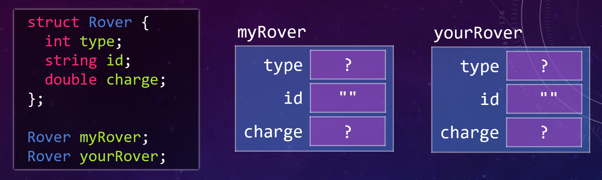

|

Note, that by default, member variables are uninitialized. They contain a "random" value based on whatever data happened to be in memory where the variable was created. An exception are :code:`string` member variables, which are by default initialized to an empty string, just like regular :code:`string` variables.

Use the dot :code:`.` operator to access a member variable. This permits working with a single component of the overall struct object.

For example:

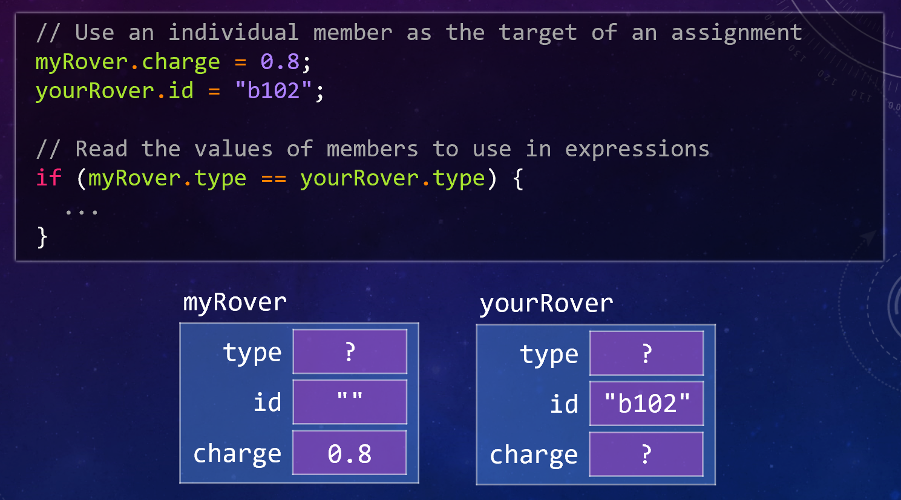

|

---------
Exercises
---------

.. shortanswer:: ch18_01_ex_minute_01

   What's wrong with the following definition of a structure to describe a cylinder? *(Hint: there are several problems.)*

   .. code-block:: cpp

      structure cylinder;
      {
        double radius;
        int height;
      };

.. mchoice:: ch18_01_ex_minute_02
   :answer_a: elements
   :answer_b: component
   :answer_c: segments
   :answer_d: members
   :answer_e: units
   :correct: d
   :feedback_a: Incorrect.
   :feedback_b: Incorrect.
   :feedback_c: Incorrect.
   :feedback_d: Correct!
   :feedback_e: Incorrect.

   What are the variables in a :code:`struct` called?

.. mchoice:: ch18_01_ex_minute_03
   :answer_a: You cannot put strings or vectors in a struct where vectors can hold any variable type
   :answer_b: Structs can hold different types of variables where a vector can hold only one
   :answer_c: No difference. They are the same
   :answer_d: Structs can be used in a while loop but not in for loops
   :answer_e: None of the above
   :correct: b
   :feedback_a: Incorrect.
   :feedback_b: Correct!
   :feedback_c: Incorrect.
   :feedback_d: Incorrect.
   :feedback_e: Incorrect.

   What is the key difference between vectors and structs?

.. mchoice:: ch18_01_ex_minute_04

   Which data set matches with the structure below?

   .. code-block:: cpp

      struct Rover{
        string name;
        int age;
        char fully_charged;
        double mileage;
      };

   - :code:`alpha = {"alpha", 13.5, "Y":, 34};`

     - Incorrect.

   - :code:`beta = {"beta", '11', 'N', 22.5};`

     - Incorrect.

   - :code:`gamma = {"gamma", 9, 'NE', 42};`

     - Incorrect.

   - :code:`delta = {"delta", 7, 'Y', 99.3};`
        
     + Correct!

   - All of the above
        
     - Incorrect.

----------------------------
Initializing :code:`structs`
----------------------------

Use the following syntax to initialize a struct

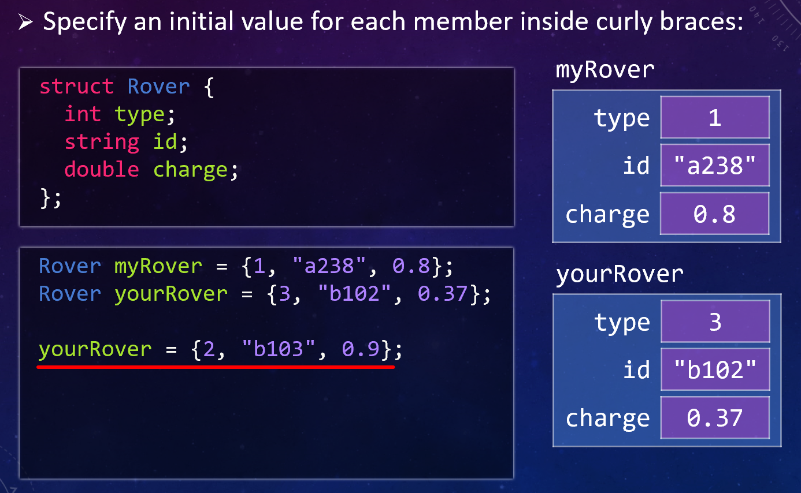

|

The red underlined command may be used to reassign the member values of the struct :code:`yourRover`, however, this will only work if the code is compiled
with the C++ 11 standard or newer. For example:

.. code-block:: console

   -bash-4.2$ g++ -std=c++11 rovers.cpp
   -bash-4.2$

|

---------------
Copying Structs
---------------

Variables of the same struct type may be copied to each other. This is a straight forward member-by-member copy

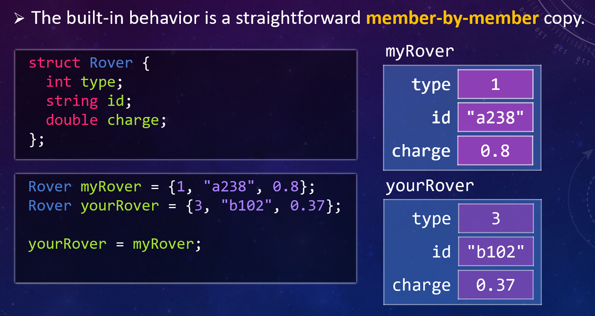

|

------------------
Vectors of Structs
------------------

Modeling the rovers may be accomplished with a vector of type :code:`Rover` structs:

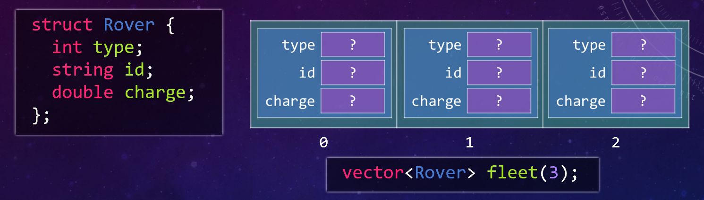

|

Or, if there are default values for the :code:`Rover` type, use the following:

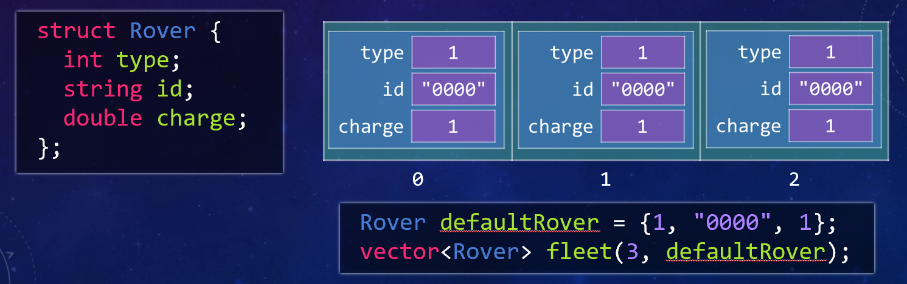

|

----------------------------------
Tip regarding good coding practice
----------------------------------

It is a good idea to keep I/O operations in separate code such as in a function. This helps to compartmentalize programs, provides purpose to code, and assists with debugging the program. Here is the general pattern:

1. The primary data structure (ie., the :code:`vector`) is declared in :code:`int main()`
2.  A file stream to the data input is opened in :code:`int main()`
3. The file stream and its data structure are passed into a :code:`void` function by reference
4. The function reads the data from the file stream into the data structure

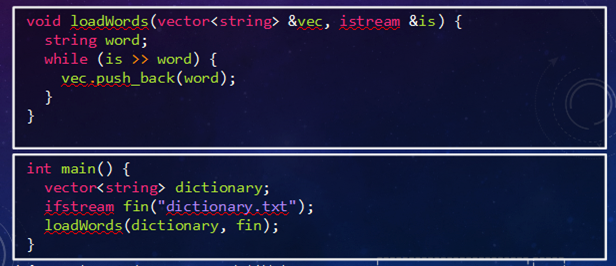

|

Let's write a function to read information regarding the rover fleet from an input file:

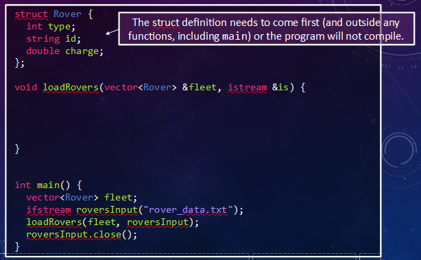

|

The input file, :file:`rover_data.txt`, has an unknown number of lines, each line representing a rover, and the read operation must input the data in the appropriate order (:code:`int`, :code:`string`, :code:`double`) into variables declared by the :code:`struct`:

.. code-block:: none

   1 a283 0.6
   2 a294 0.1
   2 a110 0.5
   3 b102 0.3
   ...

The input file stream is passed by reference with type :code:`istream`, as well as the :code:`vector` of type :code:`Rover`. Since the number of entries in the input file is unknown, a while loop is chosen to read the input file one line at a time. The individual struct variables are addressed via dot expressions (and in the correct order!!). The fleet vector is built one input line at a time with the :code:`.push_back()` method. The while condition is :code:`false` at the end of file causing an exit from the :code:`loadRovers` function. The final operation is closing the input file which frees the :code:`ifstream` channel.

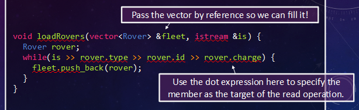

|

--------
Exercise
--------

Below is a structure definition and declaration:

.. code-block:: cpp

   struct Opponent {
     string state;
     char conf_div;
     double UM;
     double opponent;
     double discount;
   };

   Opponent MSU = {"MI", 'E', 32, 23, 0.99};
   Opponent COL = {"CO", 'N', 45, 28, 0.17};
   Opponent WIS = {"WI", 'E', 14,  7, 0.07};

.. mchoice:: ch18_01_ex_opponent_01

   Which command will access the value of the :code:`UM` member in the :code:`MSU` data set?

   - :code:`Opponent.at[1,3];`

     - Incorrect.

   - :code:`MSU(3);`

     - Incorrect.

   - :code:`MSU.UM;`

     + Correct!

   - :code:`MSU.find(UM);`
        
     - Incorrect.

   - :code:`Opponent.MSU.UM;`
        
     - Incorrect.

   - None of the above
        
     - Incorrect.

.. mchoice:: ch18_01_ex_opponent_02

   There is an error in the :code:`conf_div` variable of the :code:`WIS` struct. It must be changed to a :code:`'W'`. Which command will execute the change?

   - :code:`WIS(conf_div = 'E') = 'W';`

     - Incorrect.

   - :code:`WIS.conf_div = 'W';`

     + Correct!

   - :code:`Opponent(3,2) = 'W';`

     - Incorrect.

   - :code:`WIS(conf_div) = 'W';`
        
     - Incorrect.

   - None of the above
        
     - Incorrect.

-------------------------
Printing a :code:`Struct`
-------------------------

It is tempting to output the contents of a :code:`struct` variable using :code:`cout` and the insertion :code:`<<` operator:

.. code-block:: cpp

   int main() {
     Rover myRover = {1, "a238", 0.8};
     cout << myRover << endl;
   }

Rightly so, this results in a compiler error !! Try it…

There is a need to create, and store in your directory, a function to print :code:`struct` variables. Let's ask a few basic questions about the intent of the function:

Is there a need to modify the :code:`struct` when printing? NO

Is the :code:`struct` a large type? YES

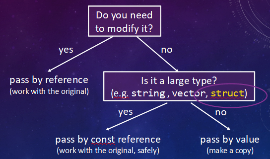

|

CONCLUSION: pass by :code:`const` reference

Here is the setup for printing a :code:`struct`. The function, generalized for current and future usage, is designed with data passage via constant reference and can send data to any :code:`ostream` device, including a monitor, via :code:`cout`.

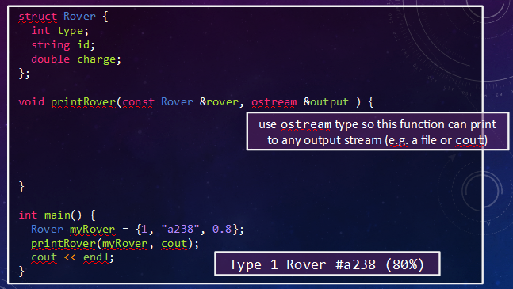

|

**Exercise**

Write an implementation of the :code:`printRover()` function below. The printed format is shown in the example above and also in the comment in :code:`main`. In :code:`printRover()`, make sure to send output to the :code:`output` stream passed in as a parameter, rather than to :code:`cout` directly. (Of course, :code:`output` may end up to be :code:`cout`, but it could also end up being a file stream or something else as well!)

.. raw:: html

   

      
ch18_ex_printRover

      

         Well done! The secret word is "goose".
      

   

.. fillintheblank:: ch18_02_ex_printRover
  :casei:

  Complete the Lobster exercise to reveal the *secret word*. Enter it here.
  
  |blank|

  - :goose: Correct.
    :x: Incorrect. If you finished the exercise, please double check your spelling.

.. admonition:: Walkthrough

  .. reveal:: ch18_02_revealwt_printRover
  
    .. youtube:: wUspT0PwPKw
      :divid: ch18_02_wt_printRover
      :height: 315
      :width: 560
      :align: center

|

^^^^^^^^^^^^^^^^^^^^^^^^^^^^^^^^^^^^^^^^^^^
Application: Selecting Rovers for a Mission
^^^^^^^^^^^^^^^^^^^^^^^^^^^^^^^^^^^^^^^^^^^

The mission: collect soil/rock samples from the dark side of the planet. To support colonization of the planet, a requirement of the mission is to catalogue the nutrients in the soils of the planet. In order to satisfy these requirements, additional variables are required to model the rover mission,

1. an integer describing the cargo capacity of the rover
2. a boolean to identify if a rover has been selected for the mission

.. youtube:: dB69rQvEblk
   :divid: ch18_02_selecting_a_rover
   :height: 315
   :width: 560
   :align: center

|

Here is the updated :code:`Rover` struct. Now, we need to integrate the struct with our code !!!

.. code-block:: cpp

   struct Rover {
     int type;        // either 1, 2, or 3 
     string id;       // 4 alphanumeric characters
     double charge;   // % of charge, between 0 and 1
     int capacity;    // cargo capacity in kilograms
     bool isSelected; // has it been selected for the mission?
   };

Start with the :code:`print` function. Our original code is perfect for integrating an additional output !!
The struct interface contains the expanded :code:`Rover` definition. The :code:`printRover` function contains the addition of one more output lines to describe the cargo capacity of the rover.

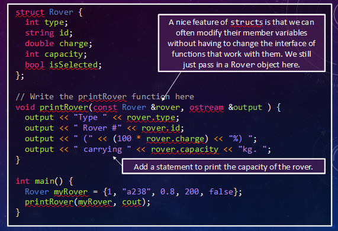

|

Here, the :code:`myRover` variable is defined in :code:`int main()` for convenience. It is more practical to place the rover data into a text file that is read by the code.

------------------------------
Loading Rover Data from a file
------------------------------

The first few entries in the text file are illustrated for the file :code:`rover_data.txt`. Here, the characteristics of each rover in the file are defined by the updated struct :code:`Rover` with columnar order type, id, capacity, and charge.

Here is :file:`rover_data.txt` for example:

.. code-block:: none

   1 a238 200 0.6
   1 a239 200 0.2
   1 b102 200 0.4
   2 a294 300 0.1
   2 a110 300 0.5
   2 a287 300 0.3
   3 b102 400 0.3
   3 c321 400 0.7
   ...

The caller :code:`int main()` remains the same, declaring :code:`fleet` to be a vector of type :code:`Rover`, constructs an :code:`ifstream` named :code:`roversInput` to house the input data, and employs a :code:`void` function to input the data stream. Note that the boolean variable, :code:`rover.isSelected`, is set to :code:`false`; completing the initialization of the :code:`Rover` vector named :code:`rovers` by the :code:`loadRovers` function.

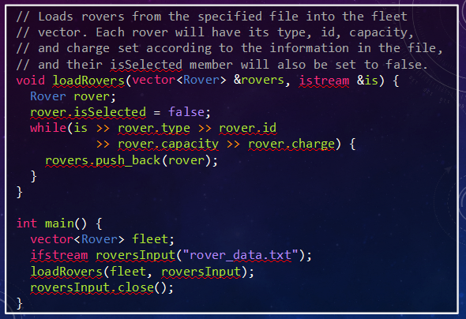

--------------------------------
Selecting Rovers for the Mission
--------------------------------

The setup for the mission is as follows:

1. a fleet of rovers, each at some % of full charge
2. IMPORTANT NOTE: a rover must be fully charged before departing on a mission
3. A battery at base camp can provide up to 2 units of "full charge"

For example:

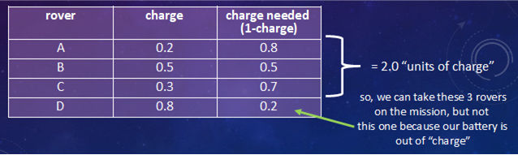

|

PROBLEM: Find the set of rovers with the "greatest rover capacity" subject to the requirement constraint "maximum of 2.0 units of charge" available for charging the rovers. (This is a common packing problem that you may have faced, and is related to choosing the most useful items to pack for your travels within the capacity of your suitcase.)

For the mission, a rover with a high ratio of capacity to "charge needed" is a reasonable solution. This helper function has the form

.. code-block:: cpp

   double desirability(const Rover &rover) {
     return rover.capacity / (1 - rover.charge);
   }

where :code:`rover.capacity / (1 - rover.charge)` may be calculated for each fleet rover.

Before accepting this function as the solution to the problem, it is important to perform sanity checks as to the validity of the function over the full realm of capacity and charge possibilities.

QUESTION: What are the extreme case values, that is tests, that exercise the function and will the function perform equally well for all values?

Consider :code:`rover.capacity`. This ranges from a value of :code:`200` to :code:`400` from our file :code:`rover_data.txt`. Clearly, the higher the capacity the higher the desirability given the same denominator.

Consider :code:`rover.charge`. This ranges from :code:`0.1` to :code:`0.8` for the set of values given, but may range to the extreme values :code:`0` and :code:`1`, with :code:`1` being 100% fully charged. Given the same capacity, the desirability is largest for the smallest denominator, that is, the greatest value for :code:`rover.charge`.

Unfortunately, when the charge is 100%, the test fails due to a divide by zero error. Good catch !!!

Change the function to be

.. code-block:: 

   // Simplifying Assumption: Any rover with > 0.9 charge is
   // equivalent in terms of desirability for our decision.

   double desirability(const Rover &rover) {
     // SPECIAL CASE
     if (rover.charge > 0.9) {
       return rover.capacity / 0.1;
     }
     
     // REGULAR CASE
     return rover.capacity / (1 - rover.charge);
   }

------------------------
Finding the "Best" Rover
------------------------

To find the best rover, one may use the :code:`desirability` function that loops through the vector of Rovers and returns the index of the most desirable rover.

NOTE1: It is important to consider a potential "end" case in this example: what if there are no rovers left to make a choice !! In such cases, it is useful to return a "nonsense" number, such as index value = :code:`-1`. A negative value for a vector index will cause an error in the program, if sampled, and may be checked by the caller prior to attempting to read the vector. Think about which vector operation may be used to determine whether a vector is "empty".

NOTE2: To determine the best Rover, search through the set of rovers.  Think about which vector operation determines the "size" of the vector.

NOTE3: Given the number of elements in a vector, use the appropriate C++ relational operator to find the best index.

Putting these tips together, an appropriate code to find the best rover looks like:

.. code-block:: cpp

   // Returns the index of the most desirable Rover in the
   // given vector. If the vector is empty, returns -1.
   int bestRover(const vector<Rover> &rovers) {
     if (rovers.size() == 0) {
       return -1; // SPECIAL CASE
     }
     
     int bestIndex = 0;
     for (int i = 1; i < rovers.size(); ++i) {
       if (desirability(rovers[bestIndex]) < desirability(rovers[i])) {
         bestIndex = i;
       }
     }
     
     return bestIndex;
   }

1. rovers.empty() is used to check if the vector is empty.
2. rovers.size() is used to set the upper limit to the for loop
3. a relational operator is used to search for the index value of the best rover

This video shows a walkthrough of writing the :code:`bestRover` function.

.. youtube:: eDAfMxFoehQ
   :divid: ch18_04_vid_bestRover
   :height: 315
   :width: 560
   :align: center

|

^^^^^^^^^^^^^^^^^^^^^^^^^^^^^^^^^^^^^^^^^^^^^^^^^^^^^^^
Summary
^^^^^^^^^^^^^^^^^^^^^^^^^^^^^^^^^^^^^^^^^^^^^^^^^^^^^^^

This is the end of the chapter! Here is a summary of what we covered in this chapter: 

* 

You can double check that you have completed everything on the "Assignments" page. Click the icon that looks like a person, go to "Assignments", select the chapter, and make sure to scroll all the way to the bottom and click the "Score Me" button.