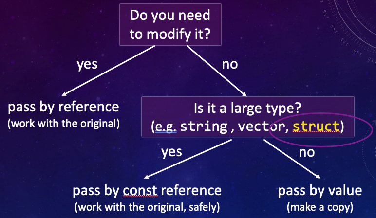

.. qnum::
   :prefix: Q
   :start: 1

.. raw:: html

   

.. include:: ../common/include_lobster_exercises.in.rst

.. raw:: html

   

=======
Structs
=======

.. admonition:: Chapter Files

  We’ll be using some starter code for this exercise. It might be helpful to go ahead and download it now and move it to the folder you are currently programming in. (It's also a good idea to go ahead and create a new folder for this chapter and use that as your current folder, so that you don't clutter up whatever else you were working on.)

  .. list-table::
    :align: left
    :widths: auto

    * - :download:`bestRover.cpp <../_static/structs/bestRover.cpp>`

      - .. reveal:: bestRover_cpp_preview
          :showtitle: Preview
          :modal:
          :modaltitle: <code>bestRover.cpp</code>

          .. literalinclude:: ../_static/structs/bestRover.cpp
            :lines: 1-20
            :append: ...

      - Starter code for bestRover function

  .. reveal:: structs_download_instructions
    :showtitle: Download Instructions
    :modal:
    :modaltitle: File Download Instructions for C++
    
    .. include:: ../common/cpp_download_instructions.in.rst

^^^^^^^^^^^^^^^^^^^^^^^^^^^^^^
Introduction
^^^^^^^^^^^^^^^^^^^^^^^^^^^^^^
.. section 1

.. youtube:: 3Fwjj53_Rz8
  :divid: ch18_01_vid_introductionToStructs
  :height: 315
  :width: 560
  :align: center

.. admonition:: Video Recap

  C++ lets us create our own data types using **structs**! Here's an example struct definition:

  .. code :: cpp

    struct Rover { // We typically capitalize struct names
      int type;
      string id;
      double charge;
    }; // don't forget the semi-colon!

-----------------------------
Exercise: Structs in Memory
-----------------------------

Structs are **compound** data types, which means that they are composed of several **member variables** of various types. The following code defines the Rover struct and declares two Rovers - :code:`myRover` and :code:`yourRover`. Step through this code in Lobster, and pay particular attention to how structs are handled in memory. 

.. raw:: html

   

      
ch18_ex_structMemory

   

Notice that a compound object (like a struct) requires space to store each of its member variables.

.. mchoice:: ch18_01_ex_structMemory
   :answer_a: Ints and doubles are initialized to zero, and strings are initialized to the empty string ("").
   :answer_b: All member variables are not initialized by default (e.g., they're just set to some random values that happened to be there in memory).
   :answer_c: Ints and doubles are not initialized by default (e.g., they're just set to some random values that happened to be there in memory), but strings are intialized to the empty string ("").
   :correct: c
   :feedback_a: Oops! Step through the above code in Lobster, and look at the type and charge variables in memory - are they intialized to zero?
   :feedback_b: Oops! Step through the above code in Lobster, and look at the id variable in memory - how is it initialized?
   :feedback_c: Correct! Member variables are not initialized by default, except for string members, which default to the empty string ("").

   In the above code, we don't specify an initial value for any of the Rover's member variables. What can we say about how member variables in a struct are intialized? *(Hint: Step through the above code in Lobster, and look at the values of the member variables in memory.)*

^^^^^^^^^^^^^^^^^^^^^
Struct Basics
^^^^^^^^^^^^^^^^^^^^^

.. youtube:: EbIVmcCeFFE
  :divid: ch18_02_vid_structBasics
  :height: 315
  :width: 560
  :align: center

.. admonition:: Video Recap

  As we saw in the previous video, we can use the dot operator to access a member variable:

  .. code :: cpp

    myRover.charge = 0.8;

  We can specify initial values for each member inside curly braces (this only works in certain versions of C++):

  .. code :: cpp

    Rover myRover = {1, "a238", 0.8};

  We can also copy structs, using a **member-by-member** copy:

  .. code :: cpp

    yourRover = myRover;

-----------------------------
Exercise: Creating a Struct
-----------------------------

Arrange the lines of code below to write a program that creates a struct called :code:`Planet`. This struct should contain two member variables: a string for the name of the planet, and an integer for the density of the planet. Once you have defined the struct, create two planets and specify initial values for them. The first planet should be named "Mars" and have a density of 3933. The second one should be named "Jupiter" and have a density of 1326. Finally, print out the densities of Mars and Jupiter.

Some lines contain **mistakes** or are **unnecessary** for the function - these lines should not be selected. Make sure to place the blocks at the right indentation levels!

.. parsonsprob:: ch18_05_ex_creatingStructs
   :language: cpp

   -----
   #include &lt;iostream&gt;
   #include &lt;string&gt;
   using namespace std;
   =====
   struct Planet {
   =====
     string name;
   =====
     int density;
   =====
   };
   =====
   int main() {
   =====
     Planet mars = {"Mars", 3933};
     Planet jupiter = {"Jupiter", 1326};
   =====
     cout << "Density of Mars: " << mars.density << endl;
     cout << "Density of Jupiter: " << jupiter.density << endl;
   =====
   }
   =====
   } #distractor
   =====
   Planet mars{"Mars", 3933}; #distractor
   Planet jupiter{"Jupiter", 1326};
   =====
   cout << "Density of Mars: " << mars["density"] << endl; #distractor
   cout << "Density of Jupiter: " << jupiter["density"] << endl;
   =====

.. admonition:: Walkthrough

  .. reveal:: ch18_01_revealwt_creatingStruct

    .. youtube:: -ZUbR_QDdxw
      :divid: ch18_01_wt_creatingStruct
      :height: 315
      :width: 560
      :align: center

.. tip ::

  You can have a struct within a struct. For example, let's suppose we had a struct containing information about a moon:

  .. code :: cpp

    struct Moon {
      string name;
      int mass;
    };

  |

  We can include :code:`Moon` variables in our :code:`Planet` struct:

  .. code :: cpp

    struct Planet {
      string name;
      int density;
      vector<Moon> moons; // a vector of Moons
    };

----------------------------------------
Exercise: Creating a Struct in Lobster
----------------------------------------

^^^^^^^^^^^^^^^^^^^^
Vectors of Structs
^^^^^^^^^^^^^^^^^^^^

.. youtube:: qQhqhBIqwsg
  :divid: ch18_03_vid_vectorsOfStructs
  :height: 315
  :width: 560
  :align: center

.. admonition:: Video Recap

  If we have multiple structs of the same type, we can store them in a vector. If we want all of the structs in our vector to have some default values, we can initialize the vector like this:

  .. code :: cpp

    Rover defaultRover = {1, "0000", 1};
    vector<Rover> fleet(3, defaultRover);

  |

  We also looked at how to incorporate our previous knowledge about filestreams to read in a vector of rovers from a file.

.. mchoice:: ch18_02_structsVectors
   :answer_a: You cannot put strings or vectors in a struct where vectors can hold any variable type.
   :answer_b: Structs can hold different types of variables where a vector can hold only one.
   :answer_c: No difference. They are the same.
   :answer_d: Structs can be used in a while loop but not in for loops.
   :correct: b
   :feedback_a: Oops! You can put strings or vectors in a struct.
   :feedback_b: Correct!
   :feedback_c: Oops! Think about what kinds of data types structs can hold versus what kinds of data types vectors can hold.
   :feedback_d: Oops! Structs can used in any kind of loop.

   What is a key difference between vectors and structs?

^^^^^^^^^^^^^^^^^^^^^
Printing a Struct
^^^^^^^^^^^^^^^^^^^^^

The built in :code:`<<` operator won't work on our custom types. If we try to print out a Rover using :code:`cout << myRover;` we'll get an error! The compiler doesn't know how to print out a Rover data type - it only knows how to print basic types.

.. tip ::

  You can specify behavior for :code:`<<` (and other operators) for custom types by defining special operator overload functions. Check out the online documentation if you're interested!

Since the default :code:`<<` behavior won't work for Rovers, let's write a function to print out one of our Rovers to an output stream (e.g., :code:`cout` or a file). Fill in the code for the :code:`printRover` function below.

.. raw:: html

   

      
ch18_ex_printRover

      

         Well done! The secret word is "goose".
      

   

.. fillintheblank:: ch18_02_ex_printRover
  :casei:

  Complete the Lobster exercise to reveal the *secret word*. Enter it here.
  
  |blank|

  - :goose: Correct.
    :x: Incorrect. If you finished the exercise, please double check your spelling.

.. admonition:: Walkthrough

  .. reveal:: ch18_02_revealwt_printRover

    .. youtube:: hAgNbR0FFCA
      :divid: ch18_02_wt_printRover
      :height: 315
      :width: 560
      :align: center

^^^^^^^^^^^^^^^^^^^^^^^^^^^^^^
Working with Structs
^^^^^^^^^^^^^^^^^^^^^^^^^^^^^^

Recall this diagram from our discussion of vectors:

ue (make a copy). If you don't need to modify the variable and it is a large type, pass by const reference (work with the original, safely).

|

Just like vectors, structs are a large type, so it's expensive to make a copy of them. Because of that, we don't want to pass structs by value to a function. If we want to modify our struct inside the function, we can pass by reference to work with the original struct. Otherwise, we can pass by const reference, which allows us to work with the original struct safely (without modifying it).

.. mchoice:: ch18_04_parameter1
   :answer_a: void chargeNeeded(Rover &rover);
   :answer_b: double chargeNeeded(const Rover &rover);
   :answer_c: double chargeNeeded(Rover &rover);
   :answer_d: void chargeNeeded(const Rover &rover);
   :correct: b
   :feedback_a: Oops! We want to return a value from our function, so we should not mark our function as void.
   :feedback_b: Correct! Because we aren't modifying our rover to figure out the charge needed, we want to use pass by const reference.
   :feedback_c: Oops! We don't need to modify our rover to figure out the charge needed, so we don't want to use pass by reference.
   :feedback_d: Oops! We want to return a value from our function, so we should not mark our function as void.

   We want to write a function called **chargeNeeded** that takes in a Rover as a parameter and returns how much battery charge is needed until the rover is at full capacity. What is the correct prototype for this function?

.. mchoice:: ch18_04_parameter2
   :answer_a: void useBattery(Rover &rover);
   :answer_b: double useBattery(const Rover &rover);
   :answer_c: double useBattery(Rover &rover);
   :answer_d: void useBattery(const Rover &rover);
   :correct: a
   :feedback_a: Correct! Because we are modifying our rover by setting the charge to zero, we want to use pass by reference.
   :feedback_b: Oops! Our function shouldn't return anything.
   :feedback_c: Oops! Our function shouldn't return anything.
   :feedback_d: Oops! Because we are modifying our rover by setting the charge to zero, we don't want to use pass by const reference.

   We want to write a function called **useBattery** that takes in a Rover as a parameter and sets its charge to zero. What is the correct prototype for this function?

Let's look at some common compiler errors that we'll see when working with structs.

.. mchoice:: ch18_03_compiler1
   :answer_a: Engine should be upper-cased.
   :answer_b: All the member variables in engine need to be the same type.
   :answer_c: The first word of the definition should be "struct" rather than "structure".
   :answer_d: There is a missing semi-colon after the closing curly bracket.
   :correct: a,c,d
   :feedback_a: Correct! It's common to capitalize the names of structs.
   :feedback_b: Oops! Structs can hold different types of variables.
   :feedback_c: Correct!
   :feedback_d: Correct! There must be a semi-colon at the end of a struct definition.

   Select all the errors with the following struct definition.

   .. code:: cpp

    structure engine {
      string type;
      double torque;
      double power;
    }

   |

.. mchoice:: ch18_03_compiler2
   :answer_a: The struct definition needs to go inside the main function.
   :answer_b: You can't use << to output member variables of structs (e.g., cout << engine1.power).
   :answer_c: CombustionEngine doesn't have a member variable "name", so it's incorrect to output "cout << engine1.name".
   :answer_d: The variable anotherEngine is an integer, so we can't get the "speed" property of an integer (e.g., "cout << anotherEngine.speed").
   :correct: c,d
   :feedback_a: Oops! The struct definition goes at the top level of your code, not inside any function.
   :feedback_b: Oops! You can use << to output member variables. (You can't use << to output an entire struct, however.)
   :feedback_c: Correct!
   :feedback_d: Correct!

   Select all of the errors with the following code.

   .. code:: cpp

     struct CombustionEngine {
       string id;
       double speed;
       double power;
     };

     int main() {
       CombustionEngine engine1;
       cout << engine1.power;
       cout << engine1.name;

       int anotherEngine;
       cout << anotherEngine.speed;
     }

   |

^^^^^^^^^^^^^^^^^^^^^^^^^^^^^^^^^^^^^^^^^^^
Selecting Rovers for a Mission
^^^^^^^^^^^^^^^^^^^^^^^^^^^^^^^^^^^^^^^^^^^

.. youtube:: bBJAzUsp9-0
  :divid: ch18_04_vid_selectingRovers
  :height: 315
  :width: 560
  :align: center

.. admonition:: Video Recap

  We added a couple of member variables to our struct, and updated our :code:`printRover` and :code:`loadRovers` functions. We defined the problem of selecting rovers for a mission and wrote a helper function to calculate the desirability of rover for the mission.

.. admonition:: Did you know?

  This problem of selecting rovers for a mission is a specific instance of a **knapsack problem**, a classic problem in computer science that has been studied for more than a century. The original problem has to do with packing the most valuable items in a knapsack without making it too heavy, rather than selecting rovers for a mission without using too much battery.

--------------------------
Exercise: Get Best Rover
--------------------------
Using the desirability function that we wrote in the previous video, write another function that loops through a vector of Rovers and **returns the index of** the most desirable one.

Here is the algorithm that the :code:`bestRover` function should follow:

1. :code:`bestRover` should take in two parameters: a vector of Rovers called :code:`rovers`, and a :code:`double` value called :code:`availableCharge`. The second parameter indicates how much charge we have to get our rovers to full charge. In the previous video, we had a battery with an available charge of 2, but we want to make our function as general as possible, so we will pass this value into the function as a parameter.
2. If :code:`rovers` is an empty vector, return :code:`-1`. This is a useful value to return because it will never be a real index into a vector, and the user calling the function can check to see if the index is valid before using it.
3. Declare a variable called :code:`bestIndex` and set it equal to :code:`-1`. We will use this variable to store the index of the best rover, but since we haven't found a good rover yet, we're going to set it equal to :code:`-1` for now.
4. Loop through all of the rovers, looking for the best rover. For each rover:

  a. First check to see that is has NOT already been selected (e.g., member variable :code:`isSelected` is :code:`false`) and that the charge needed for that rover is less than the :code:`availableCharge`. *(Hint: In the previous video, we talked about how to find the charge needed.)*
  b. If the conditions in (a) are met, and we haven't picked a best rover yet (e.g., :code:`bestIndex` equals :code:`-1`), then set :code:`bestIndex` to the index of this rover.
  c. Otherwise, if the conditions in (a) are met, but we have already picked a rover (e.g., :code:`bestIndex` doesn't equal :code:`-1`), check if the desirability of this rover is better than the desirability of the rover at the current :code:`bestIndex`.

5. Return an integer, :code:`bestIndex`.

Download the file :code:`bestRover.cpp` at the beginning of this chapter, and complete the :code:`bestRover` function. We've provided the function header for you, as well as some code to test your function in the :code:`main` function.

.. shortanswer:: ch18_07_ex_bestRover

  Copy and paste your bestRover function here. (It's only necessary to copy that one function, not the rest of your code.)

.. admonition:: Walkthrough

  .. reveal:: ch18_03_revealwt_bestRover

    .. youtube:: _6PreT1hBPE
      :divid: ch18_03_wt_bestRover
      :height: 315
      :width: 560
      :align: center

^^^^^^^^^^^^^^^^^^^^^^^^^^^^^^^^^^^^^^^^^^^^^^^^^^^^^^^
Summary
^^^^^^^^^^^^^^^^^^^^^^^^^^^^^^^^^^^^^^^^^^^^^^^^^^^^^^^

This is the end of the chapter! Here is a summary of what we covered in this chapter: 

* We can create our own **compound** data types using **structs**. Structs are composed of several **member variables** of various types.
* We can use the dot operator to access a member variable in a struct.
* We can specify initial values for each member variable. If we don't specify an initial value for the member variables, the member variables are uninitialized by default (with the exception of strings, which default to the empty string).
* We can also copy structs using a **member-by-member** copy.
* The built in :code:`<<` operator doesn't work on structs, so we need to write our own functions to print out structs.
* Like vectors, structs should either be passed by reference to functions (if the function needs to modify the struct) or passed by const reference (if the function doesn't need to modify the struct).

You can double check that you have completed everything on the "Assignments" page. Click the icon that looks like a person, go to "Assignments", select the chapter, and make sure to scroll all the way to the bottom and click the "Score Me" button.