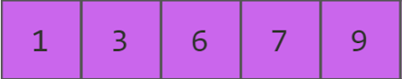
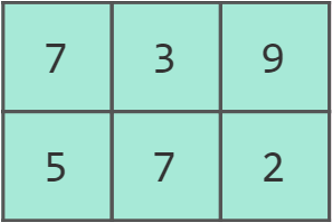
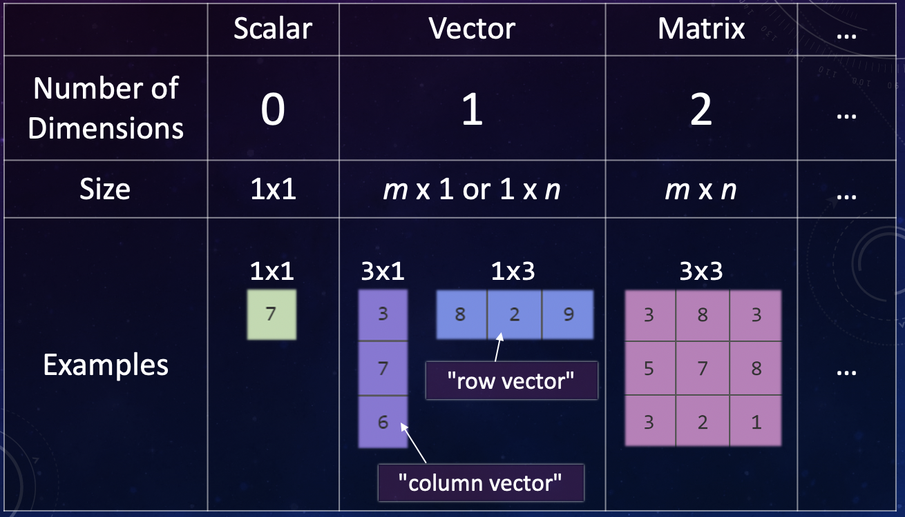
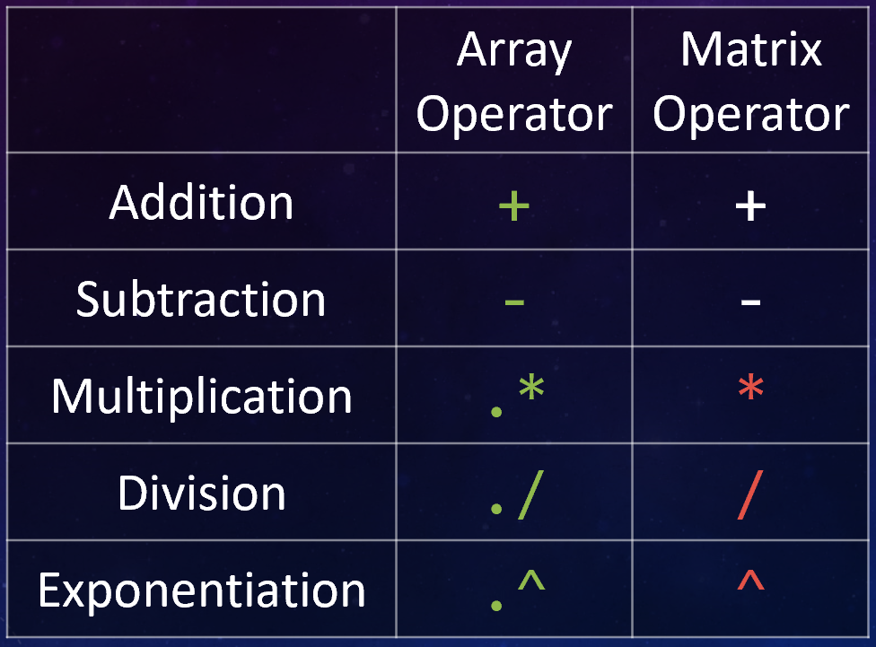

.. qnum::
   :prefix: Q
   :start: 1

.. raw:: html

   <link rel="stylesheet" href="../../_static/common/css/matlab.css">
   

====================
Vectors and Matrices
====================

.. admonition:: Technical Difficulties

  We had some technical difficulties that cause the sound in some of the videos below to cut out for brief moments. Sorry about that! We're aware of the issue and looking into a fix for future content.

^^^^^^^^^^^^
Introduction
^^^^^^^^^^^^

As we mentioned at the end of Chapter 1, a key strength of MATLAB is support for working with vectors and matrices just as easily as scalar values. A scalar is just a plain old number, like 12 or 97.4. 

A vector is a one-dimensional sequence of numbers:

|

A matrix is a two-dimensional grid of numbers:

|

Internally, MATLAB treats all data as a grid-like structure called an **array**. Scalars, vectors, and matrices are all arrays with different dimensionality (e.g. a Matrix is a 2D array).

While "array" is the technical term, most often people just call things vectors or matrices as appropriate. After all, it's called MATLAB (Matrix Laboratory), not ARRLAB.

|

Vectors and matrices consist of **elements** that hold data. Vectors and matrices can hold lots of different types of values, not just the integers shown in these examples. We will use vectors and matrices to hold large amounts of data and quickly analyze that data to help make decisions about things.

^^^^^^^^^^^^^^^^^^^^^^^^^^^^^
Creating Vectors and Matrices
^^^^^^^^^^^^^^^^^^^^^^^^^^^^^

We use the square brackets :code:`[]` to create a vector or a matrix. Elements may be separated by spaces or commas. Let's start by creating some vectors.

.. youtube:: U8-PvLF__RY
  :divid: ch02_02_vid_creating_vectors
  :height: 315
  :width: 560
  :align: center

|

-------
MatCrab
-------

.. raw:: html

  

   <table><tbody>
      <tr>
         <td style="width:125px; text-align: center">
            
         </td>
         <td>
            This is MatCrab. MatCrab knows all about MATLAB, and can help you try out MATLAB code right here in Runestone! When you see MatCrab next to an example, feel free to change the code in the example if you have a "what-if" question and want to try something out. To run the code, hit &lt;enter&gt;. (If you need to type a newline, use shift+&lt;enter&gt;.) You can also click the "Reset" button to go back to the original example.
         </td>
      </tr>
   </tbody></table>
  

   

.. .. list-table:: test
..    * - .. image:: /_static/common/img/crabster.jpg
..          :height: 60px
..          :alt: The MatCrab mascot, a cartoon crab
..      - This is MatCrab. They can help you with stuff.

----------------
Creating Vectors
----------------

.. include:: content/creating_vectors.in.rst

--------------------------
Exercise: Creating Vectors
--------------------------

.. include:: ex/creating_vectors.in.rst

.. admonition:: Walkthrough

  .. reveal:: ch02_02_revealwt_creating_vectors

    .. youtube:: m2VFdVWN28s
      :divid: ch02_02_wt_creating_vectors
      :height: 315
      :width: 560
      :align: center

--------------
Range Notation
--------------

Sometimes, we want to make a vector that has elements that contain evenly-spaced values between a starting value and an ending value. We can use range notation with the colon :code:`:` operator to create evenly-spaced vectors.

.. youtube:: Cqz_GSm7jKc
  :divid: ch02_02_vid_range_notation
  :height: 315
  :width: 560
  :align: center

|

.. include:: content/range_notation.in.rst

------------------------
Exercise: Range Notation
------------------------

.. include:: ex/range_notation.in.rst

.. admonition:: Walkthrough

  .. reveal:: ch02_02_revealwt_range_notation

    .. youtube:: Pj0FRVxQoK8
      :divid: ch02_02_wt_range_notation
      :height: 315
      :width: 560
      :align: center

-----------------
Creating Matrices
-----------------

A matrix is also created with the square brackets :code:`[]`. Rows are separated with a semicolon :code:`;` (or a newline) and each element in a row is separated with commas or spaces, just like a vector. For example:

.. youtube:: pg5QlQwnpdw
  :divid: ch02_02_vid_creating_matrices
  :height: 315
  :width: 560
  :align: center

|

.. include:: content/creating_matrices.in.rst

---------------------------
Exercise: Creating Matrices
---------------------------

.. include:: ex/creating_matrices.in.rst

.. admonition:: Walkthrough

  .. reveal:: ch02_02_revealwt_creating_matrices

    .. youtube:: bF-NeSpVScY
      :divid: ch02_02_wt_creating_matrices
      :height: 315
      :width: 560
      :align: center

^^^^^^^^^^^^^^^^^^^^^^^^^^^
Arithmetic Array Operations
^^^^^^^^^^^^^^^^^^^^^^^^^^^

In MATLAB, almost anything you can do with a scalar, you can do with a vector or matrix (since these are all fundamentally "arrays" underneath). Let's take a look at how some of the common math operations like addition and multiplication work with matrices.

.. youtube:: zGhVfJZCmjc
  :divid: ch02_03_vid_arithmetic_array_operations
  :height: 315
  :width: 560
  :align: center

|

Remember, for the *multiplicative* operators, you need to use a dot in order to get *element-by-element* behavior (the versions without a dot do "matrix multiplication", which is a very different kind of operation used in linear algebra). Here are the versions you'll want in ENGR 101:

|

There is *one exception* - if at least one of the operands is a *scalar*, e.g. :code:`2 * x`, you don't technically need the dot for multiplicative operators. But it also won't hurt to use the dot there.

-------------------------------------
Exercise: Arithmetic Array Operations
-------------------------------------

.. include:: ex/arithmetic_array_operations.in.rst

.. admonition:: Walkthrough

  .. reveal:: ch02_03_revealwt_arithmetic_array_operations

    .. youtube:: Hc-QrLqCaNY
      :divid: ch02_03_wt_arithmetic_array_operations
      :height: 315
      :width: 560
      :align: center

^^^^^^^^^^^^^^^
Vector Indexing
^^^^^^^^^^^^^^^

To access elements in a vector or matrix, you can use **indexing**. Here's a look at the basic syntax and how indexing works for vectors.

.. youtube:: jbpWJdUXamk
  :divid: ch02_04_vid_vector_indexing
  :height: 315
  :width: 560
  :align: center

|

.. include:: content/vector_indexing.in.rst

-------------------------
Exercise: Vector Indexing
-------------------------

.. include:: ex/vector_indexing.in.rst

|

^^^^^^^^^^^^^^^^^^^^^^^^^^^^^^^^
Matrices and Row/Column Indexing
^^^^^^^^^^^^^^^^^^^^^^^^^^^^^^^^

To access elements in a matrix, it's generally most useful to use **row/column indexing**. Here's the details:

.. youtube:: 5V5qAxoEKx0
  :divid: ch02_05_vid_row_column_indexing_01
  :height: 315
  :width: 560
  :align: center

|

To recap, in row/column indexing, we:

- Specify separate row/column indices
- Specify rows first, then columns, separated by a comma

.. include:: ex/row_column_indexing_1.in.rst

Just like with vector indexing, we can index in several different ways. For rows and columns, you can:

- Use either a **single number** to select one row or column.
- Use a **vector of indices** to select several rows or columns.
- Use the **colon operator** to select full rows or columns.

Let's look at some more examples:

.. youtube:: b5YvVqV6HN4
  :divid: ch02_05_vid_row_column_indexing_02
  :height: 315
  :width: 560
  :align: center

|

.. include:: content/row_column_indexing_2.in.rst

^^^^^^^^^^^^^^^^^^^^^^^^^^^^^^^^^
Manipulating Arrays with Indexing
^^^^^^^^^^^^^^^^^^^^^^^^^^^^^^^^^

We can also use indexing to change the values of certain elements in a matrix. Basically, you use an indexing expression as the target on the left hand side of an assignment. Check it out:

.. youtube:: oQOlymiHS34
  :divid: ch02_06_vid_manipulating_arrays
  :height: 315
  :width: 560
  :align: center

|

-----------------------------
Exercise: Manipulating Arrays
-----------------------------

.. include:: ex/manipulating_arrays_1.in.rst

|

.. include:: ex/manipulating_arrays_2.in.rst

.. admonition:: Walkthrough

  .. reveal:: ch02_06_revealwt_manipulating_arrays_03

    .. youtube:: Bc432vwMGwY
      :divid: ch02_06_wt_manipulating_arrays_03
      :height: 315
      :width: 560
      :align: center

^^^^^^^^^^^^^^^^^^^^^^^^^^^^^^^^^^^
Common Functions Used with Matrices
^^^^^^^^^^^^^^^^^^^^^^^^^^^^^^^^^^^

.. include:: content/common_functions.in.rst

^^^^^^^^^^^^^^^^^^^^^^^^^^^^
Linear Indexing - A Heads Up
^^^^^^^^^^^^^^^^^^^^^^^^^^^^

Each element also has a sequential index used in linear indexing (as opposed to the row/column indexing we have been using). Linear indexing uses indices 1, 2, 3, … ordered first by columns, then by rows. This is called "column-major" order. Here is an example of linear indexing in MATLAB:

.. image:: img/linear_indexing.png
  :width: 350
  :align: center
  :alt: Elements may be selected by their linear index in column-major ordering.

|

**Warning! It's easy to get the column-major order backward!** We highly recommend using row/column indexing because it is more useful, generally clearer, and leads to fewer headaches, but some MATLAB help files use linear indexing, so now you know what it is.