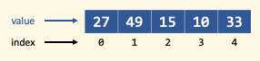

.. qnum::
   :prefix: Q
   :start: 1

.. raw:: html

   

.. include:: ../common/include_lobster_exercises.in.rst

.. raw:: html

   

==============
Vectors in C++
==============

^^^^^^^^^^^^
Introduction
^^^^^^^^^^^^
.. section 1

.. youtube:: VTNy-3dneyI
   :divid: ch16_01_introduction
   :height: 315
   :width: 560
   :align: center

|

A **vector** is a data structure that allows **random access** to read and write data. Like with strings, vector indices start at zero, not one.

^^^^^^^^^^^^^^^^^^^^^^^^^^^^^^^^^^
Warm-Up Exercise: What's My Value?
^^^^^^^^^^^^^^^^^^^^^^^^^^^^^^^^^^
.. section 2

For this exercise, consider the following vector in C++:

|

.. fillintheblank:: ch17_02_ex_warm_up
  :casei:

  What is the value at each index?

  Index 3: |blank|
  
  Index 0: |blank|

  Index 2: |blank|

  Index 4: |blank|

  Index 0: |blank|

  - :10: Correct!
    :x: Incorrect.

  - :27: Correct!
    :x: Incorrect.

  - :15: Correct!
    :x: Incorrect.

  - :33: Correct!
    :x: Incorrect.

  - :49: Correct!
    :x: Incorrect.

|

^^^^^^^^^^^^^^^^^^^^^^^^^^^^^^^^^^^^^^^^^
Declaring and Initializing Vectors in C++
^^^^^^^^^^^^^^^^^^^^^^^^^^^^^^^^^^^^^^^^^
.. section 3

.. youtube:: 9Wb0N3mAmqU
   :divid: ch16_03_vid_declaring_vectors
   :height: 315
   :width: 560
   :align: center

|

Consider the following vectors:

.. code :: cpp

  vector<int> someInts1(5,13);
  vector<int> someInts2(4);
  vector<int> someInts3{2,9,1,4};
  vector<int> someInts4;

|

.. dragndrop:: ch17_03_ex_declaring_vectors_01
  :match_1: someInts1|||[ 13 13 13 13 13 ]
  :match_2: someInts2|||[ ? ? ? ? ] ← four elements created, but no values in the elements
  :match_3: someInts3|||[ 2 9 1 4 ]
  :match_4: someInts4|||[ ] ← empty vector

  Match the code with the vector that is created.

Consider the following vectors:

.. code :: cpp

  vector<double> someDoubles1(4);
  vector<double> someDoubles2;
  vector<double> someDoubles3(2,64.5);
  vector<double> someDoubles4{10.35,0.8,-705.689};

|

.. dragndrop:: ch17_03_ex_declaring_vectors_02
  :match_1: someDoubles1|||[ ? ? ? ?] ← four elements created, but no values in the elements
  :match_2: someDoubles2|||[ ] ← empty vector
  :match_3: someDoubles3|||[ 64.5 64.5 ]
  :match_4: someDoubles4|||[ 10.35 0.8 -705.689 ]

  Match the code with the vector that is created.

|

^^^^^^^^^^^^^^^^^^^^^^^^^^^^
Indexing Into Vectors in C++
^^^^^^^^^^^^^^^^^^^^^^^^^^^^
.. section 4

.. youtube:: p_z9FD-aO54
   :divid: ch16_04_vid_vector_indexing
   :height: 315
   :width: 560
   :align: center

|

**Exercise**

.. mchoice:: ch16_04_ex_indexing_01

   The variable :code:`y` is a vector of :code:`double` values:

   .. image:: img/Indexing1.png
      :width: 300
      :align: center
      :alt: From left-to-right, y contains the values 1.57, 0.33, 88.4, 0.06, and 7.75.

   Which code snippet will print the number :code:`1.57` followed by a newline to the terminal? Select all that apply. 

   - :code:`cout << x.at(0) << endl;`

     + Correct! The element at index 0 has a value of 1.57.

   - :code:`cout << x(0) << endl;`

     - Oops! This is MATLAB indexing.

   - :code:`cout << x[1] << endl;`

     - Oops! 1.57 is the first element, but its index is 0 (not 1). 

   - :code:`cout << x.at(1) << endl;`

     - Oops! 1.57 is the first element, but its index is 0 (not 1). 

   - :code:`cout << x[0] << endl;`

     + Correct! The element at index 0 has a value of 1.57.

.. mchoice:: ch16_04_ex_indexing_02

   The variable :code:`x` is a vector of :code:`int` values:

   .. image:: img/Indexing2.png
      :width: 300
      :align: center
      :alt: From left-to-right, y contains the values 99, 54, 63, 9, 18, and 27.

   Which code snippet will print the number :code:`18` followed by a newline to the terminal? Select all that apply. 

   - :code:`cout << x[4] << endl;`

     + Correct! The element at index 4 has a value of 18.

   - :code:`cout << 2 * x.at(3) << endl;`

     + Correct! The element at index 3 has a value of 9, and 2 * 9 = 18.

   - :code:`cout << x(4) << endl;`

     - Oops! This is MATLAB indexing.

   - :code:`cout << x.at(1) - 36 << endl;`

     + Correct! The element at index 1 has a value of 54, and 54 - 36 = 18.

   - :code:`cout << x.at(4) << endl;`

     + Correct! The element at index 4 has a value of 18.

   - :code:`cout << x(5) << endl;`

     - Oops! This is MATLAB indexing syntax. Also, check to make sure you are using the correct index number.

^^^^^^^^^^^^^^^^
Vector Functions
^^^^^^^^^^^^^^^^
.. section 5

After you include the vector library using :code:`#include <vector>`, you can access many different functions that can be called on a vector. Similar to working with strings in C++, call the vector functions by using the dot notation. Here are a few commonly used vector functions:

.. list-table:: 
    :align: left
    :widths: 15 85

    * - :code:`size`

      - Returns the number of elements.

    * - :code:`front`

      - Returns a reference to the first element.

    * - :code:`back`

      - Returns a reference to the last element.

    * - :code:`at`

      - Works like indexing, but does bounds checking.

    * - :code:`empty`

      - Returns whether the vector is empty (as a bool).

    * - :code:`clear`

      - Removes all elements from the vector.

    * - :code:`push_back`

      - Adds a new element to the back of the vector.

    * - :code:`pop_back`

      - Removes the last element in the vector.

    * - :code:`erase`

      - Removes from the vector either a single element or a range of elements.

Let's see some examples of using vector functions. 

-------------------
Traversing a Vector
-------------------

.. youtube:: 63RL1y14QL4
   :divid: ch16_05_vid_traversing_a_vector
   :height: 315
   :width: 560
   :align: center

|

------------------------------
Exercise: Print Doubled Vector
------------------------------

The function :code:`printDoubled` takes in a vector of :code:`int` values and prints out 2 times the value of each element (there is no return value). A space is printed after each vector element. Complete the implementation of the :code:`printDoubled` function.

.. raw:: html

   

      
ch16_ex_printDoubled

      

         Well done! The secret word is "strudel".
      

   

.. fillintheblank:: ch16_05_ex_printDoubled
  :casei:

  Complete the Lobster exercise to reveal the *secret word*. Enter it here.
  
  |blank|

  - :strudel: Correct.
    :x: Incorrect. If you finished the exercise, please double check your spelling.

.. admonition:: Walkthrough

  .. reveal:: ch16_05_revealwt_printDoubled
  
    .. youtube:: MxLQB2Zjmv0
      :divid: ch16_05_wt_printDoubled
      :height: 315
      :width: 560
      :align: center

|

--------------------------------------
Adding/Removing Elements From a Vector
--------------------------------------

.. youtube:: TVMeF0HUJB4
   :divid: ch16_05_vid_adding_removing_vector
   :height: 315
   :width: 560
   :align: center

|

.. mchoice:: ch16_05_ex_adding_removing_01

   Which statement should we use to get from the vector on the left to the vector on the right?

   .. image:: img/AddingRemovingElements1.png
      :width: 560
      :align: center
      :alt: Originally, from left-to-right, vec contains the values 4, 38, 52, 109, and -7. After the statement is run, vec should contain 4, 38, 52, and 109.

   - :code:`vec.popback();`

     - Oops! Don't forget the _ in pop_back()!

   - :code:`vec.push_back();`

     - Oops! The push_back() function adds an element, and we want to remove an element.

   - :code:`vec.at(4) = [];`

     - Oops! This is trying to do the MATLAB approach of setting an element equal to an "empty" element to remove it, but that doesn't work in C++.

   - :code:`vec.pop_back();`

     + Correct! 

.. mchoice:: ch16_05_ex_adding_removing_02

   Which set of statements should we use to get from the vector on the left to the vector on the right?

   .. image:: img/AddingRemovingElements2.png
      :width: 560
      :align: center
      :alt: Originally, from left-to-right, vec contains the values 4, 38, 52, 109, and -7. After the statement is run, vec should contain 4, 38, 52, and 109.

   - .. code-block:: cpp

        vec.push_back(-7, -6, -5);

     - Incorrect. Watch the video again to see examples of how push_back() works. 

   - .. code-block:: cpp

        for (int i = -7; i < -4; ++i) {
          vec.push_back(i);
        }

     + Correct! This loop runs three times. On each iteration, an element is added to the vector and the values correspond to what is shown in the vector on the right.

   - .. code-block:: cpp

        for (int i = 0; i < 3; ++i) {
          vec.push_back(i);
        }

     - Incorrect. This loop will add three elements, but the contents of the elements won't match the vector on the right. 

   - .. code-block:: cpp

        vector <int> x{-7, -6, -5};
        vec.push_back(x);

     - Incorrect… but wouldn't it be nice if this worked? MATLAB handles vectors in this sort of way, but C++ cannot. We'll have to figure out a different way to add these elements. 

------------------------------
Erasing Elements from a Vector
------------------------------

.. youtube:: eKCTrSgRrqk
   :divid: ch16_05_vid_vector_erase
   :height: 315
   :width: 560
   :align: center

|

------------------------------
Exercise: Erasing Zeros
------------------------------

Arrange the lines of code below to write a program that erases all of the elements of a vector that are equal to zero. Some lines contain **mistakes** or are **unnecessary** for the function - these lines should not be selected. Make sure to place the blocks at the right indentation levels!

.. hint::

   As you erase elements, the size of your vector will change. You want to check each element, but not in the same way as the "traversing a vector" pattern we saw earlier. Think about how to step through each element in the vector and pause to erase a zero if you find one, but go to the next element if the value is not a zero. 

.. parsonsprob:: ch16_05_ex_vector_erase
   :language: cpp

   -----
   #include &lt;iostream&gt;
   #include &lt;vector&gt;
   using namespace std;
   =====
   int main() {
     vector&lt;int&gt; vec = {-2, 0, 0, 5, 72, 0, -34, 0, 0};
   =====
     int i = 0;
   =====
     while (i &lt; vec.size()) {
   =====
       if (vec.at(i) == 0) {
   =====
         vec.erase(vec.begin() + i);
   =====
       }
       else {
   =====
         ++i;
   =====
       }
   =====
     }
   =====
   }
   =====
   for (int i = 0; i &lt; vec.size(); ++i) { #distractor
   =====
   vec.erase(i); #distractor
   =====
   vec.at(i) = []; #distractor
   =====

.. admonition:: Walkthrough

  .. reveal:: ch16_05_revealwt_vector_erase
  
    .. youtube:: S3HfBGABzZ0
      :divid: ch16_05_wt_vector_erase
      :height: 315
      :width: 560
      :align: center

^^^^^^^^^^^^^^^^^^^^^^^^^^^^
Passing Vectors to Functions
^^^^^^^^^^^^^^^^^^^^^^^^^^^^
.. section 6

.. youtube:: ES2yEo4Q-bQ
   :divid: ch16_06_wt_parameter_passing
   :height: 315
   :width: 560
   :align: center

|

-----------------------------------------
Exercise: Passing Vectors to Functions
-----------------------------------------

In each of the following questions, a description of a function that takes in a vector as a parameter is given. Choose the mechanism for parameter passing that is appropriate for the function.

.. mchoice:: ch16_06_ex_parameter_passing_01
  :answer_a: pass by value
  :answer_b: pass by reference
  :answer_c: pass by const reference
  :correct: c
  :feedback_a: Oops! Because vectors are large data structures, it is expensive to make a copy of them if we don't need to.
  :feedback_b: Oops! Because we don't need to modify the vector, we don't want to use pass by reference.
  :feedback_c: Correct! We don't need to modify the vector, but we don't want to make an expensive copy, so pass by const reference is the best choice.

  A function that checks to see if there are any zeros in a vector (and returns true or false).

.. mchoice:: ch16_06_ex_parameter_passing_02
  :answer_a: pass by value
  :answer_b: pass by reference
  :answer_c: pass by const reference
  :correct: b
  :feedback_a: Oops! Because vectors are large data structures, it is expensive to make a copy of them if we don't need to.
  :feedback_b: Correct! Passing by reference allows us to modify the vector.
  :feedback_c: Oops! Passing by const reference doesn't allow us to modify the vector.

  A function that sets all elements in the vector to be 25 (and returns nothing, but the original vector passed in is modified).

.. mchoice:: ch16_06_ex_parameter_passing_03
  :answer_a: pass by value
  :answer_b: pass by reference
  :answer_c: pass by const reference
  :correct: b
  :feedback_a: Oops! Because vectors are large data structures, it is expensive to make a copy of them if we don't need to.
  :feedback_b: Correct! Passing by reference allows us to modify the vector.
  :feedback_c: Oops! Passing by const reference doesn't allow us to modify the vector. 

  A function that sorts the elements to be in ascending order (and returns nothing, but the original vector passed in is modified).

.. mchoice:: ch16_06_ex_parameter_passing_04
  :answer_a: pass by value
  :answer_b: pass by reference
  :answer_c: pass by const reference
  :correct: c
  :feedback_a: Oops! Because vectors are large data structures, it is expensive to make a copy of them if we don't need to.
  :feedback_b: Oops! Because we don't need to modify the vector, we don't want to use pass by reference.
  :feedback_c: Correct! We don't need to modify the vector, but we don't want to make an expensive copy, so pass by const reference is the best choice.

  A function that finds the index of the element that matches a given value (and returns the index).

^^^^^^^^^^^^^^^
Common Patterns
^^^^^^^^^^^^^^^
.. section 7

There are a number of "vector things" that you will find yourself wanting to do in many programs that you write. For example, you need to create vectors. And then you want to do things with those vectors, such as finding the maximum or minimum value in a vector (in Engr 101, we call that *finding the "best" element*). We've put together this reference section with a bunch of these "common patterns" for you to apply in your own programs.

There are examples of the C++ implementation of each pattern, and you can use these as templates for your own programs. You may have different data types (e.g. vectors of strings or doubles instead of ints), and the criteria that you evaluate conditions on will likely be different, but these patterns will give you a starting point. It's often easier to copy and paste some existing code and revise it than to write something from scratch. Please refer back to this section often when writing your programs!

-----------------------------------------
Creating Vectors: "Make Space, Then Fill"
-----------------------------------------

If you know ahead of time how many elements you need, first allocate enough elements and then fill in the values. Here is an example that you can use as a template for this pattern:

.. code-block:: cpp

   // make space...
   int N = 7;
   vector<int> vec(N); // the vector now has N empty elements

   //... then fill!
   for (int i = 0; i < N; ++i) {
     vec[i] = 2 * i + 1; // fill in the values
   }

----------------------------------
Creating Vectors: "Fill As You Go"
----------------------------------

If you don't know ahead of time how many elements you need, just add them as you go by using :code:`push_back`. The vector will grow as needed to accommodate everything. A common application of this pattern is reading values into a vector from a data file. Here is an example that you can use as a template for this pattern:

.. code-block:: cpp

   // declare the vector
   vector<double> data;
   
   // open a file stream
   ifstream fileIn("sensor.dat");
   
   // declare a variable to hold a value that is read in
   double value;
   
   // proceed through the file reading each value in turn; 
   // the values are added to the vector using push_back; 
   // the loop ends when no more values can be read in
   while (fileIn >> value) {
     data.push_back(value);
   }
   
   // close the file
   fileIn.close();

.. admonition:: Try it out!

   Download the :download:`sensor.dat <../_static/vectors_in_cpp/sensor.dat>` file and try out the "fill as you go" pattern. The :file:`.dat` file extension is often used for text files that contain data sets that are intended as input to a computer program. You can open :code:`.dat` files in VS Code or any text editor.

--------------------
Using an Accumulator
--------------------

Sometimes, you want to compute the result of combining a set of elements. For example, you might want to find the sum or product of elements in a vector. To do this, start a "running total" with the identity for the operation you're using. Then, add elements one at a time. Here is an example that you can use as a template for this pattern: 

.. code-block:: cpp

   // Returns the sum of elements in a vector
   int sum(const vector<int> &vec) {
   
     int sum = 0; // start at 0 because it's the additive identity
   
     // iterate through vector, adding each element to the running total
     for (int i = 0; i < vec.size(); ++i) {
       sum += vec.at(i); // can also index using vec[i]
     }
     return sum;
   }

--------------------------
Finding the "Best" Element
--------------------------

Sometimes, you want to find the "best" element according to some criteria. For example, you might want to find the maximum or minimum value in a vector. To do this, start with the first element as the "best" element. Then, traverse the vector, keeping track of the "best value so far" and comparing the "best so far" to each element. If you find a new "best element", replace "best so far" with that value, and continue on. Here is an example that you can use as a template for this pattern: 

.. code-block:: cpp

   // Returns the value of the maximum element in the vector; 
   // the vector must not be an empty vector
   int max_element(const vector<int> &vec) {
   
     int max_so_far = vec.at(0); // assume first is largest (aka "the best")
   
     // iterate through vector, looking for any larger
     for (int i = 0; i < vec.size(); ++i) {
       if (vec.at(i) > max_so_far) // compare the values
       { 
        max_so_far = vec.at(i); // keep track of the best element
       }
     }
     return max_so_far;
   }

.. admonition:: Important!

   The approach shown here does not work on empty vectors because "the maximum of nothing" doesn't make any sense; it's not a design flaw of this approach. :)

.. tip::

  In the code above, we originally set :code:`max_so_far` to the first element of the vector, and then we iterated through the vector to see if there were any higher values. Since we've already considered the first element, we can start our loop at :code:`i = 1` if we want. If we did this, we would be skipping the first vector element in our loop, because we already looked at it before the loop.

---------------------------------------
Finding the Index of the "Best" Element
---------------------------------------

As we saw with some of the MATLAB programs, sometimes we want to know the index of the "best" element and not its value. For example, we might want to know the location, or index, of the maximum value in a vector so we can look up the element later. To do this, we can use a similar approach to the "find the best element" pattern, but we keep track of the index of the "best" element instead of the value of the "best" element. Here is an example that you can use as a template for this pattern: 

.. code-block:: cpp

   // Returns the value of the minimum element in the vector
   int index_of_max_element(const vector<int> &vec) {
   
   // first, check to see if this is an empty vector; if the vector
   // is empty, return a -1 immediately (an index number cannot be negative, 
   // so this return value indicates an empty vector -- neat, huh?)
     if (vec.empty()) {
       return -1; 
     }
  
     int index_of_max = 0; // assume first is largest (aka "the best")
   
     for (int i = 0; i < vec.size(); ++i) {
       if (vec.at(i) > vec[index_of_max]){ // compare the values 
         index_of_max = i; // keep track of the index of the best element
       }
     }
   
     return index_of_max;
   }

--------------------------
Accessing Parallel Vectors
--------------------------

To get data that is "parallel", access each vector using the same index number. This is very similar to how we accessed parallel vectors in MATLAB. For example, remember displaying state names and populations? Here are several examples that you can use as a template for this pattern: 

.. code-block:: cpp

   vector<string> states;
   vector<string> populations;

   // code to "fill up" the states and populations vectors

   // Display first state
   cout << "The first state is: " << states.at(0);
   cout << " -- population " << populations.at(0) << endl;
   
   // Display 10th state
   cout << "The first state is: " << states.at(9);
   cout << " -- population " << populations.at(9) << endl;
   
   // Display last state
   cout << "The first state is: " << states.at(states.size() - 1);
   cout << " -- population " << populations.at(states.size() - 1) << endl;

.. admonition:: Note

   As we will see in a later chapter, an alternative often used in C++ is to create a **custom data type** that encapsulates both a state's name and population.

--------------------------------------
Checking If Any Element Match Criteria
--------------------------------------

Sometimes, you want to check if any element(s) match some criteria. For example, you might want to know "are there any zeros?" or "are there any elements greater than 100?". Our strategy here is to always frame this as an "any" question, and then use a loop with **early termination** to check for any such element. Here is an example that you can use as a template for this pattern:

.. code-block:: cpp

   // Returns whether there are any zeros in the vector
   bool any_zeros(const vector<int> &vec) {
     
     // iterate and check for any zeros
     for(int i = 0; i < vec.size(); ++i) {
       if ( vec.at(i) == 0 ) {
         return true; // if we find a match, return immediately
       }
     }
   
     return false; // if we get here, then there were no matches
   }

--------------------------------------
Checking If All Element Match Criteria
--------------------------------------

Sometimes, you want to check if all element(s) match some criteria. For example, you might want to know "are all the elements zero?" or "are all the elements positive?". Our strategy here is to frame this as a "checking if any match" pattern, and then use a loop with **early termination** to check for any **counterexamples**. In other words, we can use negation to turn an "all" question into an "any" question. Here is an example that you can use as a template for this pattern:

.. code-block:: cpp

   // Returns whether all the elements in the vector are positive
   bool all_positive(const vector<int> &vec) {
     
     // iterate and check for any non-positives
     for(int i = 0; i < vec.size(); ++i)  
     {
       if ( !(vec.at(i) > 0) ) // check for counterexamples
       {
         return false; // if we find one, return immediately 
                       // because we found an element that did not match 
                       // the criteria (and we don't have to check the 
                       // rest of the elements)
       }
     }
   
     return true; // if we made it here, then all the elements match the criteria!
   }

---------------------
Searching for a Value
---------------------

Sometimes, you are looking for the location of a particular element. For example, you might want to know the index of the first positive value. Or, you might want to know at which index the value :code:`0` first occurs. Our strategy here is to frame this as an "any" question, but we return the current index instead of a :code:`true` value. Here is an example that you can use as a template for this pattern: 

.. code-block:: cpp

   // Returns the index at which the given value first occurs in
   // the vector. If the value is not present, returns -1.
   int find(const vector<int> &vec, int value) {
     
     // iterate and check for the value
     for(int i = 0; i < vec.size(); ++i) {
       if ( vec.at(i) == value ) {
         return i; // if we find a match, return the index of the match
       }
     }
   
     return -1; // if we make it to here, there weren't any matches;
                // we can use -1 to represent 'no elements found'
   }

-------------------------
Common Patterns Exercises
-------------------------

Let's practice with a couple of these common patterns. Read the question, determine which "common pattern" would be applicable, and then implement the pattern to answer the question.

.. admonition:: Pro Tip

   Open this chapter of Runestone in another window or tab so that you can refer back to the common patterns listed above without having to scroll back and forth in this window.

-----------------------------------------
Exercise: Checking if All Negative
-----------------------------------------

The function :code:`all_negative` takes in a vector of :code:`int` values and returns :code:`true` if the elements in the vector are all negative (otherwise, it returns :code:`false`). Complete the implementation of the :code:`all_negative` function. 

.. raw:: html

   

      
ch16_ex_all_negative

      

         Well done! The secret word is "daffodil".
      

   

.. fillintheblank:: ch16_07_ex_all_negative
  :casei:

  Complete the Lobster exercise to reveal the *secret word*. Enter it here.
  
  |blank|

  - :daffodil: Correct.
    :x: Incorrect. If you finished the exercise, please double check your spelling.

.. admonition:: Walkthrough

  .. reveal:: ch16_07_revealwt_all_negative
  
    .. youtube:: AIxROfTVXbE
      :divid: ch16_07_wt_all_negative
      :height: 315
      :width: 560
      :align: center

|

-----------------------------------------
Exercise: Finding Minimum Value
-----------------------------------------

The function :code:`minVal` takes in a vector of :code:`double` values and returns the minimum value contained in the vector of :code:`double` values. Arrange the lines of code below to write the function :code:`minVal`. Some lines contain **mistakes** or are **unnecessary** for the function - these lines should not be selected. Make sure to place the blocks at the right indentation levels!

.. parsonsprob:: ch16_07_ex_minVal
   :language: cpp

   -----
   #include &lt;vector&gt;
   using namespace std;
   =====
   double minVal(const vector&ltdouble&gt &amp;vec) {
   =====
     double min_so_far = vec.at(0); 
   =====
     for (int i = 0; i &lt vec.size(); ++i) {
   =====
       if (vec.at(i) &lt min_so_far) {
   =====
         min_so_far = vec.at(i);
   =====
       }
   =====
     }
   =====
     return min_so_far;
   =====
   }
   =====
   double min_so_far = vec.at(1); #distractor
   =====
   for (int i = 0; i &lt= vec.size(); ++i) { #distractor
   =====
   if (vec.at(i) &gt min_so_far) { #distractor
   =====

.. admonition:: Walkthrough

  .. reveal:: ch16_07_revealwt_min_val
  
    .. youtube:: xXcBpuALqfI
      :divid: ch16_07_wt_min_val
      :height: 315
      :width: 560
      :align: center

^^^^^^^^^^^^^^^^^^^^^^^^^^^^^^^^^^^^^^^^^^^^^^^^^^^^^^^
Summary
^^^^^^^^^^^^^^^^^^^^^^^^^^^^^^^^^^^^^^^^^^^^^^^^^^^^^^^

This is the end of the chapter! Here is a summary of what we covered in this chapter: 

* Vector indices start at zero, not one.
* When you declare a vector, you must include what type of data will be in the vector. You can declare an empty vector, a vector of a certain size with no values in the elements, or a vector with intial data.
* Index into a vector using :code:`[]` or :code:`.at()`. Using :code:`.at()` is slightly slower, but the compiler warns you if you are about to go out-of-bounds.
* We can use a loop to traverse each element in a vector.
* :code:`pop_back()` is used to remove an element from the end of a vector. :code:`push_back()` is used to add elements to a vector.
* :code:`.erase()` can be used to erase elements from a vector.
* When you pass a vector to a function, you should either pass by reference (if you need to modify the vector) or pass by const reference (if you don't need to modify the vector). Pass by value makes an expensive copy of the vector, and is not the best choice.
* If you know ahead of time how large your vector needs to be, you can initialize your vector to be the appropriate size ("make space") and then fill it with values. If you don't know how big the vector needs to be ahead of time, you can "fill as you go" using :code:`push_back()`.
* Sometimes we iterate through a vector to combine the elements of the vector (e.g., into a sum or product). A common way to do this is to start a "running total" with the identify of the operation you're using, then iterate through your vector and update this running total.
* To find the "best" element of a vector, first assume that the first element is the "best" element. Then, iterate through the vector, checking each element to see if it's better than the current best element. If you find a new best element, replace the old best element. A similar pattern can be used to look for the index of the best element.
* Sometimes we have parallel vectors, where information at the same indices corresponds to each other.
* If we want to check if any element match criteria, we can iterate through the vector and use early termination if we find an element that matches our criteria. Similarly, if we want to check if all elements match some criteria, we can iterate through the vector, and use early termination if we find an element that *doesn't* match our criteria.
* To search for an element in a vector, iterate through the vector and return the matching element as soon as you find it.

You can double check that you have completed everything on the "Assignments" page. Click the icon that looks like a person, go to "Assignments", select the chapter, and make sure to scroll all the way to the bottom and click the "Score Me" button.