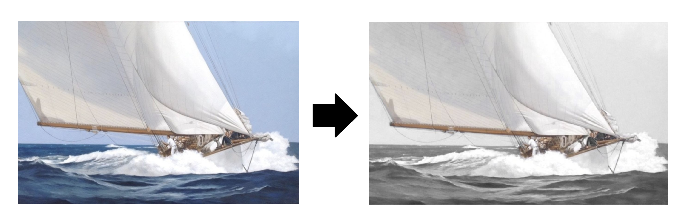
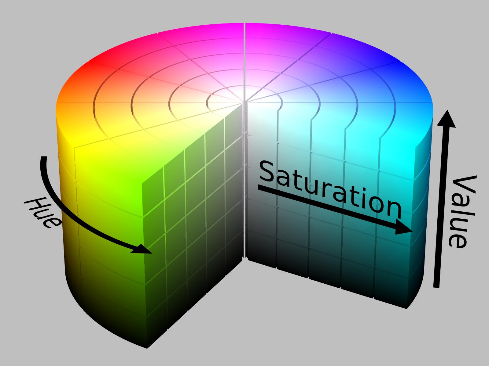

.. qnum::
   :prefix: Q
   :start: 1

.. raw:: html

   <link rel="stylesheet" href="../_static/common/css/matlab.css">
   
   

===================
Working with Images
===================

.. figure:: img/boat_color.png
   :width: 560
   :align: center
   :alt: boat_color.png

   *"Speed & Foam", Michel Brousseau*

^^^^^^^
Warm Up
^^^^^^^

TODO

^^^^^^^^^^^^
Introduction
^^^^^^^^^^^^

In this chapter, we'll take a look at how to use MATLAB to manipulate images.

.. admonition:: Chapter Files

  We'll be using several files throughout this chapter's exercises. These include starter code files as well as image files used as examples. It might be helpful to go ahead and download each of them now and move them to your current folder in MATLAB. (It's also a good idea to go ahead and create a new folder for this chapter and use that as your current folder, so that you don't clutter up whatever else you were working on.)

  .. list-table:: 
    :align: left
    :widths: auto

    * - :download:`boat_gray.png <../_static/working_with_images/boat_gray.png>`

      - .. reveal:: boat_gray_png_preview
          :showtitle: Preview
          :modal:
          :modaltitle: <code>boat_gray.png</code>

          .. image:: img/boat_gray.png
            :width: 350
            :align: center
            :alt: boat_gray.png

      - Grayscale image of a boat (PNG format)

    * - :download:`boat_color.png <../_static/working_with_images/boat_color.png>`

      - .. reveal:: boat_color_png_preview
          :showtitle: Preview
          :modal:
          :modaltitle: <code>boat_color.png</code>

          .. image:: img/boat_color.png
            :width: 350
            :align: center
            :alt: boat_color.png (PNG format)

      - Color image of a boat

    * - :download:`minecraft_face.png <../_static/working_with_images/minecraft_face.png>`

      - .. reveal:: minecraft_face_png_preview
          :showtitle: Preview
          :modal:
          :modaltitle: <code>minecraft_face.png</code>

          .. image:: img/minecraft_face.png
            :align: center
            :alt: minecraft_face.png (PNG format)

      - An 8x8 RGB image of "Alex" from Minecraft
    
  .. reveal:: working_with_images_download_instructions
    :showtitle: Download Instructions
    :modal:
    :modaltitle: File Download Instructions for MATLAB
    
    .. include:: ../common/matlab_download_instructions.in.rst
      

.. admonition:: Heads Up!

  For some of the videos in this chapter, the *file names* you see us using might be slightly different than the versions you download. Make sure you're using the correct name, which might not match the video or might have a slightly different file extension (e.g. :file:`.jpg` vs. :file:`.jpeg`).

^^^^^^^^^^^^^^^^^^^^^^^^^^^^
Grayscale Images as Matrices
^^^^^^^^^^^^^^^^^^^^^^^^^^^^

.. figure:: img/ansel_adams.jpg
   :width: 400
   :align: center
   :alt: ansel_adams.jpg

   *The Tetons and Snake River, Grand Teton National Park, Wyoming. Ansel Adams*

We can use matlab to make, store, and manipulate grayscale images. A grayscale image is just a grid of *intensity values* (i.e. bright vs. dark). In MATLAB, we can represent this as matrix of numbers!

.. youtube:: J6PU1e6K0T8
  :divid: ch05_02_vid_grayscale_images
  :height: 315
  :width: 560
  :align: center

|

Each cell in the matrix represents a pixel of the picture. The intensity value determines the shade of gray based on a gradient. The higher the intensity value, the closer to white. The value can be represented 2 ways:

- An integer between 0 and 255, inclusive
- A real number (a double) between 0 and 1, inclusive

--------------------------
Exercise: Grayscale Images
--------------------------

TODO

.. include:: ex/grayscale_images.in.rst

.. admonition:: Walkthrough

  .. reveal:: ch05_02_revealwt_grayscale_images

    .. youtube:: m2VFdVWN28s
      :divid: ch05_02_wt_grayscale_images
      :height: 315
      :width: 560
      :align: center

^^^^^^^^^^^^^^^^^^^^^^^^^
Loading and Saving Images
^^^^^^^^^^^^^^^^^^^^^^^^^
.. section 3

Matlab has built-in functions for saving and loading images. Let's look at an example:

.. youtube:: hfjwgcbH44M
  :divid: ch05_03_vid_loading_and_saving_images
  :height: 315
  :width: 560
  :align: center

|

Here's the recap:

- To **load** image data from a file into a matrix, use the :code:`imread()` function:

  .. code-block:: matlab

    img = imread('filename.png');
    % The matrix img now contains the data for the given image file

- To **save** a matrix as an image file, use the :code:`imwrite()` function:

  .. code-block:: matlab

    % Assume img is a matrix containing a representation of image data
    % This line will save that into a new image file named newFile.png
    img = imread('newFile.png');

MATLAB can handle most common image file formats including :file:`.jpg`, :file:`.png`, :file:`.gif`, :file:`.bmp`, :file:`.ppm`, etc.

.. admonition:: Pro Tip

  Remember, when you specify a file name for MATLAB, you should use the single quotes and make sure to include the file extension (the part after the dot in the file name).

  Finally, you'll usually want to remember to **add the semicolon** :code:`;` **to suppress output when working with images**, since otherwise the result will print out at the command window - for an image, the result may be *huge*, which makes this behavior annoying.

^^^^^^^^^^^^^^^^
Image Operations
^^^^^^^^^^^^^^^^
.. section 3

Let's work through a few examples to give you some practice loading and working with images, as well as highlight a couple common image operations.

---------------------
Example: Thresholding
---------------------

Matlab has built-in functions for saving and loading images. Let's look at an example:

.. youtube:: npx7BmWdaDI
  :divid: ch05_04_vid_thresholding
  :height: 315
  :width: 560
  :align: center

|

.. tip::

  You can also use imshow to display a logical matrix directly, e.g. :code:`imshow(img > 200)`, and the figure window will show a black-and-white image white corresponds to true values in the image and black to false.

-----------------------------
Exercise: Contrast Stretching
-----------------------------

.. include:: ex/contrast_stretching.in.rst

.. admonition:: Walkthrough

  .. reveal:: ch05_04_revealwt_contrast_stretching

    .. youtube:: m2VFdVWN28s
      :divid: ch05_04_wt_contrast_stretching
      :height: 315
      :width: 560
      :align: center

^^^^^^^^^^^^^^^^
RGB Color Images
^^^^^^^^^^^^^^^^
.. section 5

We can use a matrix of numbers to represent a grayscale image, with values between 0 and 255 for different shades of gray. If we want a color image, how could we describe the color of each pixel?

We could try to have a number for each color, e.g. 0 = red, 1 = orange, 2 = blue, ..., 58 = etc. Although a box of 256 crayons would be pretty awesome, we really need a strategy that can represent every possible color, and there are a lot more than 256! A fixed set of colors also doesn't allow us to account for things like brightness or saturation of the color, which are important to our human understanding of color.

You may be familiar with the way printers use a combination of three *primary colors* to create other colors. We'll look at something similar, but using the primary colors of light which are red, green, and blue (RGB). If we use 256 possible values for each primary color, we get a total of over 16 million different color combinations! This representation is inspired by the way our eyes perceive color and also aligned with the way computer displays produce color.

In MATLAB RGB images, we need to find a way to describe where each pixel is and also describe the amount of red, green, and blue in each pixel. We do this with a matrix for each *color channel* in the image. If we wanted to, we could store these channels as individual matrices, but that could get confusing fast. Instead, we'll take advantage of MATLAB's capability to make 3D matrices and store each RGB color channel as one layer.

Here's the details:

.. youtube:: Q97m7naKIfo
  :divid: ch05_05_vid_color_images
  :height: 315
  :width: 560
  :align: center

|

-----------------------------------
Exercise: Row/Column/Layer Indexing
-----------------------------------

.. include:: ex/row_column_layer_indexing.in.rst

.. admonition:: Walkthrough

  .. reveal:: ch05_05_revealwt_row_column_layer_indexing

    .. youtube:: m2VFdVWN28s
      :divid: ch05_05_wt_row_column_layer_indexing
      :height: 315
      :width: 560
      :align: center

|

^^^^^^^^^^^^^^^^^^^^^^^^^^^^^^^^^^
Manipulating Images as 3D Matrices
^^^^^^^^^^^^^^^^^^^^^^^^^^^^^^^^^^
.. section 6

Given the representation of an RGB image as three channels stored in layers of a 3D matrix, there are two main ways you might choose to work with an image: 1) all the channels together (the whole image) OR 2) one channel at a time. Let's look at some examples:

**Working With The Whole Image**

.. youtube:: jYiWOYHOvpw
  :divid: ch05_06_vid_whole_image
  :height: 315
  :width: 560
  :align: center

|

**Working With A Single Channel**

.. youtube:: WOxAHmEYnOY
  :divid: ch05_06_vid_single_channel
  :height: 315
  :width: 560
  :align: center

|

To review, here's what the two look like as indexing expressions:

- :code:`img(___, ___, :)` means that you want the **whole** image. The colon in the layer indicator means that you're selecting all of the channels (layers) at once.
- :code:`img(___, ___, 2)` means, for example, that you want a **single channel** - the **2nd (green)** in this case.

Also, when you would like to do more complicated operations on one of the channels in an image, you sometimes need to "take out the channel, work with it, and then copy it back in".

.. code-block:: matlab

  % Pull out a copy of the red channel
  % to work with it individually.
  red = img(:,:,1);

  % Make changes to the red channel.
  red(:) = 255;

  % Copy the red channel data back into the original image.
  % You need this, otherwise the image isn't changed.
  img(:,:,1) = red;

^^^^^^^^^^^^^^^^^^^^^^^^^^^^^^^^^^^^^^^^
HSV Image Representation and Application
^^^^^^^^^^^^^^^^^^^^^^^^^^^^^^^^^^^^^^^^
.. section 7

We also want to introduce another representation for color images that uses channels for the hue, saturation, and value (HSV) of each pixel, instead of RGB. We'll explain what those mean in a moment, but first let's look at an application - *color desaturation* - that motivates the need for a different representation.

   Desaturation is the process of removing color from all or part of an image (e.g. the blue sea/sky in this image). It can produce some pretty cool, dramatic effects.

.. youtube:: ATHtSPAy4-w
  :divid: ch05_06_vid_rgb_desaturation
  :height: 315
  :width: 560
  :align: center

|

This is a good example of a case where RGB colors don't provide an intuitive way to manipulate an image, even though they mimic the way our eyes perceive color. We can't identify or manipulate the blue colors in the background by just looking at the blue channel, In the next section we'll show you how to use an HSV image representation to approach this problem. 

HSV is another three-channel representation, where the three channels: hue, saturation, and value. Here's the basic idea of each:

- Hue: "which basic color is it?"
- Saturation: "how strong is the color?"
- Value: "how bright is it?"

   The HSV color space

.. list-table:: 
  :align: center
  :widths: auto

  * - .. figure:: img/boat_hue.jpg
        :width: 180
        :align: center
        :alt: boat_hue.jpg

        Hue
    - .. figure:: img/boat_saturation.jpg
        :width: 180
        :align: center
        :alt: boat_saturation.jpg

        Saturation
    - .. figure:: img/boat_value.jpg
        :width: 180
        :align: center
        :alt: boat_value.jpg

        Value

-----------------------------------
Exercise: Row/Column/Layer Indexing
-----------------------------------

.. include:: ex/row_column_layer_indexing.in.rst

.. admonition:: Walkthrough

  .. reveal:: ch05_05_revealwt_row_column_layer_indexing

    .. youtube:: m2VFdVWN28s
      :divid: ch05_05_wt_row_column_layer_indexing
      :height: 315
      :width: 560
      :align: center

|
